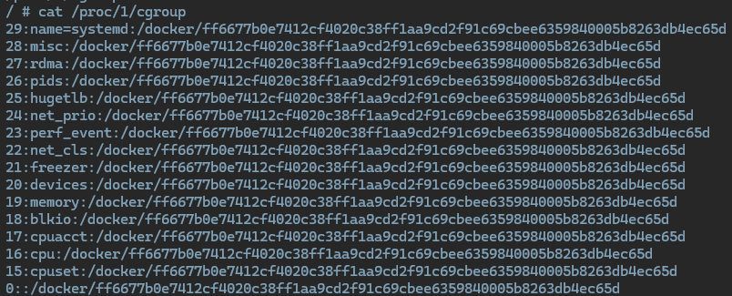
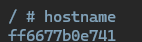

# Auxiliary Commands & Tips

This documentation aims to provide guidance, utilities and useful commands that could be leveraged in certification preparation and exam exercises for agility.

- [Auxiliary Commands & Tips](#auxiliary-commands--tips)
  - [Linux helpers](#linux-helpers)
    - [Create a file inline with cat](#create-a-file-inline-with-cat)
  - [Docker commands](#docker-commands)
    - [Remove all stopped containers in the system](#remove-all-stopped-containers-in-the-system)
    - [Retrieve running processes inside a container](#retrieve-running-processes-inside-a-container)
    - [Create a docker network](#create-a-docker-network)
    - [Save Docker Image and Container](#save-docker-image-and-container)
    - [Import Docker Image and Container](#import-docker-image-and-container)
    - [List containers ordered by creation time](#list-containers-ordered-by-creation-time)
    - [Inspect docker image layers and filesystem](#inspect-docker-image-layers-and-filesystem)
      - [With Dive](#with-dive)
      - [With Whaler](#with-whaler)
    - [Attack surface - understand if i am in a container](#attack-surface---understand-if-i-am-in-a-container)
      - [Docker general](#docker-general)
    - [Interact with Remote Docker Daemon](#interact-with-remote-docker-daemon)
      - [Configuring the Docker CLI for Remote Access](#configuring-the-docker-cli-for-remote-access)
      - [Security Considerations](#security-considerations)
      - [Tips for Remote Interaction](#tips-for-remote-interaction)

## Linux helpers

### Create a file inline with cat

To create a file from the command line without using nano, vim or similar utilities we can leverage command `cat` and the usage of file delimiters `EOF/EOL`.

```bash
cat > <file_name> <<EOL
<file_content>
EOL

# Example
cat > Dockerfile <<EOL
FROM ubuntu:20.04

RUN apt install nginx
EOL
```

## Docker commands

### Remove all stopped containers in the system

```bash
docker rm -f $(docker ps -aq -f status=exited)
```

Explanation:

- with `$()` we are capturing the output (stdout) of the command inside the parenthesis. This command is `docker ps -aq -f status=exited`. The options are:
  - `docker` is the Docker CLI communicating with the Daemon.
  - `ps` gets the containers (by default only those running). There are two options for used for this command:
    - `-aq`: `a` states for all containers and `q` indicates that only the container id must be retrieved.
    - `-f status=existed` with this option we are filtering to only obtain those containers that have exited.
- Main command `docker rm -f <list-of-containers-id>`. Options explanation:
  - `rm` command for removing the containers.
  - `-f` forces container removal.

### Retrieve running processes inside a container

```bash
docker top <container_name>
```

______________________________________________________________________

### Create a docker network

[Theory about networks](./concepts.md#docker-networking)

```bash
docker network create --driver <driver_name> <network_name>

#Example using default driver bridge
docker network create mynetwork
```

______________________________________________________________________

### Save Docker Image and Container

**Docker Save**: Use `docker save` to create a tar archive of an image.

```bash
docker save -o myimage.tar myimage:latest
```

**Docker Export**: Use `docker export` to create a tar archive of a container's filesystem.

```bash
docker export -o mycontainer.tar mycontainer_id
```

> \[!NOTE\]
> Be aware of the limitations when using `docker export` for containers. This command does not preserve the history, container creation metadata, layered information, or volume data associated with the container. For a complete backup or migration, consider using `docker save` for images or Docker's volume backup methods for data persistence.
> `docker save` is ideal for sharing images, preserving their history and layers, while `docker export` is for containers, flattening their filesystem into a single layer.

### Import Docker Image and Container

**Docker Import for Images**: Use `docker import` to create an image from a tar archive previously exported with `docker export`.

```bash
docker import mycontainer.tar mynewimage:latest
```

**Docker Load for Images**: To load an image saved with `docker save`, use `docker load`.

```bash
docker load -i myimage.tar
```

`docker import` is used to create an image from a flat filesystem, while `docker load` restores an image with its history and layers.

______________________________________________________________________

### List containers ordered by creation time

```bash
echo '['$(docker container ls --format '{{json .}}' | paste -sd "," -)']' | jq 'sort_by(.CreatedAt) | .[] | {ID: .ID, Image: .Image, CreatedAt: .CreatedAt}'
```

For this command to run, `jq` must be installed in the system:

```bash
sudo apt-get update && sudo apt-get install -y jq
```

______________________________________________________________________

### Inspect docker image layers and filesystem

#### With Dive

[GitHub dive project](https://github.com/wagoodman/dive)

```bash
docker run -ti --rm -v /var/run/docker.sock:/var/run/docker.sock wagoodman/dive <your_image>

#Example
docker run -ti --rm -v /var/run/docker.sock:/var/run/docker.sock wagoodman/dive nginx:latest
```

> \[!NOTE\]
> Following instruction helps to analyze an image that is in `tar` not loaded to the docker images pool. **The tar must be present in the directory you are executing the command**

```bash
docker run -ti --rm -v /var/run/docker.sock:/var/run/docker.sock -v "$(pwd)"/nginx.tar:/app/nginx.tar wagoodman/dive docker-archive://app/nginx.tar
```

#### With Whaler

[Whaler github repository](https://github.com/P3GLEG/Whaler)

> \[!CAUTION\]
> This project is no longer actively maintained and therefore its use is more for testing or complementary purposes.

```bash
docker run -t --rm -v /var/run/docker.sock:/var/run/docker.sock:ro pegleg/whaler <your_image>
```

______________________________________________________________________

### Attack surface - understand if i am in a container

There are several checks that could indicate if we are inside a container or not:

#### Docker general

```bash
# Search for .dockerenv or other docker related files
find / -name "*.docker*"
```

```bash
# Check cgroups processes
cat /proc/1/cgroup
cat /proc/self/cgroup
```



```bash
# Check the host name for strange id (e.g., 07f90a194e6a)
hostname
```



```bash
# Check the cgroup of init process
cat /proc/self/mountinfo
```


______________________________________________________________________

### Interact with Remote Docker Daemon

Interacting with a remote Docker daemon allows you to manage Docker containers and images on a different host from your local machine. This capability is particularly useful for managing multiple Docker hosts or for situations where Docker needs to be controlled from a centralized location.

#### Configuring the Docker CLI for Remote Access

To interact with a remote Docker daemon, you need to configure the Docker CLI on your local machine. You can achieve this by setting the `DOCKER_HOST` environment variable to point to the remote Docker daemon.

```bash
export DOCKER_HOST="tcp://<REMOTE_HOST>:2375"
```

Replace `<REMOTE_HOST>` with the IP address or hostname of your remote Docker host and `2375` with the port configured for remote access.

#### Security Considerations

When enabling remote access to the Docker daemon, it's crucial to secure the communication channel to prevent unauthorized access:

1. `Basic Authentication:` Not directly supported for Docker daemon remote access. You would need to set up a reverse proxy (e.g., Nginx) in front of the Docker daemon to handle basic authentication.

2. `Token-Based Authentication:` Similar to basic authentication, Docker does not natively support token-based authentication for remote daemon access. Implementing this requires a reverse proxy or a third-party authentication mechanism.

3. `TLS Certificates:` Docker supports mutual TLS to secure remote daemon access. Both the client and the server verify each other's identities through certificates.

   - Generate CA, server, and client certificates.
   - Configure the Docker daemon with `--tlsverify`, `--tlscacert`, `--tlscert`, and `--tlskey` flags pointing to the respective certificates.
   - Use the Docker CLI with `--tlsverify`, `--tlscacert`, `--tlscert`, and `--tlskey` options, or set the equivalent environment variables (`DOCKER_TLS_VERIFY`, `DOCKER_CERT_PATH`).

#### Tips for Remote Interaction

- `Firewall Configuration:` Ensure your firewall rules allow traffic on the Docker daemon port only from trusted sources.

- `Docker Context:` Docker 19.03 and later support the `docker context` command, allowing you to easily switch between different Docker daemons, including remote ones, without manually changing environment variables each time.

  ```bash
  docker context create remote --docker "host=tcp://<REMOTE_HOST>:2376"
  docker context use remote
  ```

- `Monitoring and Logging:` Implement monitoring and logging for access to the remote Docker daemon to detect and respond to unauthorized access attempts.
