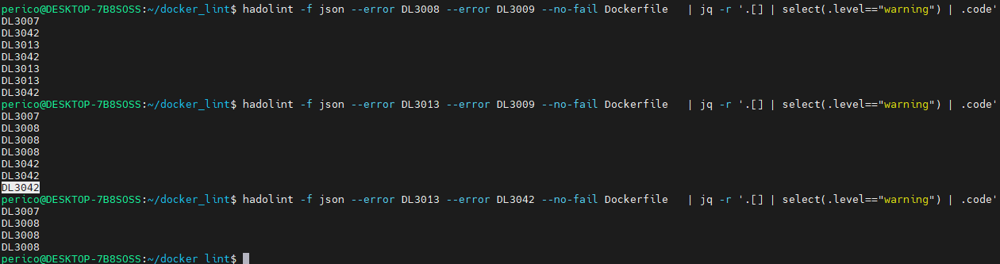
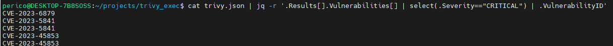
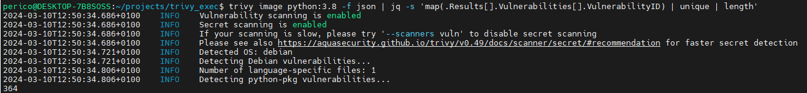
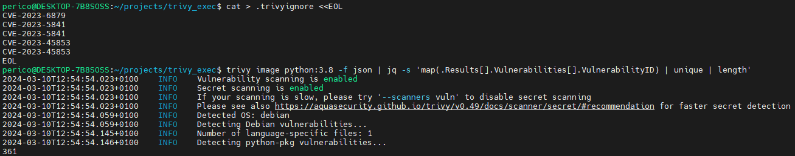
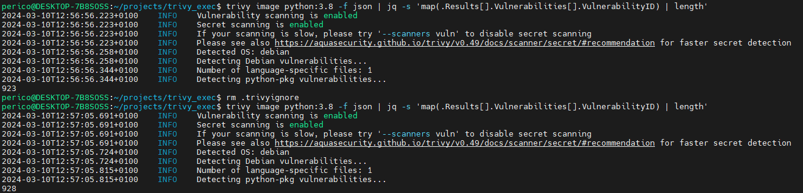
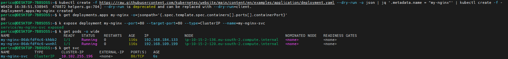

# Auxiliary Commands & Tips

This documentation aims to provide guidance, utilities and useful commands that could be leveraged in certification preparation and exam exercises for agility.

- [Auxiliary Commands & Tips](#auxiliary-commands--tips)
  - [Linux helpers](#linux-helpers)
    - [Create a file inline with cat](#create-a-file-inline-with-cat)
  - [Docker commands](#docker-commands)
    - [Remove all stopped containers in the system](#remove-all-stopped-containers-in-the-system)
    - [Retrieve running processes inside a container](#retrieve-running-processes-inside-a-container)
    - [Get a container by id](#get-a-container-by-id)
    - [Create a docker network](#create-a-docker-network)
    - [Save Docker Image and Container](#save-docker-image-and-container)
    - [Import Docker Image and Container](#import-docker-image-and-container)
    - [List containers ordered by creation time](#list-containers-ordered-by-creation-time)
    - [Inspect docker image layers and filesystem](#inspect-docker-image-layers-and-filesystem)
      - [With Dive](#with-dive)
      - [With Whaler](#with-whaler)
    - [Attack surface - understand if i am in a container](#attack-surface---understand-if-i-am-in-a-container)
      - [Docker general](#docker-general)
    - [Interact with Remote Docker Daemon](#interact-with-remote-docker-daemon)
      - [Configuring the Docker CLI for Remote Access](#configuring-the-docker-cli-for-remote-access)
      - [Security Considerations](#security-considerations)
      - [Tips for Remote Interaction](#tips-for-remote-interaction)
  - [Security tools](#security-tools)
    - [Hadolint commands](#hadolint-commands)
    - [Get all vulnerable IDs of fixed level](#get-all-vulnerable-ids-of-fixed-level)
    - [Trivy commands](#trivy-commands)
      - [Get all vulnerable IDs of fixed Severity](#get-all-vulnerable-ids-of-fixed-severity)
      - [Ignore specific results](#ignore-specific-results)
      - [Avoid exit code if vulnerabilities are found](#avoid-exit-code-if-vulnerabilities-are-found)
  - [Kubernetes commands](#kubernetes-commands)
    - [Configure autocompletion kubectl](#configure-autocompletion-kubectl)
    - [Installing kubecolor](#installing-kubecolor)
    - [Setting kubernetes shortnames](#setting-kubernetes-shortnames)
    - [Get information](#get-information)
      - [Filter in table format](#filter-in-table-format)
    - [Using JSONPath - Example: Retrieve API server IP](#using-jsonpath---example-retrieve-api-server-ip)
    - [Retrieving the yaml object entirely](#retrieving-the-yaml-object-entirely)
    - [Interacting with ETCD](#interacting-with-etcd)
    - [Expose Replica Controller](#expose-replica-controller)

## Linux helpers

### Create a file inline with cat

To create a file from the command line without using nano, vim or similar utilities we can leverage command `cat` and the usage of file delimiters `EOF/EOL`.

```bash
cat > <file_name> <<EOL
<file_content>
EOL

# Example
cat > Dockerfile <<EOL
FROM ubuntu:20.04

RUN apt install nginx
EOL
```

## Docker commands

### Remove all stopped containers in the system

```bash
docker rm -f $(docker ps -aq -f status=exited)
```

Explanation:

- with `$()` we are capturing the output (stdout) of the command inside the parenthesis. This command is `docker ps -aq -f status=exited`. The options are:
  - `docker` is the Docker CLI communicating with the Daemon.
  - `ps` gets the containers (by default only those running). There are two options for used for this command:
    - `-aq`: `a` states for all containers and `q` indicates that only the container id must be retrieved.
    - `-f status=existed` with this option we are filtering to only obtain those containers that have exited.
- Main command `docker rm -f <list-of-containers-id>`. Options explanation:
  - `rm` command for removing the containers.
  - `-f` forces container removal.

### Retrieve running processes inside a container

```bash
docker top <container_name>
```

### Get a container by id

```bash
docker container ls -f id=<id_container>
```

______________________________________________________________________

### Create a docker network

[Theory about networks](./concepts.md#docker-networking)

```bash
docker network create --driver <driver_name> <network_name>

#Example using default driver bridge
docker network create mynetwork
```

______________________________________________________________________

### Save Docker Image and Container

**Docker Save**: Use `docker save` to create a tar archive of an image.

```bash
docker save -o myimage.tar myimage:latest
```

**Docker Export**: Use `docker export` to create a tar archive of a container's filesystem.

```bash
docker export -o mycontainer.tar mycontainer_id
```

> \[!NOTE\]
> Be aware of the limitations when using `docker export` for containers. This command does not preserve the history, container creation metadata, layered information, or volume data associated with the container. For a complete backup or migration, consider using `docker save` for images or Docker's volume backup methods for data persistence.
> `docker save` is ideal for sharing images, preserving their history and layers, while `docker export` is for containers, flattening their filesystem into a single layer.

### Import Docker Image and Container

**Docker Import for Images**: Use `docker import` to create an image from a tar archive previously exported with `docker export`.

```bash
docker import mycontainer.tar mynewimage:latest
```

**Docker Load for Images**: To load an image saved with `docker save`, use `docker load`.

```bash
docker load -i myimage.tar
```

`docker import` is used to create an image from a flat filesystem, while `docker load` restores an image with its history and layers.

______________________________________________________________________

### List containers ordered by creation time

```bash
echo '['$(docker container ls --format '{{json .}}' | paste -sd "," -)']' | jq 'sort_by(.CreatedAt) | .[] | {ID: .ID, Image: .Image, CreatedAt: .CreatedAt}'
```

For this command to run, `jq` must be installed in the system:

```bash
sudo apt-get update && sudo apt-get install -y jq
```

______________________________________________________________________

### Inspect docker image layers and filesystem

#### With Dive

[GitHub dive project](https://github.com/wagoodman/dive)

```bash
docker run -ti --rm -v /var/run/docker.sock:/var/run/docker.sock wagoodman/dive <your_image>

#Example
docker run -ti --rm -v /var/run/docker.sock:/var/run/docker.sock wagoodman/dive nginx:latest
```

> \[!NOTE\]
> Following instruction helps to analyze an image that is in `tar` not loaded to the docker images pool. **The tar must be present in the directory you are executing the command**

```bash
docker run -ti --rm -v /var/run/docker.sock:/var/run/docker.sock -v "$(pwd)"/nginx.tar:/app/nginx.tar wagoodman/dive docker-archive://app/nginx.tar
```

#### With Whaler

[Whaler github repository](https://github.com/P3GLEG/Whaler)

> \[!CAUTION\]
> This project is no longer actively maintained and therefore its use is more for testing or complementary purposes.

```bash
docker run -t --rm -v /var/run/docker.sock:/var/run/docker.sock:ro pegleg/whaler <your_image>
```

______________________________________________________________________

### Attack surface - understand if i am in a container

There are several checks that could indicate if we are inside a container or not:

#### Docker general

```bash
# Search for .dockerenv or other docker related files
find / -name "*.docker*"
```

```bash
# Check cgroups processes
cat /proc/1/cgroup
cat /proc/self/cgroup
```


```bash
# Check the host name for strange id (e.g., 07f90a194e6a)
hostname
```


```bash
# Check the cgroup of init process
cat /proc/self/mountinfo
```


______________________________________________________________________

### Interact with Remote Docker Daemon

Interacting with a remote Docker daemon allows you to manage Docker containers and images on a different host from your local machine. This capability is particularly useful for managing multiple Docker hosts or for situations where Docker needs to be controlled from a centralized location.

#### Configuring the Docker CLI for Remote Access

To interact with a remote Docker daemon, you need to configure the Docker CLI on your local machine. You can achieve this by setting the `DOCKER_HOST` environment variable to point to the remote Docker daemon.

```bash
export DOCKER_HOST="tcp://<REMOTE_HOST>:2375"
```

Replace `<REMOTE_HOST>` with the IP address or hostname of your remote Docker host and `2375` with the port configured for remote access.

#### Security Considerations

When enabling remote access to the Docker daemon, it's crucial to secure the communication channel to prevent unauthorized access:

1. `Basic Authentication:` Not directly supported for Docker daemon remote access. You would need to set up a reverse proxy (e.g., Nginx) in front of the Docker daemon to handle basic authentication.

2. `Token-Based Authentication:` Similar to basic authentication, Docker does not natively support token-based authentication for remote daemon access. Implementing this requires a reverse proxy or a third-party authentication mechanism.

3. `TLS Certificates:` Docker supports mutual TLS to secure remote daemon access. Both the client and the server verify each other's identities through certificates.

   - Generate CA, server, and client certificates.
   - Configure the Docker daemon with `--tlsverify`, `--tlscacert`, `--tlscert`, and `--tlskey` flags pointing to the respective certificates.
   - Use the Docker CLI with `--tlsverify`, `--tlscacert`, `--tlscert`, and `--tlskey` options, or set the equivalent environment variables (`DOCKER_TLS_VERIFY`, `DOCKER_CERT_PATH`).

#### Tips for Remote Interaction

- `Firewall Configuration:` Ensure your firewall rules allow traffic on the Docker daemon port only from trusted sources.

- `Docker Context:` Docker 19.03 and later support the `docker context` command, allowing you to easily switch between different Docker daemons, including remote ones, without manually changing environment variables each time.

  ```bash
  docker context create remote --docker "host=tcp://<REMOTE_HOST>:2376"
  docker context use remote
  ```

- `Monitoring and Logging:` Implement monitoring and logging for access to the remote Docker daemon to detect and respond to unauthorized access attempts.

## Security tools

### Hadolint commands

### Get all vulnerable IDs of fixed level

```bash
hadolint -f json --error DL3008 --error DL3009 --no-fail Dockerfile   | jq -r '.[] | select(.level=="warning") | .code'
```



### Trivy commands

#### Get all vulnerable IDs of fixed Severity

```bash
cat trivy.json | jq -r '.Results[].Vulnerabilities[] | select(.Severity=="CRITICAL") | .VulnerabilityID'
```



#### Ignore specific results

1. Create the trivy ignore file.

```bash
cat > .trivyignore <<EOL
CVE-2023-6879
CVE-2023-5841
CVE-2023-5841
CVE-2023-45853
CVE-2023-45853
EOL
```

2. Launch the scan in the same folder the `.trivyignore` has been created or use the `--ignorefile` option pointing to the location of your Trivy ignore file.

As a test, I will show the same with `python:3.8`.

- First we analyze the image as it is and the result is `364` as it could be seen in the output image.

```bash
trivy image python:3.8 -f json | jq -s 'map(.Results[].Vulnerabilities[].VulnerabilityID) | unique | length'
```



- Then we create the `.trivyignore` file with the contents [Get all vulnerable IDs of fixed Severity](#get-all-vulnerable-ids-of-fixed-severity) command.
- Then we analyze the `python:3.8` image again.

```bash
trivy image python:3.8 -f json | jq -s 'map(.Results[].Vulnerabilities[].VulnerabilityID) | unique | length'
```



> \[!NOTE\]
> If we remove the `unique` filter in the `jq` count, we will see exactly the 5 count difference between both analysis due to `.trivyignore` content.
> **Notice the removal of `.trivyignore` in between the two executions**



#### Avoid exit code if vulnerabilities are found

```bash
# Do not forget the option if you wan to avoid exit code error.
--exit-code 0
```

## Kubernetes commands

### Configure autocompletion kubectl

```bash
kubectl completion bash >/etc/bash_completion.d/kubectl
```

### Installing kubecolor

```bash
wget https://github.com/hidetatz/kubecolor/releases/download/v0.0.25/kubecolor_0.0.25_Linux_x86_64.tar.gz -O kubecolor.tar.gz
tar xzfv kubecolor.tar.gz
rm LICENSE README.md
sudo mv kubecolor /usr/local/bin
sudo chmod +x /usr/local/bin/kubecolor
```

### Setting kubernetes shortnames

```bash
# ${HOME}/.bashrc
alias kubectl="kubecolor"
alias kd="kubectl describe"
alias kdel="kubectl delete"
alias kget="kubectl get"
alias ke="kubectl edit"
alias ka="kubectl apply"
alias kaf="kubectl apply -f"
alias klogs="kubectl logs"
alias ll='ls -alF'
alias la='ls -A'
alias l='ls -CF'
alias k='kubecolor'
alias kg='kubecolor get'
alias kd='kubecolor describe'
alias kn='f() { [ "$1" ] && kubecolor config set-context --current --namespace $1;}; f'
alias deploy='kubectl get deploy'
alias pods='kubectl get pod'
alias ktaint="kubectl get nodes -o custom-columns='NAME:.metadata.name,TAINTS:.spec.taints'"
complete -F __start_kubectl k
```

### Get information

#### Filter in table format

```bash
kubectl get pods -n <ns> <pod-id> -o=custom-columns='NAME:metadata.name, NAMESPACE: metadata.namespace'

E.g.
kubectl get pods -n kube-system -l component=kube-apiserver -o=custom-columns='NAME:metadata.name, NAMESPACE:metadata.namespace, CONTAINER:spec.containers[].name'
```

### Using JSONPath - Example: Retrieve API server IP

```bash
export CLUSTERNAME=$(kubectl config view --minify -o jsonpath='{.clusters[].name}')
APISERVER=$(kubectl config view -o jsonpath="{.clusters[?(@.name==\"$CLUSTERNAME\")].cluster.server}")
```

> \[!TIP\]
> `jsonpath` in this command is a query language for JSON, similar to XPath for XML. It allows you to filter and format the output of complex JSON structures.

In this specific command:

```markdown
APISERVER=$(kubectl config view -o jsonpath="{.clusters[?(@.name==\"$CLUSTERNAME\")].cluster.server}")
```

The `jsonpath` expression `{.clusters[?(@.name==\"$CLUSTERNAME\")].cluster.server}` is used to extract the server URL of the cluster whose name matches the value of `$CLUSTERNAME`.

Here's a breakdown:

- `.clusters`: This navigates to the `clusters` field in the JSON output.
- `[?(@.name==\"$CLUSTERNAME\")]`: This filters the clusters array to only include the cluster where the `name` field matches the `$CLUSTERNAME` variable.
- `.cluster.server`: This navigates to the `server` field of the `cluster` object of the filtered cluster.

The result is the server URL of the cluster with the name `$CLUSTERNAME`. This value is then assigned to the `APISERVER` variable.

### Retrieving the yaml object entirely

```bash
kubectl get pods -n kube-system -l component=etcd -o yaml
```

### Interacting with ETCD

As mentioned, ETCD is the datastore available for all the cluster and its main purpose is store the information of the cluster (replicated) so the state is consistent.

To interact with etcd there is the command `etcdctl` available.

```bash
export ETCDL_SERVER=$(kubectl get pods -n kube-system -l component=etcd -o json | jq .items[].spec.containers[0].command | grep listen-client-urls | cut -d '=' -f 2 | cut -d "," -f 2 | cut -d '"' -f 1)
export ETCDL_POD=$(kubectl get pods -n kube-system -l component=etcd -o=jsonpath={'.items[0].metadata.name'})

export ETCDL_COMMAND="get / --prefix --keys-only"
export ETCDL_COMMAND="version"

# Inside the container
kubectl exec -it ${ETCDL_POD} -n kube-system -- sh -c "ETCDCTL_API=3 etcdctl --endpoints ${ETCDL_SERVER} --cacert /etc/kubernetes/pki/etcd/ca.crt --key /etc/kubernetes/pki/etcd/server.key --cert /etc/kubernetes/pki/etcd/server.crt ${ETCDL_COMMAND}"
```

### Expose Replica Controller

1. Example deployment:

```bash
kubectl create -f https://raw.githubusercontent.com/kubernetes/website/main/content/en/examples/application/deployment.yaml --dry-run -o json | jq '.metadata.name = "my-nginx"' | kubectl create -f -
```

Options explained:

- `kubectl create -f <file>`: This command is used to create resources in Kubernetes from a file. In this case, the file is being fetched directly from a URL.

- `https://raw.githubusercontent.com/kubernetes/website/main/content/en/examples/application/deployment.yaml`: This is the URL of the file that contains the Kubernetes resource definitions. It's hosted on the Kubernetes website's GitHub repository.

- `--dry-run`: This option allows you to see what the command would do without actually applying any changes. It's useful for testing and validating your commands.

- `-o json`: This option changes the output format to JSON. By default, `kubectl` commands output in a human-readable format, but JSON is easier to manipulate programmatically.

- `| jq '.metadata.name = "my-nginx"'`: This part of the command uses the `jq` tool to modify the JSON output from the previous command. It's changing the `name` field in the `metadata` section of the resource definition to "my-nginx".

- `| kubectl create -f -`: This part of the command takes the output from the previous command (the modified JSON) and uses it as the input file for another `kubectl create` command. The `-f -` part tells `kubectl` to read the file from standard input (which is the output of the previous command).

2. Getting the container port if defined (in this case we know, but for further reference):

```bash
k get deployments.apps my-nginx -o=jsonpath='{.spec.template.spec.containers[].ports[].containerPort}'
```

> \[!TIP\]
> If the pod template has several containers defined, or the container exposes several ports --> `-o=jsonpath='{.spec.template.spec.containers[*].ports[*].containerPort}'`

```bash
kubectl expose deployment my-nginx --port=80 --targetPort=80 --type=ClusterIP --name=my-nginx-svc
```


