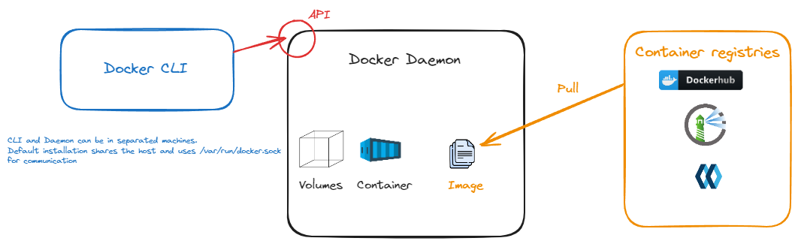
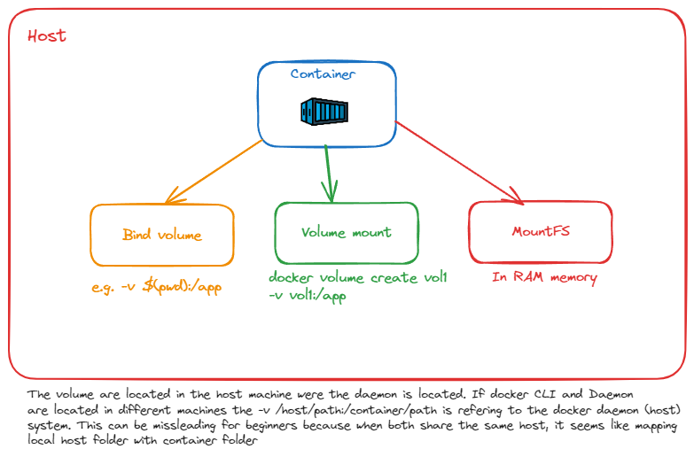
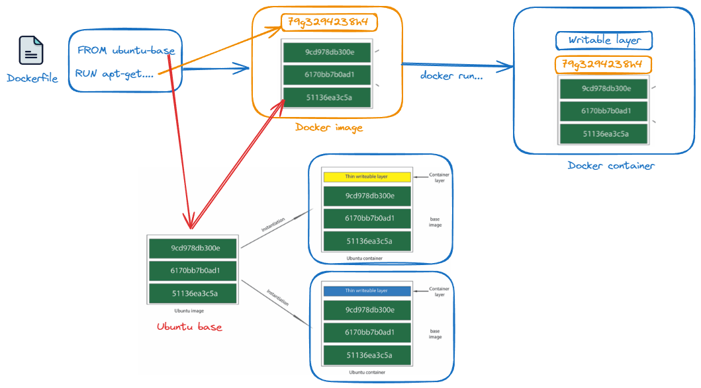
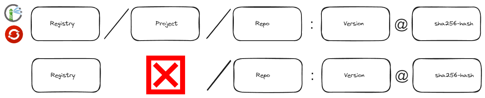
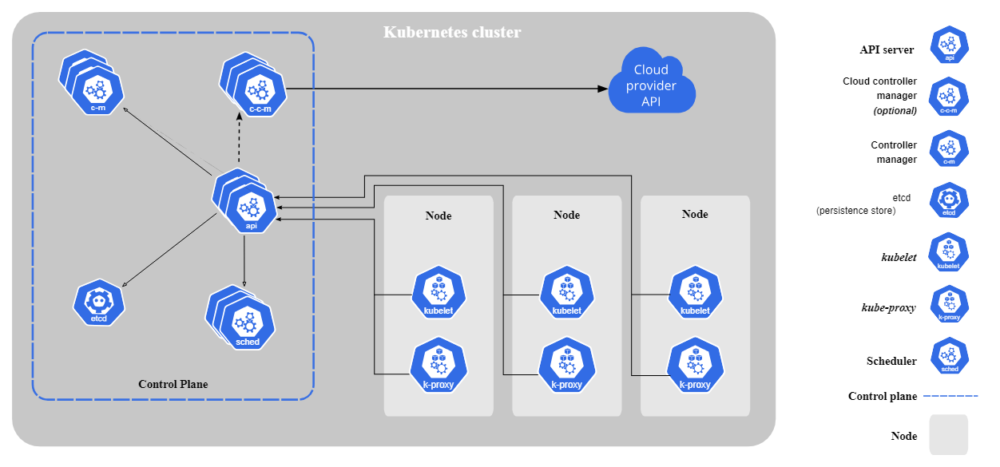

# Theoretical concepts

This documentation page aims to shortly summarize some of the most important theory related to the certification preparation and overall knowledge about containers and container security 📚

- [Theoretical concepts](#theoretical-concepts)
  - [Docker](#docker)
    - [Docker architecture](#docker-architecture)
      - [Docker Engine](#docker-engine)
      - [Docker Objects](#docker-objects)
    - [Container Low Level](#container-low-level)
      - [Namespaces](#namespaces)
        - [PID Namespace (Process Isolation)](#pid-namespace-process-isolation)
        - [Network Namespace (Network Isolation)](#network-namespace-network-isolation)
        - [Mount Namespace (Filesystem Isolation)](#mount-namespace-filesystem-isolation)
        - [User Namespace (User ID Isolation)](#user-namespace-user-id-isolation)
        - [UTS Namespace (Hostname Isolation)](#uts-namespace-hostname-isolation)
        - [IPC Namespace (Inter-Process Communication Isolation)](#ipc-namespace-inter-process-communication-isolation)
        - [Cgroup Namespace (Resource Limitation View)](#cgroup-namespace-resource-limitation-view)
      - [cgroups (Control Groups)](#cgroups-control-groups)
      - [Capabilities](#capabilities)
      - [Modifying Capabilities](#modifying-capabilities)
      - [Security Considerations](#security-considerations)
    - [Docker alternatives](#docker-alternatives)
    - [Docker Networking - Host](#docker-networking---host)
    - [Docker Networking - Containers](#docker-networking---containers)
    - [Docker Volume Management](#docker-volume-management)
      - [Understanding Docker Volumes:](#understanding-docker-volumes)
      - [Key Points to Remember:](#key-points-to-remember)
    - [Docker Layers - Dockerfile, Image, and Containers](#docker-layers---dockerfile-image-and-containers)
    - [Dockerfile Instructions](#dockerfile-instructions)
    - [Docker Compose Instructions](#docker-compose-instructions)
      - [Examples](#examples)
    - [Docker Registry](#docker-registry)
      - [Image Reference Formats:](#image-reference-formats)
      - [Hosted vs Cloud-Based Repositories](#hosted-vs-cloud-based-repositories)
  - [Docker Security](#docker-security)
    - [Image Security](#image-security)
    - [Container Security](#container-security)
    - [Docker Daemon/Host Security](#docker-daemonhost-security)
    - [Docker Registry Security](#docker-registry-security)
    - [Additional Measures](#additional-measures)
  - [Kubernetes](#kubernetes)
    - [Kubernetes Architecture](#kubernetes-architecture)
      - [Kubernetes Cluster](#kubernetes-cluster)
    - [Container Runtime Interface (CRI)](#container-runtime-interface-cri)
    - [Kubernetes Distributions](#kubernetes-distributions)
    - [Kubernetes alternatives](#kubernetes-alternatives)
    - [Kubernetes Objects](#kubernetes-objects)
      - [Security Contexts](#security-contexts)
    - [Defining Security Contexts](#defining-security-contexts)
    - [Key Security Context Settings](#key-security-context-settings)
    - [Kubernetes Workload Prioritization](#kubernetes-workload-prioritization)
      - [PriorityClasses](#priorityclasses)
      - [Quality of Service (QoS)](#quality-of-service-qos)
      - [Affinity and Anti-Affinity](#affinity-and-anti-affinity)
      - [Tolerations](#tolerations)
    - [Scheduling Workflow](#scheduling-workflow)
    - [Kubernetes Networking](#kubernetes-networking)
      - [Commonly Used Kubernetes Network Plugins (CNIs)](#commonly-used-kubernetes-network-plugins-cnis)
      - [Cluster Networking](#cluster-networking)
      - [Kube-proxy](#kube-proxy)
    - [Kubernetes Services](#kubernetes-services)

## Docker

### Docker architecture



Docker is a powerful platform designed to make it easier to create, deploy, and run applications by using containers. Containers allow developers to package an application with all of its dependencies into a standardized unit for software development. Docker's architecture is key to its functionality, enabling both development and operations teams to work more efficiently. Here's an overview of Docker's architecture within a 70-line constraint:

#### Docker Engine

The Docker Engine is the core of Docker, a lightweight and powerful open-source containerization technology combined with a workable API. The Engine creates and manages Docker containers. It's a client-server based application comprising three major components:

1. `` Docker Daemon (`dockerd`): `` The server part of the engine that listens for Docker API requests and manages Docker objects such as images, containers, networks, and volumes. It's the process that actually executes the containers.

2. `REST API:` An interface that programs can use to talk to the daemon and instruct it what to do.

3. `` Docker CLI (`docker`): `` The command line interface that allows users to interact with Docker using commands.

#### Docker Objects

- `Images:` An immutable file that's essentially a snapshot of a container. Images serve as the basis of containers. An image includes everything needed to run an application - the code or binary, runtimes, dependencies, and any other filesystem objects required.

- `Containers:` An abstraction at the app layer that packages code and dependencies together. Multiple containers can run on the same hardware more efficiently than if using virtual machines. Containers are created from images, and they can be started, stopped, moved, and deleted.

- `Volumes:` Provide persistent storage for a Docker container. They are essential for when you need to store data generated by and used by Docker containers.

- `Networks:` Enable isolated networks to be defined and managed by Docker. They provide connectivity between containers on the same host or across different hosts.

______________________________________________________________________

### Container Low Level

Docker containers use various Linux kernel features to isolate and manage resources. These include namespaces, cgroups, and capabilities, which are essential for container security and functionality.

#### Namespaces

Namespaces are a feature of the Linux kernel that partitions kernel resources such that one set of processes sees one set of resources while another set of processes sees a different set of resources. Docker utilizes namespaces to provide the isolated workspace called the container. When you run a container, Docker creates a set of namespaces for that container, each serving a specific aspect of isolation. Here's an extension on all the key namespaces created by Docker for each container:

##### PID Namespace (Process Isolation)

- **Purpose:** Isolates the process ID number space, meaning processes in a container can have the same PID as the host system but are treated independently. This ensures process isolation and management within containers.

  ```bash
  docker run --pid=host ...
  ```

##### Network Namespace (Network Isolation)

- **Purpose:** Provides each container with its own network stack, including IP addresses, routing tables, and sockets. Containers can have their own private networks, isolated from the host system.

  ```bash
  docker run --network=bridge ...
  ```

##### Mount Namespace (Filesystem Isolation)

- **Purpose:** Isolates filesystem mount points. Changes to the filesystem in a container do not affect the host filesystem or other containers.

  ```bash
  docker run -v /host/path:/container/path ...
  ```

##### User Namespace (User ID Isolation)

- **Purpose:** Maps user IDs inside the container to different user IDs on the host system. This prevents a root user inside the container from having root privileges on the host system, enhancing security.

  ```bash
  docker run --userns-remap=default ...
  ```

##### UTS Namespace (Hostname Isolation)

- **Purpose:** Allows each container to have its own hostname and domain name, separate from the host and other containers. This is useful for virtual hosting and isolation.

  ```bash
  docker run --hostname=mycontainer ...
  ```

##### IPC Namespace (Inter-Process Communication Isolation)

- **Purpose:** Isolates IPC (Inter-Process Communication) resources between containers. This prevents processes in different containers from seeing or interacting with IPC resources in other containers or the host.

  ```bash
  docker run --ipc=private ...
  ```

##### Cgroup Namespace (Resource Limitation View)

- **Purpose:** Virtualizes the view of cgroup resources. Processes within the container can see a cgroup hierarchy that is distinct from the host, allowing for finer-grained control over resource allocation and measurement.

#### cgroups (Control Groups)

cgroups limit, account for, and isolate the resource usage (CPU, memory, disk I/O, network, etc.) of a collection of processes. Docker uses cgroups to prevent containers from consuming too many resources and affecting other containers on the host.

- `Memory Limit:` Restricts a container's memory usage.

  ```bash
  docker run -m 512m ...
  ```

- `CPU Limit:` Restricts a container's CPU usage.

  ```bash
  docker run --cpus=1.5 ...
  ```

#### Capabilities

Linux capabilities partition the privileges of the superuser into distinct, smaller privilege sets that can be independently enabled or disabled for Docker containers. This granularity ensures containers operate with the least privilege required, enhancing security.

Here's an overview of some key Linux capabilities and their purposes:

| Capability             | Purpose                                                                                                                        |
| ---------------------- | ------------------------------------------------------------------------------------------------------------------------------ |
| `CAP_CHOWN`            | Allows changing the owner of files and directories.                                                                            |
| `CAP_DAC_OVERRIDE`     | Bypasses file read, write, and execute permission checks.                                                                      |
| `CAP_DAC_READ_SEARCH`  | Bypasses file read permission checks and directory read and execute permission checks.                                         |
| `CAP_FOWNER`           | Bypasses permission checks on operations that require the filesystem UID of the process to match the UID of the file.          |
| `CAP_FSETID`           | Allows setting file UID and GID to arbitrary values.                                                                           |
| `CAP_KILL`             | Allows sending signals to processes owned by other users.                                                                      |
| `CAP_NET_BIND_SERVICE` | Allows binding to TCP/UDP sockets below 1024.                                                                                  |
| `CAP_NET_RAW`          | Allows using RAW and PACKET sockets, enabling ping and other network diagnostics.                                              |
| `CAP_SETGID`           | Allows changing the GID of processes.                                                                                          |
| `CAP_SETUID`           | Allows changing the UID of processes.                                                                                          |
| `CAP_SETPCAP`          | Allows transferring or removing any capability in the calling process's permitted capability set to or from any other process. |
| `CAP_SYS_ADMIN`        | Provides a broad set of administrative operations like mounting filesystems, configuring network interfaces, and more.         |
| `CAP_SYS_CHROOT`       | Allows changing the root directory of the calling process.                                                                     |
| `CAP_SYS_PTRACE`       | Allows tracing arbitrary processes using ptrace.                                                                               |
| `CAP_SYS_TIME`         | Allows setting the system clock.                                                                                               |

For more information check [Docker security official documentation page](https://docs.docker.com/engine/security/).

#### Modifying Capabilities

- **Dropping Capabilities:** You can remove specific or all default capabilities from a container to minimize its privileges further.

  ```bash
  docker run --cap-drop ALL --cap-add NET_BIND_SERVICE ...
  ```

- **Adding Capabilities:** Conversely, you can grant additional capabilities to a container if required for its operation.

  ```bash
  docker run --cap-add SYS_TIME ...
  ```

#### Security Considerations

- `Namespace Isolation:` While namespaces provide isolation, they are not foolproof. Processes with sufficient privileges can still interact with other namespaces, potentially leading to security breaches.

- `cgroups Limitations:` cgroups help with resource isolation but do not control all types of resource consumption. For example, they don't directly limit the total file system cache.

- `Capabilities Precautions:` Granting unnecessary capabilities can increase the attack surface of the container. Always adhere to the principle of least privilege, granting only the capabilities required for the container to function.

By combining namespaces, cgroups, and capabilities, Docker provides a powerful and flexible system for managing containerized applications while maintaining a strong security posture. However, understanding these mechanisms and their implications is crucial for securing container environments.

______________________________________________________________________

### Docker alternatives

1. [Podman](https://podman.io/) - Podman is a daemonless, open source, Linux native tool designed to make it easy to find, run, build, share and deploy applications using Open Containers Initiative (OCI) Containers and Container Images.
2. [CRI-O:](https://cri-o.io/) - Container management solution optimized for Kubernetes compliant with OCI specification.
3. [Linux Containers - LXC](https://linuxcontainers.org/lxc/getting-started/)

______________________________________________________________________

### Docker Networking - Host

By default, if docker CLI and docker daemon are located in the same host machine they communicate over the `/var/run/docker.sock` linux socket.

______________________________________________________________________

### Docker Networking - Containers

Docker supports multiple networking options, each tailored for specific use cases:

- `Bridge:` The default network driver, suitable for containers' communication on the same host.
- `Host:` Removes network isolation between container and host, offering performance improvement.
- `Overlay:` Enables network communication between containers across different hosts, crucial for Docker Swarm.
- `Macvlan:` Allows assigning a MAC address to a container, making it appear as a physical device on the network.
- `None:` Disables all networking, useful for containers that don't require network communication.

> \[!NOTE\]
> Docker default network is `Bridge`.

______________________________________________________________________

### Docker Volume Management

Docker volumes are essential for persisting data generated by and used within Docker containers. Managed entirely by Docker, volumes offer several advantages, including ease of backup, restoration, and migration. They are stored on the Docker host, ensuring data persists beyond the container's lifecycle.

#### Understanding Docker Volumes:

1. `Bind Mounts (Host Volumes):`
   Bind mounts link a directory on the host's filesystem to a container, allowing direct access and modification of files from both the host and the container. It's specified using an absolute path on the host.

   Example:

   ```bash
   docker run -v /path/on/host:/path/in/container some-image
   ```

2. `Anonymous Volumes:`
   Anonymous volumes are not named and are created to hold data temporarily until the container is deleted. They are ideal for non-persistent, ephemeral data.

   Example:

   ```bash
   docker run -v /path/in/container some-image
   ```

3. `Named Volumes (Volume Mounts):`
   Named volumes, or volume mounts, offer a more durable and portable way to store container data compared to bind mounts. They are easy to backup, restore, and can be used by multiple containers.

   Example:

   ```bash
   docker volume create my-named-volume
   docker run -v my-named-volume:/path/in/container some-image
   ```

4. `tmpfs Mounts (Temporary Volumes):`
   `tmpfs` mounts allow you to create temporary volumes that are stored in the host's memory only. This is particularly useful when you want to store sensitive information that you don't want to persist on disk.

   Example:

   ```bash
   docker run --tmpfs /path/in/container some-image
   ```



#### Key Points to Remember:

- `Volume Location:` Volumes exist on the Docker host. When using Docker in a client-server model, remember that paths specified for volumes refer to the host where the Docker daemon runs, not necessarily the local client machine.

- `Persistent Storage:` Docker volumes are designed to persist data, separate from the container's lifecycle. Even when a container is removed, the volume remains until explicitly deleted.

- `Data Isolation:` Using volumes can help to isolate your data, allowing containers to remain lightweight and stateless, which is a best practice for containerized applications.

Leveraging these various types of volumes effectively ensures data persistence, security, and efficiency in managing the state of Dockerized applications. Always plan your data management strategy according to the needs of your application and the environment in which your containers run.

> \[!IMPORTANT\]
> `Misconceptions:` For beginners, it can be misleading when the Docker CLI and Daemon are on the same host, as it appears as if you're directly mapping a local host folder to a container folder. However, **the binding is actually taking place on the host where the Docker daemon runs**.

______________________________________________________________________

### Docker Layers - Dockerfile, Image, and Containers

Docker uses a layered filesystem to build images and run containers efficiently. Here's the relationship between Dockerfile, images, and containers, as illustrated in the diagram:

- `Dockerfile`: A text document containing all the commands to build a Docker image. It starts from a base image and executes instructions that create layers.
- `Docker Image`: A read-only template composed of layered filesystems used to execute code in a Docker container. Each instruction in the Dockerfile creates a new layer in the image.
- `Docker Container`: A runnable instance of an image with an additional writable layer on top of the image's layers. Containers share the base image layers, making them lightweight and fast.

`Union Layers and Reusability`: Docker images are built using union filesystems that combine multiple layers into a single view. Layers are reused across different images to save space, and changes within a running container are stored in the writable layer, keeping the underlying image unchanged for reuse.



______________________________________________________________________

### Dockerfile Instructions

- `FROM`: Initializes a new build stage and sets the base image.
- `RUN`: Executes commands in a new layer on top of the current image and commits the results.
- `CMD`: Provides defaults for an executing container.
- `LABEL`: Adds metadata to an image.
- `EXPOSE`: Informs Docker that the container listens on specific network ports at runtime.
- `ENV`: Sets the environment variable.
- `ADD`: Copies new files, directories, or remote file URLs and adds them to the filesystem of the image.
- `COPY`: Copies new files or directories and adds them to the filesystem of the container.
- `ENTRYPOINT`: Configures a container that will run as an executable.
- `VOLUME`: Creates a mount point with the specified name and marks it as holding externally mounted volumes from the native host or other containers.
- `USER`: Sets the username or UID to use when running the image.
- `WORKDIR`: Sets the working directory for any RUN, CMD, ENTRYPOINT, COPY, and ADD instructions that follow it.
- `ARG`: Defines a variable that users can pass at build-time to the builder with the docker build command.
- `ONBUILD`: Adds a trigger instruction to be executed at a later time, when the image is used as the base for another build.
- `STOPSIGNAL`: Sets the system call signal that will be sent to the container to exit.
- `HEALTHCHECK`: Tells Docker how to test a container to check that it is still working.
- `SHELL`: Allows the default shell used for the shell form of commands to be overridden.

> \[!IMPORTANT\]
> Do not forget this security tips to define more secure images to proper Dockerfile quality.

01. `Use Official Images`: Stick to official or verified images to reduce the risk of vulnerabilities.
02. `Minimize Base Images`: Use minimal base images like Alpine to reduce attack surface.
03. `Avoid Running as Root`: Use `USER` to switch to a non-root user for running applications.
04. `Use Multi-Stage Builds`: Separate the build environment from the runtime environment to minimize the final image size and reduce risk.
05. `Specify Exact Versions`: In the `FROM` instruction, specify exact versions of images to avoid unexpected changes.
06. `Keep Secrets Out`: Never hard-code secrets in your Dockerfile. Use secrets management tools or Docker secrets.
07. `Use COPY Over ADD`: Prefer `COPY` for copying local files, use `ADD` for URLs and tar extraction.
08. `Regularly Scan Images for Vulnerabilities`: Integrate security scans into your CI/CD pipeline to catch vulnerabilities early.
09. `Limit Build Context`: Use `.dockerignore` files to exclude unnecessary files from the build context to prevent accidental inclusion of sensitive files.
10. `Keep Containers Up-to-Date`: Regularly update and rebuild containers to include security patches.

______________________________________________________________________

### Docker Compose Instructions

Docker Compose is a tool for defining and running multi-container Docker applications. Below are the majority of instructions available in a `docker-compose.yml` file, along with examples and security tips.

```yaml
version: '3.8'  # Specify the Docker Compose version

services:  # Define the services your application consists of
  web:  # Name of the first service
    image: nginx:alpine  # Specify the image to use
    ports:
      - "80:80"  # Map port 80 of the container to port 80 on the host
    depends_on:
      - app  # This service depends on the `app` service

  app:  # Name of the second service
    build: ./app  # Path to the directory containing Dockerfile
    environment:
      - DEBUG=0  # Environment variable to control debug mode

volumes:  # Define volumes for persistent data
  db-data:  # Name of the volume

networks:  # Define networks for inter-service communication
  frontend:  # Name of the network
```

#### Examples

- **Defining a Service with a Build Context and Environment Variables:**

```yaml
services:
  example-service:
    build:
      context: ./dir  # Directory containing the Dockerfile
      dockerfile: Dockerfile  # Specify an alternate Dockerfile
    environment:
      VARIABLE_NAME: value  # Set environment variables
```

- **Using Volumes for Persistent Data:**

```yaml
services:
  db:
    image: postgres:latest
    volumes:
      - db-data:/var/lib/postgresql/data  # Mount the `db-data` volume

volumes:
  db-data:  # Declare the volume
```

- **Setting Up Custom Networks:**

```yaml
services:
  web:
    networks:
      - frontend  # Connect to the `frontend` network

networks:
  frontend:  # Define the network
```

> \[!IMPORTANT\]
> Do not forget to check this security tips for Docker Compose.

1. `Use Fixed Version Tags`: Always use fixed version tags for images to ensure consistency and prevent unexpected changes. Using hash is a very recommended practice for security.

```yaml
image: nginx:1.19.0-alpine
```

2. `Restrict Ports`: Only expose necessary ports to limit access to your services.

```yaml
ports:
  - "127.0.0.1:80:80"  # Only bind to localhost
```

3. `Use Environment Files`: Instead of hardcoding environment variables, especially secrets, use an environment file.

```yaml
env_file:
  - web.env
```

4. `Enable Logging Options`: Configure logging options to manage and rotate logs properly, preventing disk space issues.

```yaml
logging:
  driver: json-file
  options:
    max-size: "200k"
    max-file: "10"
```

5. `Secure Networks`: Create custom networks and use them to isolate containers.

```yaml
networks:
  default:
    driver: bridge
```

6. `Run as Non-Root User`: Ensure services run as a non-root user if the Dockerfile supports it.

```yaml
user: "1001"
```

7. `Use Read-Only Volumes`: When possible, mount volumes as read-only.

```yaml
volumes:
  - type: volume
    source: my-volume
    target: /app/data
    read_only: true
```

8. `Implement Health Checks`: Define health checks to ensure services are running as expected.

```yaml
healthcheck:
  test: ["CMD", "curl", "-f", "http://localhost"]
  interval: 30s
  timeout: 10s
  retries: 5
```

> \[!NOTE\]
> For full details and options, take a look at [Docker compose specification](https://github.com/compose-spec/compose-spec)

______________________________________________________________________

### Docker Registry

The Docker registry stores Docker images, which can be referenced in various formats depending on the registry and organizational requirements.

#### Image Reference Formats:



1. **Namespaced Registry Format (Used in Openshift, Harbor):**
   Images are stored in a format that includes the registry address, project namespace, repository name, and optionally, the tag and digest.

   ```bash
   registry-url/project-name/repository-name:tag@sha256:digest
   ```

   Example:

   ```bash
   myregistry.com/myproject/nginx:1.17@sha256:25a0d4
   ```

2. **Standard Registry Format (Used in Registry V2, Docker Hub):**
   This format includes the registry address, repository name, and optionally, the tag and digest, but omits the namespace.

   ```bash
   registry-url/repository-name:tag@sha256:digest
   ```

   Example:

   ```bash
   docker.io/nginx:1.17@sha256:25a0d4
   ```

> \[!IMPORTANT\]
> These formats are used to pull specific image versions, ensuring immutability and traceability by referencing the exact image content hash. The hash is not required but really recommended as a security measure.

In namespaces registries, separating projects or teams into namespaces can help organize and manage access controls. In standard registries, images are typically organized by repository names and tags without an additional project or namespace layer.

#### Hosted vs Cloud-Based Repositories

Hosted and cloud-based Docker repositories provide storage solutions for Docker images with varying features and security options. Here's a comparison from both functional and security perspectives:

| Feature / Security    | Hosted Repository                                         | Cloud-Based Repository                                    |
| --------------------- | --------------------------------------------------------- | --------------------------------------------------------- |
| `Deployment`          | On-premises infrastructure, manual setup and maintenance. | Provided as a service, managed by a third-party provider. |
| `Accessibility`       | Typically within an internal network or VPN.              | Accessible over the internet with proper credentials.     |
| `Scalability`         | Limited by on-premises hardware.                          | Highly scalable, on-demand resources.                     |
| `Redundancy`          | Dependent on local infrastructure setup.                  | Multiple regions and zones for high availability.         |
| `Compliance`          | Must be manually enforced and audited.                    | Often provides compliance certifications out-of-the-box.  |
| `Security Updates`    | Manually applied, requires internal processes.            | Managed by the service provider, automatically applied.   |
| `Access Control`      | Managed internally, can integrate with existing systems.  | Provided by the platform, with options for integration.   |
| `Image Scanning`      | Can be configured with third-party tools.                 | Often included as a service feature.                      |
| `Backup and Recovery` | Managed by internal IT policies.                          | Handled by the provider, with varying backup options.     |

Hosted repositories offer more control but require more management overhead, while cloud-based repositories provide ease of use and managed services at the cost of less direct control. The choice between the two depends on organizational requirements, resources, and preferences.

______________________________________________________________________

## Docker Security

Ensuring the security of Docker containers involves a multi-faceted approach, covering image security, container runtime security, Docker daemon/host security measures, and Docker registry security. The Center for Internet Security (CIS) Docker Benchmark provides a comprehensive set of practices designed to safeguard your Docker environment. Below is a summary tailored for a Docker security markdown section, highlighting key measures based on the CIS benchmark:

> \[!CAUTION\]
> This is not an exhaustive list of all possible controls but serves as a solid starting point for securing your Docker environment. Delve deeper into each area for a more secure and robust configuration.

> \[!IMPORTANT\]
> **For more detailed information about security measures in depth check [Container Security in depth documentation.](./container-security-in-depth.md)**

### Image Security

- `Use Trusted Base Images:` Only use official or trusted base images for your containers. Regularly scan these images for vulnerabilities and ensure they are up to date.
- `Minimize Image Layers:` Reduce the number of layers in your images to minimize complexity and potential attack surface.
- `Avoid Storing Secrets:` Do not store secrets in Docker images. Use Docker secrets or other secure mechanisms for managing sensitive information.
- `Static Analysis:` Regularly perform static analysis of your container images to detect vulnerabilities or misconfigurations.

### Container Security

- `Use Non-Root Users:` Run containers as a non-root user whenever possible to limit the potential impact of exploits.
- `Limit Container Resources:` Use Docker's resource constraints (CPU, memory, etc.) to prevent denial-of-service (DoS) attacks.
- `Network Segmentation:` Apply network segmentation principles to container networking. Use custom bridge networks and avoid using the host network mode.
- `Read-Only Filesystems:` Where possible, run containers with read-only filesystems using the `--read-only` flag to prevent tampering.
- `Logging and Monitoring:` Implement logging and monitoring to detect suspicious activities or security incidents within containers.

### Docker Daemon/Host Security

- `Secure the Docker Daemon:` Ensure the Docker daemon is configured securely, using TLS for authentication and encrypting network traffic.
- `Regular Updates:` Keep the Docker engine and host operating system up to date with the latest security patches.
- `Host Hardening:` Apply general host hardening guidelines to the Docker host to minimize vulnerabilities and reduce the attack surface.
- `Control Docker Daemon Access:` Restrict access to the Docker daemon and use role-based access control (RBAC) where applicable.
- `Audit Docker Host and Daemon:` Regularly audit the Docker host and daemon configurations and logs for any security issues or misconfigurations.

### Docker Registry Security

- `Use TLS:` Ensure communication with your Docker registry is encrypted using TLS.
- `Authentication:` Implement robust authentication mechanisms to control who can push and pull images.
- `Access Control:` Use role-based access controls to limit user capabilities based on their role.
- `Registry Scanning:` Integrate vulnerability scanning to detect security issues before images are deployed.
- `Audit Logs:` Enable and monitor audit logs to keep track of activities performed on the registry.

### Additional Measures

- `Security Scanning:` Utilize tools for continuous security scanning of images and containers to detect vulnerabilities early.
- `Implement Docker Bench for Security:` Use the Docker Bench for Security script to automatically check for dozens of common best-practices around deploying Docker containers in production.

By implementing these security measures, you will significantly enhance the security posture of your Docker environment, ensuring that containerized applications are protected against various threats.

______________________________________________________________________

## Kubernetes

### Kubernetes Architecture

Kubernetes is an open-source platform designed to automate deploying, scaling, and operating application containers. It groups containers that make up an application into logical units for easy management and discovery. Here's an overview of Kubernetes' architecture:

#### Kubernetes Cluster

A Kubernetes cluster consists of a set of worker machines, called nodes, that run containerized applications. Every cluster has at least one worker node.

1. `Master Node:` The machine that controls Kubernetes nodes. This is where all task assignments originate. The master node communicates with worker nodes via the Kubernetes API, which the master node exposes. The master node consists of several components:

    - `API Server (kube-apiserver):` It is the front-end of the control plane and exposes the Kubernetes API. It is designed to scale horizontally, i.e., it scales by deploying more instances.

    - `etcd:` Consistent and highly-available key-value store used as Kubernetes' backing store for all cluster data. It manages the configuration data of the cluster and represents the overall state of the cluster at any given point of time.

    - `Scheduler (kube-scheduler):` It is responsible for distributing work or containers across multiple nodes. It looks for newly created Pods with no assigned node, and selects a node for them to run on.

    - `Controller Manager (kube-controller-manager):` The Controller Manager is a daemon that embeds the core control loops shipped with Kubernetes. In applications of robotics and automation, a control loop is a non-terminating loop that regulates the state of the system. In Kubernetes, a controller is a control loop that watches the shared state of the cluster through the `apiserver` and makes changes attempting to move the current state towards the desired state. Examples of controllers that ship with Kubernetes today are the replication controller, endpoints controller, namespace controller, and serviceaccounts controller.

    The kube-controller-manager is a binary that runs all the controllers for the Kubernetes master. It's responsible for ensuring that the shared state of the cluster matches the users' declared intentions. The controllers it runs include:

    - `Node Controller:` Responsible for noticing and responding when nodes go down.
    - `Replication Controller:` Responsible for maintaining the correct number of pods for every replication controller object in the system.
    - `Endpoints Controller:` Populates the Endpoints object (that is, joins Services & Pods).
    - `Service Account & Token Controllers:` Create default accounts and API access tokens for new namespaces.
    - `... and others.`

    Each of these controllers is a separate process, but to reduce complexity, they are all compiled into a single binary and run in a single process. These controllers read the state of the cluster from the api-server and, upon state changes, make or request changes. They communicate with the API server to create, update, and delete resources.

    - `Cloud Controller Manager (cloud-controller-manager):` It runs controllers that interact with the underlying cloud providers. The cloud-controller-manager binary is an alpha feature introduced in Kubernetes release 1.6.

2. `Worker/Slave Node:` These machines perform the requested tasks assigned by the master node. Each worker node runs a special component called the Kubelet, which is an agent for managing the node and communicating with the Kubernetes master. The worker nodes also run the container runtime, such as Docker, for managing the container lifecycle.

    - `Kubelet:` An agent that runs on each node in the cluster. It makes sure that containers are running in a Pod. The kubelet takes a set of PodSpecs that are provided through various mechanisms and ensures that the containers described in those PodSpecs are running and healthy.

    - `Kube Proxy (kube-proxy):` It is a network proxy that runs on each node in your cluster, implementing part of the Kubernetes Service concept. kube-proxy maintains network rules on nodes. These network rules allow network communication to your Pods from network sessions inside or outside of your cluster.

    - `Container Runtime:` The software that is responsible for running containers. Kubernetes supports several runtimes: Docker, containerd, cri-o, rktlet and any implementation of the Kubernetes CRI (Container Runtime Interface).



### Container Runtime Interface (CRI)

The Container Runtime Interface (CRI) is a plugin interface which enables Kubernetes to use a wide variety of container runtimes, without the need to recompile. It provides a standard interface for communication between the Kubernetes kubelet service and the container runtime.

- **CRI-O:** CRI-O is an implementation of the Kubernetes CRI to enable using OCI (Open Container Initiative) compatible runtimes. It is a lightweight alternative to Docker as a runtime for Kubernetes. It allows Kubernetes to use any OCI-compliant runtime as the container runtime for running Pods. CRI-O is the default CRI for Kubernetes.

- **Docker:** Docker is a platform that allows you to develop, ship, and run applications in containers. It uses containerd as the container runtime to run containers. Docker was the original container runtime for Kubernetes, but it is being deprecated in favor of runtimes that are more focused on simplicity, robustness, and portability.

- **containerd:** containerd is a high-level container runtime by itself. It's available as a daemon for Linux and Windows, which can manage the complete container lifecycle of its host system: image transfer and storage, container execution and supervision, low-level storage, and network attachments.

Remember, the choice of CRI can be important depending on the specific needs of your applications and the performance characteristics of your cluster.

______________________________________________________________________

### Kubernetes Distributions

1. [kind (Kubernetes in Docker)](https://kind.sigs.k8s.io/) - kind lets you run Kubernetes clusters in Docker containers. It is primarily used for testing Kubernetes itself, but can also be used for local development or CI.
2. [kubeadm](https://kubernetes.io/docs/setup/production-environment/tools/kubeadm/) - kubeadm helps you bootstrap a minimum viable Kubernetes cluster that conforms to best practices. It's a tool that works by provisioning and configuring the necessary components to form a compliant cluster.
3. [Google Kubernetes Engine (GKE)](https://cloud.google.com/kubernetes-engine) - GKE offers a managed environment within Google Cloud to run Kubernetes clusters. It handles much of the management and maintenance of the cluster infrastructure.
4. [Azure Kubernetes Service (AKS)](https://azure.microsoft.com/en-us/services/kubernetes-service/) - AKS is a managed Kubernetes service provided by Microsoft Azure that simplifies Kubernetes deployment, management, and operations.
5. [Amazon Elastic Kubernetes Service (EKS)](https://aws.amazon.com/eks/) - EKS is a managed Kubernetes service from Amazon Web Services that makes it easy to deploy, manage, and scale containerized applications using Kubernetes on AWS.
6. [Linode Kubernetes Engine (LKE)](https://www.linode.com/products/kubernetes/) - LKE is a fully-managed Kubernetes container orchestration service provided by Linode, offering an easy deployment and management experience for scaling applications.

### Kubernetes alternatives

1. [OpenShift](https://www.openshift.com/) - OpenShift is a family of containerization software developed by Red Hat.

2. [Docker Swarm](https://docs.docker.com/engine/swarm/) - Docker's own native clustering and orchestration solution.

3. [Apache Mesos](http://mesos.apache.org/) - Apache Mesos abstracts CPU, memory, storage, and other compute resources away from machines (physical or virtual), enabling fault-tolerant and elastic distributed systems to easily be built and run effectively.

______________________________________________________________________

### Kubernetes Objects

Kubernetes Objects are persistent entities in the Kubernetes system. Kubernetes uses these entities to represent the state of your cluster. Here are some of the most common Kubernetes Objects:

- `Pods:` The smallest and simplest unit in the Kubernetes object model that you create or deploy. A Pod represents a running process on your cluster. Each Pod is isolated by the IP address, PID, and more namespaces. Pods can have multiple containers.

    Example:

    ```yaml
    apiVersion: v1
    kind: Pod
    metadata:
      name: my-pod
    spec:
      containers:
      - name: my-container
        image: my-image
    ```

- `Services:` An abstract way to expose an application running on a set of Pods as a network service. It provides a single IP address and DNS name by which it can be accessed.

    Example:

    ```yaml
    apiVersion: v1
    kind: Service
    metadata:
      name: my-service
    spec:
      selector:
        app: perico
      ports:
        - protocol: TCP
          port: 80
          targetPort: 9376
    ```

- `Volumes:` Provides persistent storage for a Pod. Kubernetes supports many types of volumes, such as NFS, Ceph, GlusterFS, local directory, etc.

    Example:

    ```yaml
    apiVersion: v1
    kind: Pod
    metadata:
      name: my-pod
    spec:
      containers:
      - name: my-container
        image: my-image
        volumeMounts:
        - mountPath: /opt
          name: my-volume
      volumes:
      - name: my-volume
        emptyDir: {}
    ```

- `Namespaces:` Provides scope for names. Names of resources need to be unique within a namespace, but not across namespaces. They are useful when multiple teams or projects are using the same cluster.

    Example:

    ```yaml
    apiVersion: v1
    kind: Namespace
    metadata:
      name: my-namespace
    ```

- `ReplicaSets:` Ensures that a specified number of pod replicas are running at any given time. However, they do not offer any sort of update strategy, as they are designed to be used with Pods that are expected to be replaced in a rolling update fashion. `ReplicaSets` are created from other replica controller definitions such as `Deployments` or `StatefulSets`

    Example:

    ```yaml
    apiVersion: apps/v1
    kind: ReplicaSet
    metadata:
      name: my-replicaset
    spec:
      replicas: 3
      selector:
        matchLabels:
          app: perico
      template:
        metadata:
          labels:
            app: perico
        spec:
          containers:
          - name: my-container
            image: my-image
    ```

- `Deployments:` Provides declarative updates for Pods and ReplicaSets. You describe a desired state in a Deployment, and the Deployment Controller changes the actual state to the desired state at a controlled rate.

    Example:

    ```yaml
    apiVersion: apps/v1
    kind: Deployment
    metadata:
      name: my-deployment
    spec:
      replicas: 3
      selector:
        matchLabels:
          app: perico
      template:
        metadata:
          labels:
            app: perico
        spec:
          containers:
          - name: my-container
            image: my-image
    ```

- `StatefulSets:` Manages the deployment and scaling of a set of Pods, and provides guarantees about the ordering and uniqueness of these Pods.

    Example:

    ```yaml
    apiVersion: apps/v1
    kind: StatefulSet
    metadata:
      name: my-statefulset
    spec:
      serviceName: "my-service"
      replicas: 3
      selector:
        matchLabels:
          app: perico
      template:
        metadata:
          labels:
            app: perico
        spec:
          containers:
          - name: my-container
            image: my-image
    ```

- `DaemonSets:` Ensures that all (or some) Nodes run a copy of a Pod. As nodes are added to the cluster, Pods are added to them. As nodes are removed from the cluster, those Pods are garbage collected.

    Example:

    ```yaml
    apiVersion: apps/v1
    kind: DaemonSet
    metadata:
      name: my-daemonset
    spec:
      selector:
        matchLabels:
          app: perico
      template:
        metadata:
          labels:
            app: perico
        spec:
          containers:
          - name: my-container
            image: my-image
    ```

- `Jobs:` Creates one or more Pods and ensures that a specified number of them successfully terminate.

    Example:

    ```yaml
    apiVersion: batch/v1
    kind: Job
    metadata:
      name: my-job
    spec:
      template:
        spec:
          containers:
          - name: my-container
            image: my-image
          restartPolicy: OnFailure
    ```

- `Custom Resource Definitions (CRDs):` Allows you to create your own custom Kubernetes objects. A resource is an endpoint in the Kubernetes API that stores a collection of API objects of a certain kind.

For more information and a complete list of Kubernetes Objects, refer to the [official Kubernetes documentation](https://kubernetes.io/docs/concepts/overview/working-with-objects/).

> \[!TIP\]
> To get an understanding of all the resources definitions available in your cluster, you can execute `kubectl api-resources -o wide`
______________________________________________________________________

#### Security Contexts

Security contexts define privilege and access control settings for a Pod or Container in Kubernetes. They are vital for managing the security aspects of your pods and containers by setting permissions and access controls that are enforced by the container runtime environment. Security contexts allow administrators to manage the security constraints that are applied at runtime, ensuring that containers operate under the defined security policies, which can include controlling access to resources or limiting potential damage in case an intrusion occurs.

### Defining Security Contexts

You can specify security contexts for a Pod or a Container. A Pod-level security context applies to all containers within the same Pod. If you specify both Pod-level and Container-level security contexts, the settings in the Container-level context override the Pod-level settings for the corresponding containers.

Example:

```yaml
apiVersion: v1
kind: Pod
metadata:
  name: security-context-demo
spec:
  securityContext:
    runAsUser: 1000
    runAsGroup: 3000
    fsGroup: 2000
  containers:
  - name: nginx
    image: nginx
    securityContext:
      allowPrivilegeEscalation: false
```

In this example:

- The `runAsUser` and `runAsGroup` fields dictate that the Pod runs with a user ID of 1000 and a group ID of 3000, respectively.
- The `fsGroup` field specifies that file system groups should be set to 2000. This affects the ownership of volumes mounted into the Pod and can allow the container to write to the volume.
- The Container-level security context for the nginx container specifically sets `allowPrivilegeEscalation` to false, preventing the container from gaining more privileges than its parent process.

### Key Security Context Settings

- **`runAsUser`**: Sets the UID with which the container will run.
- **`runAsGroup`**: Sets the GID with which the container will run.
- **`fsGroup`**: Sets the GID for file systems used by the container. By default it will be mounted as `root` and that could lead to privileges issues is using non-root user in the image of the container.
- **`privileged`**: Determines if any container in a Pod can enable privileged mode, similar to the root user on a Linux machine.
- **`readOnlyRootFilesystem`**: When set to true, this prevents containers from writing to the filesystem on the root partition.
- **`allowPrivilegeEscalation`**: Controls whether a process can gain more privileges than its parent process. This directly affects the use of `setuid` and `setgid` bits as well as the `CAP_SYS_ADMIN` capability.

By appropriately configuring security contexts, you can significantly limit the potential impact of a compromised container. For instance, running containers as a non-root user (where possible) is a security best practice, as it reduces the capabilities of malicious software or an attacker that manages to break into your container.

### Kubernetes Workload Prioritization

In Kubernetes, you can control the scheduling of your workloads based on their priority, quality of service, affinity, and tolerations. These features allow you to ensure that critical workloads are always scheduled first and are placed on the most suitable nodes.

#### PriorityClasses

PriorityClasses are non-namespaced objects that define a mapping from a priority class name to the integer value of the priority. Pods can have a priority class assigned which ensures that they are scheduled before lower-priority pods.

Example:

```yaml
apiVersion: scheduling.k8s.io/v1
kind: PriorityClass
metadata:
  name: high-priority
value: 1000000
globalDefault: false
description: "This priority class should be used for high priority pods."
```

#### Quality of Service (QoS)

Kubernetes uses Quality of Service (QoS) classes to make decisions about scheduling and eviction of Pods. QoS is used in the Kubernetes scheduler to make decisions about which pods to run, and in the kubelet to decide which pods to evict when resources are scarce. There are three QoS classes in Kubernetes: `Guaranteed`, `Burstable`, and `BestEffort`.

- `Guaranteed`: Pods are considered top-priority and are guaranteed to not be killed until they exceed their limits, or if the system is under extreme memory pressure. To qualify for this class, every Container in the Pod must have a memory limit and a memory request, and they must be the same. Similarly, every Container must have a CPU limit and a CPU request, and they must be the same.
- `Burstable`: Pods have some minimum guaranteed amount of resources, but can use more resources when available. To qualify for this class, at least one Container in the Pod must have a memory or CPU request. These pods are considered second priority and are the first to be killed if a node is out of resources and there are no more `BestEffort` pods.
- `BestEffort`: Pods have no guaranteed amount of resources. These pods are considered the lowest priority. If a Pod doesn’t meet the criteria for any other class, it is given the `BestEffort` QoS class. They are the first to be killed if a node runs out of resources.

The QoS class of any pod can be viewed by using the `kubectl describe pod` command. The QoS class is displayed in the output of the command. This can be useful for troubleshooting resource related issues in a cluster.

#### Affinity and Anti-Affinity

Affinity and anti-affinity are scheduling rules that Kubernetes uses to determine where to place pods. There are two types of affinity:

- `Node Affinity`: This is similar to the `nodeSelector` field but allows you to specify rules rather than a single key-value pair. For example, you can specify that a pod should run on a node with a certain label, or not run on that node, depending on the rules you set.

- `Pod Affinity and Anti-Affinity`: These allow you to specify rules about how pods should be placed relative to other pods. For example, you might have a service that requires a lot of resources and want to ensure that it doesn’t share a node with another resource-intensive service.

Example:

```yaml
apiVersion: v1
kind: Pod
metadata:
  name: perico
spec:
  affinity:
    nodeAffinity:
      requiredDuringSchedulingIgnoredDuringExecution:
        nodeSelectorTerms:
        - matchExpressions:
          - key: disktype
            operator: In
            values:
            - ssd
    podAffinity:
      requiredDuringSchedulingIgnoredDuringExecution:
      - labelSelector:
          matchExpressions:
          - key: security
            operator: In
            values:
            - S1
        topologyKey: topology.kubernetes.io/zone
    podAntiAffinity:
      preferredDuringSchedulingIgnoredDuringExecution:
      - weight: 100
        podAffinityTerm:
          labelSelector:
            matchExpressions:
            - key: security
              operator: In
              values:
              - S2
          topologyKey: topology.kubernetes.io/zone
```

#### Tolerations

Tolerations are applied to pods and allow (but do not require) the pods to schedule onto nodes with matching taints. Taints are the opposite of tolerations—they allow a Node to repel a set of pods. Taints and tolerations work together to ensure that pods are not scheduled onto inappropriate nodes. A toleration "tolerates" a taint.

Nodes can have taints applied to them, and pods that do not tolerate those taints will not be scheduled on those nodes. Conversely, pods that tolerate the taints will be scheduled on those nodes.

Example:

```yaml
apiVersion: v1
kind: Pod
metadata:
  name: perico
spec:
  tolerations:
  - key: "key1"
    operator: "Equal"
    value: "value1"
    effect: "NoSchedule"
  - key: "key2"
    operator: "Exists"
    effect: "NoExecute"
    tolerationSeconds: 3600
```

In this example, the pod will tolerate the `NoSchedule` effect for the taint with key `key1` and value `value1`. It will also tolerate the `NoExecute` effect for any taint with the key `key2`, and if the `NoExecute` taint is applied to the node, the pod will only stay for 3600 seconds before being evicted.

### Scheduling Workflow

The Kubernetes scheduler is responsible for placing pods onto nodes. It performs this task by following a specific workflow that involves several stages:

1. **Filtering**: The scheduler filters out nodes that do not meet the requirements of the pod. This could be due to resource constraints, taints and tolerations, affinity and anti-affinity rules, and other factors. The remaining nodes are considered feasible to host the pod.

2. **Scoring**: Each of the remaining nodes is then scored based on a set of criteria. These criteria include how well the pod fits on the node, whether the pod's requirements match the node's labels, the node's resource availability, and more. Each node is given a score between 0 and 100 for each criterion, and these scores are then combined to form a total score for each node.

3. **Selection**: The node with the highest total score is selected to host the pod. If there are multiple nodes with the same highest score, one of them is chosen at random.

Here's a simplified example of how the scoring might work:

```text
Node A: Score 80 (high resource availability, matches pod's affinity rules)
Node B: Score 70 (medium resource availability, does not match pod's affinity rules)
Node C: Score 90 (high resource availability, matches pod's affinity rules, less network latency)

In this case, Node C would be chosen to host the pod.
```

This workflow ensures that pods are placed on the most suitable nodes in the cluster, taking into account the current state of the cluster and the specific requirements of each pod.
______________________________________________________________________

### Kubernetes Networking

Kubernetes supports a flat network model, which means that every Pod can communicate with all others without NAT. By default, each Pod is assigned its own unique IP address. This design allows for easy service discovery and robust in-cluster communication but requires a network plugin to manage the IP assignment and handling.

- **Cluster Networking:** This involves communication between different services within the same Kubernetes cluster. Pods need to communicate with each other and with the Kubernetes master. The network must allow for IP routing between Pods across nodes and must not require NAT for intra-cluster traffic.

- **External Networking:** This type of networking deals with communication between services within the Kubernetes cluster and the external world. It can involve exposing certain services to the outside through various methods like NodePort, LoadBalancer, or Ingress.

> \[!NOTE\]
> Kubernetes does not come with a default network plugin. You must install a third-party network plugin.

#### Commonly Used Kubernetes Network Plugins (CNIs)

In the context of the Cloud Native Computing Foundation (CNCF) and Kubernetes, a Container Network Interface (CNI) is a specification and a set of tools to configure networking interfaces in Linux containers. Kubernetes uses CNI as an interface between network providers and Kubernetes networking.

CNIs are responsible for allocating IP addresses to pods, handling routing on the host, and managing DNS. They provide the network plumbing under the hood of Kubernetes and ensure that all components can communicate with each other correctly.

Here are some commonly used Kubernetes network plugins:

- **Calico:** An open-source networking and network security solution for containers, virtual machines, and native host-based workloads. Calico supports a variety of networking options including the ability to use both overlay and non-overlay networks.

- **Flannel:** A simple and easy to configure layer 3 network fabric designed for Kubernetes. Flannel runs a small, simple daemon on each host that sets up a network overlay. It is very easy to set up and does not require complex configuration.

- **Weave Net:** Provides a resilient and simple to use network for Kubernetes and Docker container deployments. It creates a virtual network that connects Docker containers deployed across multiple hosts and enables their automatic discovery.

- **Cilium:** Leverages BPF (Berkeley Packet Filter), providing highly scalable and programmable networking and security for the container ecosystem. Cilium is particularly focused on providing visibility and security for microservice architectures.

- **Canal:** Combines Flannel and Calico, providing networking from Flannel and network policy from Calico. It is a good choice for those who need simple networking combined with strong security.

Each of these plugins has its own strengths and is suited for different types of environments and requirements. When choosing a network plugin, consider your specific needs in terms of performance, security, and network policies.

For more comprehensive information and detailed guidance, you can check the [Kubernetes official documentation page](https://kubernetes.io/docs/home/).

#### Cluster Networking

Cluster networking involves communication between different services within the same Kubernetes cluster. Pods need to communicate with each other and with the Kubernetes master. The network must allow for IP routing between Pods across nodes and must not require NAT for intra-cluster traffic.

- **Pod IPs:** Every pod in a Kubernetes cluster is assigned a unique IP address, which is used for communication within the cluster. This IP is not accessible outside the cluster, and is only relevant within the cluster. Pods can communicate with each other directly using these IPs, without the need for a proxy or a load balancer.

- **Service IPs:** Services in Kubernetes are a way to group a set of pods together and provide network connectivity to these pods without exposing the actual private IP address of each pod. Each service is assigned a unique IP address that remains constant for the lifetime of the service. Any traffic that is sent to the service IP is transparently forwarded to the appropriate pod IP.

- **Shared localhost interface inside pods:** Each pod in a Kubernetes cluster shares a network namespace, which means that they share a localhost interface. This means that processes running in different containers of the same pod can communicate with each other over localhost (127.0.0.1). This is useful for sidecar patterns where one container might need to communicate with another container running in the same pod.

Remember, Kubernetes does not come with a default network plugin. You must install a third-party network plugin to manage the IP assignment and handling.

#### Kube-proxy

Kube-proxy is a key component of any Kubernetes cluster and is responsible for managing network communication inside the cluster. It operates at the network transport level (i.e., TCP, UDP) and can thus forward or proxy traffic to appropriate pods based on their IP and port.

- **Role:** Kube-proxy maintains network rules on nodes. These network rules allow network communication to your Pods from network sessions inside or outside of your cluster.

- **Working:** Kube-proxy uses the operating system's packet filtering layer if available, and falls back to forwarding traffic itself if necessary. It ensures that the networking environment is predictable and accessible, and that it isolates the pods from each other.

- **Services:** Kube-proxy is responsible for routing service traffic to appropriate back-end pods. When a service is created within Kubernetes, it is assigned a virtual IP address. This IP is tied to a port on each node running kube-proxy. Any traffic that hits this port/IP combo is routed to one of the pods backing the service.

Remember, kube-proxy is not responsible for managing container-to-container traffic within the same pod. This is handled by the shared network namespace of the pod.

### Kubernetes Services

Kubernetes Services, often referred to as "K8s Services", are an abstraction that defines a logical set of Pods and a policy by which to access them. Services enable a loose coupling between dependent Pods.

- **Common DNS:** When a service is created within a Kubernetes cluster, it is automatically assigned a unique DNS name. This allows for easy discovery of services within the cluster, and allows pods to use familiar DNS lookup techniques to find service endpoints.

- **Types:** There are four types of services in Kubernetes:
  - **ClusterIP:** Exposes the service on a cluster-internal IP. Choosing this value makes the service only reachable from within the cluster.
  - **NodePort:** Exposes the service on each Node’s IP at a static port. A ClusterIP service, to which the NodePort service routes, is automatically created.
  - **LoadBalancer:** Exposes the service externally using a cloud provider’s load balancer. NodePort and ClusterIP services, to which the external load balancer routes, are automatically created.
  - **ExternalName:** Maps the service to the contents of the externalName field by returning a CNAME record with its value.

- **Selectors:** Kubernetes services use selectors to determine which pods are part of their set. When a pod is added to the cluster that matches a service's selector, the service will automatically start routing traffic to that pod. Similarly, if a pod is removed from the cluster that matches a service's selector, the service will automatically stop routing traffic to that pod.

Remember, services match a set of pods using labels and selectors, a pattern that allows greater flexibility than fixed pod references.

Example:

```yaml
# Deployment YAML
apiVersion: apps/v1
kind: Deployment
metadata:
  name: nginx-deployment
  labels:
    app: nginx
spec:
  replicas: 3
  selector:
    matchLabels:
      app: nginx
  template:
    metadata:
      labels:
        app: nginx
    spec:
      containers:
      - name: nginx
        image: nginx:1.14.2
        ports:
        - containerPort: 9376
```

This Deployment YAML creates a Deployment object that spins up three replicas of the application, which are defined using a `Pod` template. The `Pod` template specifies that the Pods run one container, `nginx`, which runs the `nginx` Docker Hub image at version `1.14.2`.

```yaml
# Service YAML
apiVersion: v1
kind: Service
metadata:
  name: my-service
spec:
  selector:
    app: nginx
  ports:
    - protocol: TCP
      port: 80
      targetPort: 9376
  type: LoadBalancer
```

This Service YAML creates a Service object named `my-service` that routes traffic to the `nginx` application. The Service exposes the `nginx` application at an external IP address that is not shown. The Service routes incoming requests on its port `80` to the `9376` port on the `nginx` Pods.
