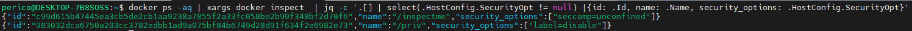
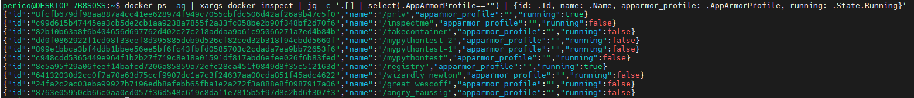

# Security

Ensuring the security of Docker environments involves a comprehensive approach, covering the security of images, containers, the Docker daemon, and Docker registry. This document expands on the key security measures, providing examples and details for implementing each control.

- [Security](#security)
  - [Image Security](#image-security)
    - [Use Trusted Base Images](#use-trusted-base-images)
      - [Docker content trust](#docker-content-trust)
      - [Image hash](#image-hash)
      - [Digital signature](#digital-signature)
      - [Allowed sources](#allowed-sources)
    - [Minimize Image Layers](#minimize-image-layers)
      - [Multi-Stage Builds](#multi-stage-builds)
      - [Distroless images](#distroless-images)
      - [Images from scratch](#images-from-scratch)
      - [Install only required packages](#install-only-required-packages)
    - [Protect sensitive content - Secrets](#protect-sensitive-content---secrets)
      - [Avoid hardcoding of secrets](#avoid-hardcoding-of-secrets)
      - [Use Key vault integrations](#use-key-vault-integrations)
      - [Utilize Docker secrets](#utilize-docker-secrets)
      - [Utilize environment variables](#utilize-environment-variables)
      - [Files and directory permissions](#files-and-directory-permissions)
    - [Verify security in images](#verify-security-in-images)
      - [Lint Dockerfile](#lint-dockerfile)
      - [Perform SCA (CVE search) for image dependencies](#perform-sca-cve-search-for-image-dependencies)
      - [Search for malware](#search-for-malware)
      - [Ensure no secrets in the file system](#ensure-no-secrets-in-the-file-system)
      - [Ensure application security (holistic AST)](#ensure-application-security-holistic-ast)
    - [Keep components updated](#keep-components-updated)
  - [Container Security](#container-security)
    - [Avoid root users](#avoid-root-users)
    - [Utilize only required kernel capabilities](#utilize-only-required-kernel-capabilities)
      - [Do Not Permit Privileged Containers](#do-not-permit-privileged-containers)
      - [Restrict SecComp unconfined](#restrict-seccomp-unconfined)
      - [Restrict AppArmor unconfined](#restrict-apparmor-unconfined)
    - [Ensure network segmentation and enforce isolation practices](#ensure-network-segmentation-and-enforce-isolation-practices)
    - [Manage volumes securely](#manage-volumes-securely)
      - [Use read-only file systems](#use-read-only-file-systems)
      - [Manage mounts permissions](#manage-mounts-permissions)
    - [Limit container resources](#limit-container-resources)
    - [Use security profiles](#use-security-profiles)
    - [Monitor container activities](#monitor-container-activities)
      - [Detect abnormal behavior](#detect-abnormal-behavior)
      - [Register container transactions - history](#register-container-transactions---history)
      - [Monitor container resource consumption](#monitor-container-resource-consumption)
      - [Ensure healthy containers](#ensure-healthy-containers)
      - [Utilize logging systems](#utilize-logging-systems)
  - [Daemon/Host Security](#daemonhost-security)
    - [Verify Docker CIS benchmark for daemon](#verify-docker-cis-benchmark-for-daemon)
    - [Ensure authenticated users in the host](#ensure-authenticated-users-in-the-host)
    - [Limit Docker daemon exposition](#limit-docker-daemon-exposition)
      - [Network visibility to the API](#network-visibility-to-the-api)
        - [Docker sock](#docker-sock)
      - [Docker group protection](#docker-group-protection)
      - [Implement A\&A protection for Docker](#implement-aa-protection-for-docker)
    - [Monitor processes](#monitor-processes)
    - [Apply hardening techniques to host](#apply-hardening-techniques-to-host)
      - [AppArmor](#apparmor)
      - [SeLinux](#selinux)
      - [Ubnutu hardening](#ubnutu-hardening)
      - [Ansible DevSec Hardening framework](#ansible-devsec-hardening-framework)
    - [Regularly update and patch host and its technologies](#regularly-update-and-patch-host-and-its-technologies)
  - [Docker Registry security](#docker-registry-security)
    - [Harden the registry](#harden-the-registry)
      - [Set-up TLS](#set-up-tls)
      - [Implement RBAC](#implement-rbac)
      - [Limit network connectivity and sources](#limit-network-connectivity-and-sources)
    - [Differentiate environments - tenants](#differentiate-environments---tenants)
    - [Restrict access to registry - approval pipelines](#restrict-access-to-registry---approval-pipelines)
    - [Monitor registry - audit logs](#monitor-registry---audit-logs)
    - [Actively scan the registry](#actively-scan-the-registry)

## Image Security

Ensuring the security of Docker images is crucial to the overall security posture of containerized applications. Below, we detail the recommended controls for securing Docker images.

### Use Trusted Base Images

Trusting the sources of the images that you can use in your environment is highly important. There are infinity of container sources and millions of vulnerable or malicious images.
Limiting what is available in your environment and reducing it to only a valid source of trust is critical enabling security and reducing the overall risk of using containers and its features.

#### Docker content trust

#### Image hash

#### Digital signature

#### Allowed sources

______________________________________________________________________

### Minimize Image Layers

A valid generalization in security space is that the more utilities, resources, assets and libraries are available in a system, the more likely is the system to be able to be compromised.
In other words, if there are more elements, it is more likely to find an exploitable path due to increase in the attack surface.

Therefore, it is critical to be able to reduce it and limit only to the bare minimum required elements in the build image to avoild exploitation, lateral movement and privilege escalation among other issues.

#### Multi-Stage Builds

#### Distroless images

#### Images from scratch

#### Install only required packages

Mention to Docker-Slim

______________________________________________________________________

### Protect sensitive content - Secrets

#### Avoid hardcoding of secrets

#### Use Key vault integrations

#### Utilize Docker secrets

#### Utilize environment variables

#### Files and directory permissions

______________________________________________________________________

### Verify security in images

#### Lint Dockerfile

Hadolint

#### Perform SCA (CVE search) for image dependencies

Clair
Trivy
Grype
Syft

#### Search for malware

#### Ensure no secrets in the file system

#### Ensure application security (holistic AST)

By following these controls and implementing the examples provided, you can significantly enhance the security of your Docker images, creating a more secure foundation for your containerized applications.

______________________________________________________________________

### Keep components updated

Define a policy of maximum created time for an image and alert for a new build when threshold is reached.

______________________________________________________________________

## Container Security

This section focuses on the controls and proactive actions that can be performed in a Docker environment, to improve the security posture overall by targeting container security best practices.

### Avoid root users

______________________________________________________________________

### Utilize only required kernel capabilities

#### Do Not Permit Privileged Containers

Privileged containers are granted nearly unrestricted access to host resources, bypassing the security mechanisms of the container runtime, such as SELinux, AppArmor, and seccomp profiles. Running a container in `--privileged` mode effectively disables the security boundaries normally provided by Docker, making it equivalent to running processes directly on the host system. This level of access includes but is not limited to manipulating the host’s network stack, accessing the host’s devices, and modifying kernel configurations. Consequently, if a privileged container is compromised, the attacker could gain control over the entire host system, leading to a significant security breach.

To identify containers running in privileged mode, you can use the following command. This allows administrators to audit existing containers and assess their security posture.

```bash
docker ps --quiet --all | xargs docker inspect --format '{{.Id}}: Privileged={{.HostConfig.Privileged}} - Running={{.State.Running}}'
```

```bash
## Using jq
docker ps --quiet --all | xargs docker inspect | jq -c '.[] | select(.State.Running == true and .HostConfig.Privileged == true) | {id: .Id, name: .Name, running: .State.Running}'
```

This one-liner iterates over all containers, inspecting each to report whether it is running in privileged mode. Containers with "Privileged=true" are running in privileged mode and require further inspection to justify their configuration.

Other important considerations:

- **Justification**: Ensure that the use of privileged containers is justified and documented. For each case where a privileged container is deemed necessary, document the specific requirements that lead to this decision.

- **Alternatives**: Explore alternatives to privileged containers. Docker provides various fine-grained capabilities that can be enabled individually with the `--cap-add` flag. By granting specific capabilities required by your application instead of enabling privileged mode, you can adhere to the principle of least privilege.

- **Security Policies**: Implement security policies within your organization that restrict the use of privileged containers. Use tools like Pod Security Policies in Kubernetes or Docker Bench for Security that enforce these policies and scan for configurations that deviate from security best practices.

#### Restrict SecComp unconfined

Another important check for your containers, is to ensure the proper SecComp profile is applied or at least the default.

This one liner checks the security options for all the containers to showcase those that have a non-default behavior.

```bash
docker ps -aq | xargs docker inspect  | jq -c '.[] | select(.HostConfig.SecurityOpt != null) |{id: .Id, name: .Name, security_options: .HostConfig.SecurityOpt}'
```



Other way of finding the `SecComp` profile applied to a container is to get the `/proc/<PID-OF-CONTAINER>/status` content.

We can combine both actions with the following:

```bash
declare -A pid_container_map
for container_id in $(docker ps -aq); do
  pid=$(ps aux | grep ${container_id} | grep containerd | awk '{print $2}')
  if [ ! -z "$pid" ]; then
    pid_container_map[$pid]=$container_id
  fi
done

for pid in "${!pid_container_map[@]}"; do
  seccomp=$(grep -w 'Seccomp:' /proc/${pid}/status | awk '{print $2}')
  if [ "$seccomp" == "0" ]; then
    echo "Alert: Insecure configuration detected for PID $pid (Container ID: ${pid_container_map[$pid]}). Seccomp value is 0."
  fi
done
```

#### Restrict AppArmor unconfined

Similar a SecComp check, AppArmor unsecure disabling of a profile must be checked in order to ensure there is no such.

In order to do so, check all the containers labeled as `apparmor=unconfined`.

This command does the trick:

```bash
docker ps -aq | xargs docker inspect  | jq -c '.[] | select(.HostConfig.SecurityOpt != null and (.HostConfig.SecurityOpt | contains(["apparmor=unconfined"]))) | {id: .Id, name: .Name, security_options: .HostConfig.SecurityOpt}'
```

Another important check - specially for production environments - is to check if the container has an AppArmor profile applied.

```bash
docker ps -aq | xargs docker inspect | jq -c '.[] | select(.AppArmorProfile=="") | {id: .Id, name: .Name, apparmor_profile: .AppArmorProfile, running: State.Running}'
```



______________________________________________________________________

### Ensure network segmentation and enforce isolation practices

______________________________________________________________________

### Manage volumes securely

______________________________________________________________________

#### Use read-only file systems

#### Manage mounts permissions

______________________________________________________________________

### Limit container resources

______________________________________________________________________

### Use security profiles

Seccomp

______________________________________________________________________

### Monitor container activities

#### Detect abnormal behavior

Sysdig falco

#### Register container transactions - history

#### Monitor container resource consumption

#### Ensure healthy containers

DOS --> healthcheck

#### Utilize logging systems

______________________________________________________________________

## Daemon/Host Security

### Verify Docker CIS benchmark for daemon

---

### Ensure authenticated users in the host

Avoid any system/integration accounts. All users must be nominal. Ideally use PAM or other authentication services (unique sessions with SSH, etc.) so any user accesing the host system is properly authenticated.

______________________________________________________________________

### Limit Docker daemon exposition

#### Network visibility to the API

##### Docker sock

By default Docker Daemon is listening in UNIX socket `/var/run/docker.sock` and not exposed to external sources.
If fact, by default installation only `root` user can interact with the socket.

There are many environments where the developer is granted with the `Docker` group, that allows connectivity to the socket and interaction with the Daemon is not limited.

While this feature gives more agility to the developers, it also brings an inherent risk if other security measures are not imposed and could potentially represent the possibility for the developer to obtain root access (e.g., mounting the file system.)

> [!CAUTION]
> Never grant access to QA, Pre and Production environments to developers including them in the Docker security group. It is critical to have this really controlled.

This bash command allows to quickly identify the users that are part of the `Docker` group. This users must be a very reduced group of people carefully controled (if neccesary at all).

```bash
grep -i 'docker' /etc/group | cut -d ':' -f 4 | tr ',' '\n'
```

Same for sudo.

```bash
grep -i 'sudo' /etc/group | cut -d ':' -f 4 | tr ',' '\n'
```

#### Docker group protection

#### Implement A&A protection for Docker

______________________________________________________________________

### Monitor processes

______________________________________________________________________

### Apply hardening techniques to host

#### AppArmor

#### SeLinux

#### Ubnutu hardening

#### Ansible DevSec Hardening framework

______________________________________________________________________

### Regularly update and patch host and its technologies

______________________________________________________________________

## Docker Registry security

### Harden the registry

#### Set-up TLS

#### Implement RBAC

#### Limit network connectivity and sources

______________________________________________________________________

### Differentiate environments - tenants

______________________________________________________________________

### Restrict access to registry - approval pipelines

______________________________________________________________________

### Monitor registry - audit logs

______________________________________________________________________

### Actively scan the registry
