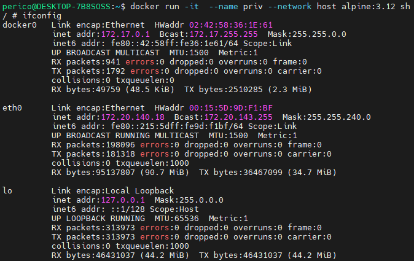

# Security

Ensuring the security of Docker environments involves a comprehensive approach, covering the security of images, containers, the Docker daemon, and Docker registry. This document expands on the key security measures, providing examples and details for implementing each control.

This documentation includes security practices explained generally and with specific details for `Docker` and `Kubernetes`.

- [Security](#security)
  - [Image Security](#image-security)
    - [Use Trusted Base Images](#use-trusted-base-images)
      - [Docker Content Trust](#docker-content-trust)
      - [Digital Signature](#digital-signature)
      - [Allowed Sources](#allowed-sources)
    - [Minimize Image Layers](#minimize-image-layers)
      - [Multi-Stage Builds](#multi-stage-builds)
      - [Distroless Images](#distroless-images)
      - [Images from scratch](#images-from-scratch)
      - [Install only required packages](#install-only-required-packages)
    - [Protect sensitive content - Secrets](#protect-sensitive-content---secrets)
      - [Avoid hardcoding of secrets](#avoid-hardcoding-of-secrets)
      - [Use Key vault integrations](#use-key-vault-integrations)
      - [Utilize Docker secrets](#utilize-docker-secrets)
      - [Utilize environment variables](#utilize-environment-variables)
      - [Files and directory permissions](#files-and-directory-permissions)
    - [Verify security in images](#verify-security-in-images)
      - [Lint Dockerfile](#lint-dockerfile)
      - [Perform SCA (CVE search) for image dependencies](#perform-sca-cve-search-for-image-dependencies)
      - [Search for malware](#search-for-malware)
      - [Ensure no secrets in the file system](#ensure-no-secrets-in-the-file-system)
      - [Ensure application security (holistic AST)](#ensure-application-security-holistic-ast)
    - [Keep components updated](#keep-components-updated)
  - [Container Security](#container-security)
    - [Avoid root users](#avoid-root-users)
    - [Utilize only required kernel capabilities](#utilize-only-required-kernel-capabilities)
      - [Do Not Permit Privileged Containers](#do-not-permit-privileged-containers)
      - [Restrict SecComp unconfined](#restrict-seccomp-unconfined)
      - [Restrict AppArmor unconfined](#restrict-apparmor-unconfined)
    - [Ensure Network Segmentation and Enforce Isolation Practices](#ensure-network-segmentation-and-enforce-isolation-practices)
      - [Avoid Sharing Host Network](#avoid-sharing-host-network)
    - [Manage volumes securely](#manage-volumes-securely)
      - [Use read-only file systems](#use-read-only-file-systems)
      - [Manage mounts permissions](#manage-mounts-permissions)
    - [Limit container resources](#limit-container-resources)
    - [Use Security Profiles](#use-security-profiles)
      - [Seccomp](#seccomp)
      - [AppArmor](#apparmor)
      - [OPA Gatekeeper](#opa-gatekeeper)
    - [Monitor container activities](#monitor-container-activities)
      - [Detect Abnormal Behavior](#detect-abnormal-behavior)
      - [Register container transactions - history](#register-container-transactions---history)
      - [Monitor container resource consumption](#monitor-container-resource-consumption)
      - [Ensure healthy containers](#ensure-healthy-containers)
      - [Utilize logging systems](#utilize-logging-systems)
        - [Docker Events](#docker-events)
          - [Types of Events](#types-of-events)
          - [Security Implications](#security-implications)
          - [Using `docker events`](#using-docker-events)
        - [Docker Logs](#docker-logs)
          - [Log Location and Types](#log-location-and-types)
          - [Security and Operational Insights](#security-and-operational-insights)
          - [Log Management Practices](#log-management-practices)
    - [Conclusion](#conclusion)
  - [Daemon/Host Security](#daemonhost-security)
    - [Verify Docker CIS benchmark for daemon](#verify-docker-cis-benchmark-for-daemon)
    - [Ensure authenticated users in the host](#ensure-authenticated-users-in-the-host)
    - [Limit Docker daemon exposition](#limit-docker-daemon-exposition)
      - [Network visibility to the API](#network-visibility-to-the-api)
        - [Docker sock](#docker-sock)
        - [Docker over TLS](#docker-over-tls)
      - [Docker group protection](#docker-group-protection)
      - [Implement A\&A protection for Docker](#implement-aa-protection-for-docker)
    - [Monitor processes](#monitor-processes)
    - [Apply Hardening Techniques to Host](#apply-hardening-techniques-to-host)
      - [AppArmor](#apparmor-1)
      - [SELinux](#selinux)
      - [Ubuntu Hardening](#ubuntu-hardening)
      - [OpenSCAP](#openscap)
      - [Ansible DevSec Hardening Framework](#ansible-devsec-hardening-framework)
    - [Regularly Update and Patch Host and Its Technologies](#regularly-update-and-patch-host-and-its-technologies)
      - [System Packages](#system-packages)
      - [CRI Specific Packages](#cri-specific-packages)
      - [Kubernetes Components](#kubernetes-components)
      - [Kubernetes Update Strategy](#kubernetes-update-strategy)
  - [Docker Registry security](#docker-registry-security)
    - [Harden the registry](#harden-the-registry)
      - [Set-up TLS](#set-up-tls)
      - [Implement RBAC](#implement-rbac)
      - [Limit network connectivity and sources](#limit-network-connectivity-and-sources)
    - [Differentiate environments - tenants](#differentiate-environments---tenants)
    - [Restrict access to registry - approval pipelines](#restrict-access-to-registry---approval-pipelines)
    - [Monitor registry - audit logs](#monitor-registry---audit-logs)
    - [Actively scan the registry](#actively-scan-the-registry)

## Image Security

Ensuring the security of Docker images is crucial to the overall security posture of containerized applications. Below, we detail the recommended controls for securing Docker images.

### Use Trusted Base Images

Trusting the sources of the images that you can use in your environment is highly important. There are infinity of container sources and millions of vulnerable or malicious images.
Limiting what is available in your environment and reducing it to only a valid source of trust is critical enabling security and reducing the overall risk of using containers and its features.

#### Docker Content Trust

Docker Content Trust (DCT) enhances the security of your containerized applications by ensuring the integrity and publisher of all the data received over the network. Leveraging The Update Framework (TUF) and Notary, DCT provides a strong guarantee that your Docker images are exactly what the publisher intended, free from any tampering or unwanted modifications. By signing images and verifying signatures upon pulling, DCT prevents the deployment of unauthorized or altered images.

**Example:** Enable DCT by setting the `DOCKER_CONTENT_TRUST` environment variable before pulling or pushing images.

```bash
export DOCKER_CONTENT_TRUST=1
docker pull <image_name>
```

This command ensures that only signed images are pulled from the registry, significantly reducing the risk of malicious content.

This configuration reduces our exposition to malicious images. However, what happens with our own images in our private repository?
To ensure we are able to work with `DOCKER_CONTENT_TRUST` enabled, our own images muy be digitaly signed with `Notary` server.

TODO: Link with 05_sign_docker_images challenge when done.

Sure, here's the extended documentation:

```markdown
#### Image Hash

An image hash is a unique identifier that is generated by applying a cryptographic hash function to the image data. Docker uses SHA256 hashes to uniquely identify images. This ensures that every distinct image will have a unique hash. When pulling or running images, you can specify the image's hash instead of its tag to ensure that the exact image is used.

```bash
docker pull ubuntu@sha256:45b23dee08af5e43a7fea6c4cf9c25ccf269ee113168c19722f87876677c5cb2
```

#### Digital Signature

Digital signatures provide a way to verify the authenticity and integrity of data. In the context of Docker and Kubernetes, digital signatures can be used to ensure that the images you're using in your deployments are exactly what the publisher intended.

For example, you can use Cosign to sign and verify container images:

```bash
# Sign the image
cosign sign -key cosign.key <image_name>

# Verify the image
cosign verify -key cosign.pub <image_name>
```

#### Allowed Sources

In Docker environments, you can restrict network access to only allow pulling images from certain registries. This can be done by configuring the Docker daemon with a whitelist of allowed registries.

In Kubernetes, you can use Admission Controllers to enforce policies on what images can be run in your cluster. For example, you can use the ImagePolicyWebhook admission controller to reject deployments that use images from untrusted sources.

Additionally, network policies can be used in both Docker and Kubernetes environments to restrict network access at the container or pod level, further limiting where images can be pulled from.

Example OPA policy with hypothetical registry `company.official.repo`

```rego
package kubernetes.admission

deny[msg] {
    input.request.kind.kind == "Pod"
    image := input.request.object.spec.containers[_].image
    not startswith(image, "company.official.repo")
    msg := sprintf("image '%v' comes from a disallowed registry", [image])
}
```

______________________________________________________________________

### Minimize Image Layers

A valid generalization in security space is that the more utilities, resources, assets and libraries are available in a system, the more likely is the system to be able to be compromised.
In other words, if there are more elements, it is more likely to find an exploitable path due to increase in the attack surface.

Therefore, it is critical to be able to reduce it and limit only to the bare minimum required elements in the build image to avoild exploitation, lateral movement and privilege escalation among other issues.

#### Multi-Stage Builds

#### Distroless Images

Distroless images offer a way to build more secure containerized applications by minimizing the attack surface. These images contain only the application and its runtime dependencies, omitting package managers, shells, and other utilities typically found in a standard Linux distribution. This reduction in size and complexity significantly decreases the potential for security vulnerabilities.

Consider a Python application Dockerfile example that leverages distroless images for enhanced security:

```Dockerfile
# Build stage for compiling dependencies
FROM python:3.9-slim AS build

COPY requirements.txt .

# Install only the necessary dependencies
RUN apt-get update && \
    apt-get install --no-install-suggests --no-install-recommends --yes \
    build-essential libpython3-dev && \
    python3 -m venv /venv && \
    /venv/bin/pip install --upgrade pip && \
    /venv/bin/pip install -r requirements.txt

# Final stage using a distroless image
FROM gcr.io/distroless/python3-debian11

WORKDIR /app
COPY --from=build /venv /venv
COPY . .

# Application startup command
CMD ["/venv/bin/python", "app.py"]
```

This Dockerfile uses a multi-stage build process: the first stage installs the necessary dependencies using a slim base image, while the final stage uses a distroless image. By copying only the application and its runtime environment to the distroless image, it significantly reduces potential security risks and the overall image size, promoting the creation of more secure, production-ready container images.

#### Images from scratch

#### Install only required packages

Mention to Docker-Slim

______________________________________________________________________

### Protect sensitive content - Secrets

#### Avoid hardcoding of secrets

#### Use Key vault integrations

#### Utilize Docker secrets

#### Utilize environment variables

#### Files and directory permissions

______________________________________________________________________

### Verify security in images

#### Lint Dockerfile

Linting Dockerfiles is an essential practice for ensuring your container images are secure, efficient, and adhere to best practices. **Hadolint** is a standout tool in this space, integrating seamlessly into CI/CD pipelines to analyze Dockerfiles against a set of best practices. It not only identifies potential issues but also suggests fixes, helping improve the Dockerfile's quality.

Another notable tool is **Dockle**, a container image linter that focuses on security and best practices. Dockle scans your container images for common pitfalls and security issues, providing insights and recommendations to enhance your container security posture.

Other relevant Dockerfile linters include:

- **Dockerfilelint**: This is an open-source tool that helps developers validate their Dockerfiles. It checks for syntax errors, inefficient coding practices, and potential security vulnerabilities.

- **Dive**: While primarily a tool for exploring a Docker image, Dive can be used indirectly to lint Dockerfiles by analyzing the layers and contents of an image built from a Dockerfile. It helps identify ways to make the image more efficient by reducing its size and removing unnecessary files or layers.

Incorporating these tools into your development workflow can significantly improve the quality and security of your Docker images. By linting Dockerfiles with Hadolint, Dockle, and other similar tools, developers can adhere to best practices, minimize security vulnerabilities, and ensure their images are optimized for production.

#### Perform SCA (CVE search) for image dependencies

Software Composition Analysis (SCA) is crucial for container security, identifying vulnerabilities in container image dependencies. Tools like **Clair** analyze images for known vulnerabilities, **Trivy** offers comprehensive scans across OS, middleware, and language-specific packages, **Grype** specializes in finding and managing security issues in container images, and **Syft** generates a detailed bill of materials (SBOM) for container images to track dependencies. Together, these tools enhance the security posture of containerized applications by ensuring dependencies are continuously monitored for vulnerabilities.

For detailed example on how to use this tools, check [Static analysis of images challenge in this repo](./modules/09_static_analysis_of_images/solutions/README.md).

#### Search for malware

#### Ensure no secrets in the file system

#### Ensure application security (holistic AST)

By following these controls and implementing the examples provided, you can significantly enhance the security of your Docker images, creating a more secure foundation for your containerized applications.

______________________________________________________________________

### Keep components updated

Define a policy of maximum created time for an image and alert for a new build when threshold is reached.

______________________________________________________________________

## Container Security

This section focuses on the controls and proactive actions that can be performed in a Docker environment, to improve the security posture overall by targeting container security best practices.

### Avoid root users

______________________________________________________________________

### Utilize only required kernel capabilities

#### Do Not Permit Privileged Containers

Privileged containers are granted nearly unrestricted access to host resources, bypassing the security mechanisms of the container runtime, such as SELinux, AppArmor, and seccomp profiles. Running a container in `--privileged` mode effectively disables the security boundaries normally provided by Docker, making it equivalent to running processes directly on the host system. This level of access includes but is not limited to manipulating the host’s network stack, accessing the host’s devices, and modifying kernel configurations. Consequently, if a privileged container is compromised, the attacker could gain control over the entire host system, leading to a significant security breach.

To identify containers running in privileged mode, you can use the following command. This allows administrators to audit existing containers and assess their security posture.

```bash
docker ps --quiet --all | xargs docker inspect --format '{{.Id}}: Privileged={{.HostConfig.Privileged}} - Running={{.State.Running}}'
```

```bash
## Using jq
docker ps --quiet --all | xargs docker inspect | jq -c '.[] | select(.State.Running == true and .HostConfig.Privileged == true) | {id: .Id, name: .Name, running: .State.Running}'
```

This one-liner iterates over all containers, inspecting each to report whether it is running in privileged mode. Containers with "Privileged=true" are running in privileged mode and require further inspection to justify their configuration.

Other important considerations:

- **Justification**: Ensure that the use of privileged containers is justified and documented. For each case where a privileged container is deemed necessary, document the specific requirements that lead to this decision.

- **Alternatives**: Explore alternatives to privileged containers. Docker provides various fine-grained capabilities that can be enabled individually with the `--cap-add` flag. By granting specific capabilities required by your application instead of enabling privileged mode, you can adhere to the principle of least privilege.

- **Security Policies**: Implement security policies within your organization that restrict the use of privileged containers. Use tools like Pod Security Policies in Kubernetes or Docker Bench for Security that enforce these policies and scan for configurations that deviate from security best practices.

#### Restrict SecComp unconfined

Another important check for your containers, is to ensure the proper SecComp profile is applied or at least the default.

This one liner checks the security options for all the containers to showcase those that have a non-default behavior.

```bash
docker ps -aq | xargs docker inspect  | jq -c '.[] | select(.HostConfig.SecurityOpt != null) |{id: .Id, name: .Name, security_options: .HostConfig.SecurityOpt}'
```


Other way of finding the `SecComp` profile applied to a container is to get the `/proc/<PID-OF-CONTAINER>/status` content.

We can combine both actions with the following:

```bash
declare -A pid_container_map
for container_id in $(docker ps -aq); do
  pid=$(ps aux | grep ${container_id} | grep containerd | awk '{print $2}')
  if [ ! -z "$pid" ]; then
    pid_container_map[$pid]=$container_id
  fi
done

for pid in "${!pid_container_map[@]}"; do
  seccomp=$(grep -w 'Seccomp:' /proc/${pid}/status | awk '{print $2}')
  if [ "$seccomp" == "0" ]; then
    echo "Alert: Insecure configuration detected for PID $pid (Container ID: ${pid_container_map[$pid]}). Seccomp value is 0."
  fi
done
```

It is a good practice that containers run only with the `permissions` needed. For this reason is important to avoid using `unconfined` as default profile.

Example of limiting profile:

- Default allow of all system calls.
- Explicit denial of syscalls included in `names` list.

```json
{
    "defaultAction": "SCMP_ACT_ALLOW",
    "syscalls": [
        {
            "names": ["mkdir","rmdir","chown","chmod","kill"],
            "action": "SCMP_ACT_ERRNO",
            "args": []
        }
  ]
}
```

```bash
docker run -it --name container-name --security-opt seccomp=<profile-name>.json <container-image>
```

Possible `Actions`:

| Action           | Description                                                 |
| ---------------- | ----------------------------------------------------------- |
| `SCMP_ACT_KILL`  | Kill with a exit status of SIGSYS                           |
| `SCMP_ACT_TRAP`  | Send a SIGSYS signal without executing the syscall          |
| `SCMP_ACT_ERRNO` | Receive a return value of errno when it calls a syscall     |
| `SCMP_ACT_TRACE` | Invoke a ptracer to make a decision or set errno to -ENOSYS |
| `SCMP_ACT_ALLOW` | Allow executing the syscall                                 |

#### Restrict AppArmor unconfined

Similar a SecComp check, AppArmor insecure disabling of a profile must be checked in order to ensure there is no such.

In order to do so, check all the containers labeled as `apparmor=unconfined`.

This command does the trick:

```bash
docker ps -aq | xargs docker inspect  | jq -c '.[] | select(.HostConfig.SecurityOpt != null and (.HostConfig.SecurityOpt | contains(["apparmor=unconfined"]))) | {id: .Id, name: .Name, security_options: .HostConfig.SecurityOpt}'
```

Another important check - specially for production environments - is to check if the container has an AppArmor profile applied.

```bash
docker ps -aq | xargs docker inspect | jq -c '.[] | select(.AppArmorProfile=="") | {id: .Id, name: .Name, apparmor_profile: .AppArmorProfile, running: State.Running}'
```


______________________________________________________________________

### Ensure Network Segmentation and Enforce Isolation Practices

Network segmentation and isolation are critical components of container security. They limit the communication between containers to only what is necessary, reducing the potential attack surface.

#### Avoid Sharing Host Network

By default, Docker isolates containers from each other and from the host using a network driver called `bridge`. This creates a private network inside the host where each container gets its own network namespace. It's a good practice to maintain this isolation to prevent an attacker from performing lateral movement if a container is compromised.

Sharing the host network with a container means that the container uses the same network stack as the host, effectively giving it full visibility of all network interfaces on the host. This could potentially increase the resources that an attacker can exploit if the container is compromised.

As you can see in the following illustration, sharing the host network automatically provides visibility with all host interfaces that could potentially increase the resources that an attacker can exploit.



You can check for containers running in the host network with this command:

```bash
docker ps -aq | xargs docker inspect  | jq -c '.[] | select(.NetworkSettings.Networks.host != null) | {id: .Id, name: .Name, network: "host", network_id:.NetworkSettings.Networks.host.NetworkID}'
```

In a Kubernetes environment, the principle of network segmentation and isolation is just as important. Kubernetes supports a variety of network plugins to manage pod networking, and some of them provide network policy capabilities that allow you to control the network traffic to and from your pods.

For example, `Calico` is a popular network plugin for Kubernetes that provides network policy capabilities. With Calico, you can define network policies that control the traffic to and from your pods based on IP address, port, and protocol. This allows you to enforce network segmentation and isolation at the pod level.

`Istio` is another tool that can be used to enforce network segmentation (**`At L7`**) and isolation in a Kubernetes environment. Istio is a service mesh that provides traffic management, policy enforcement, and telemetry collection for your microservices. With Istio, you can define traffic routing rules and access policies that control the communication between your services.

> \[!NOTE\]
> There is integration available between Istio and Calico that can improve the experience of configuring it in a kubernetes cluster. [Calico - Istio Integration](https://docs.tigera.io/calico/latest/getting-started/kubernetes/hardway/istio-integration)

In addition to network plugins and service meshes, Kubernetes also provides built-in network policies that you can use to control the network traffic to and from your pods. These network policies allow you to specify which pods can communicate with each other and which network ports they can use.

Here's an example of a Kubernetes network policy that only allows traffic from pods in the same namespace:

```yaml
apiVersion: networking.k8s.io/v1
kind: NetworkPolicy
metadata:
  name: default-deny
spec:
  podSelector: {}
  policyTypes:
  - Ingress
  - Egress
  ingress:
  - from:
    - podSelector: {}
```

This policy selects all pods in the namespace (due to the empty `podSelector`) and denies all ingress and egress traffic by default. It then allows ingress traffic from any pod in the same namespace.

Remember, network segmentation and isolation are not just about blocking traffic. They're also about allowing the necessary traffic to flow freely. Always consider the communication needs of your applications when designing your network policies.

______________________________________________________________________

### Manage volumes securely

______________________________________________________________________

#### Use read-only file systems

#### Manage mounts permissions

______________________________________________________________________

### Limit container resources

______________________________________________________________________

### Use Security Profiles

Security profiles provide an added layer of security enforcement by restricting the actions that containers can perform in the Docker and Kubernetes environments.

#### Seccomp

Seccomp (Secure Computing Mode) is a Linux kernel feature that can be used to restrict the system calls a process can make. In Docker and Kubernetes, you can use a seccomp profile to limit the system calls a container can make.

For Docker, you can specify a seccomp profile like this:

```bash
docker run --security-opt seccomp=/path/to/seccomp/profile.json -it ubuntu bash
```

In Kubernetes, you can specify a seccomp profile using the `seccomp.security.alpha.kubernetes.io/pod` and `container.seccomp.security.alpha.kubernetes.io/...` annotations.

#### AppArmor

AppArmor (Application Armor) is a Linux kernel security module that allows the system administrator to restrict programs' capabilities with per-program profiles. 

For Docker, you can specify an AppArmor profile like this:

```bash
docker run --security-opt apparmor=your_apparmor_profile -it ubuntu bash
```

In Kubernetes, you can specify an AppArmor profile using the `container.apparmor.security.beta.kubernetes.io/...` annotation.

#### OPA Gatekeeper

OPA Gatekeeper is an open-source project that provides a first-class integration between Open Policy Agent (OPA) and Kubernetes. It enforces policies executed by OPA as a dynamic admission controller in a Kubernetes cluster.

> \[!IMPORTANT\]
> Having a set of centralized managed policies in Kubernetes is a **super win!**. If carefully defined, this allows to implement majority of security required controls and have a centralized management of the different policies and conditions under those policies are applied.

For example, you can use OPA Gatekeeper to enforce that all images must come from a certain registry:

```rego
package kubernetes.admission

deny[msg] {
    input.request.kind.kind == "Pod"
    image := input.request.object.spec.containers[_].image
    not startswith(image, "company.official.repo")
    msg := sprintf("image '%v' comes from a disallowed registry", [image])
}
```

This policy will deny any Pod that tries to run a container with an image that does not come from `company.official.repo`.

______________________________________________________________________

### Monitor container activities

#### Detect Abnormal Behavior

In containerized environments, detecting abnormal or suspicious behavior is crucial for maintaining security and operational integrity. Utilizing external tools like Sysdig Falco and Tracee offers advanced monitoring capabilities, enabling teams to identify and respond to potential threats in real time.

**Sysdig Falco** is an open-source tool designed for behavioral activity monitoring within containerized platforms. It leverages system calls from the Linux kernel to analyze the behavior of running containers and detects anomalous activity based on predefined rules. Falco can alert on violations such as unexpected network connections, changes to critical files, or unauthorized process spawning within containers. Its ruleset is highly customizable, allowing for the tailoring of detection mechanisms to fit specific environment needs or security policies. Alerts can be integrated with various endpoints like email, Slack, or a webhook, facilitating immediate response to detected threats.

**Tracee** by Aqua Security is another powerful tool focusing on runtime security and forensics. It utilizes eBPF (extended Berkeley Packet Filter) technology to capture a wide range of system and application events with minimal overhead. Tracee comes with a set of built-in detection rules based on common attack patterns, providing out-of-the-box security insights. It can detect suspicious file operations, network activity, or process executions that deviate from normal behavior. Tracee's ability to provide detailed context about each event, including the command line arguments, environment variables, and process relationships, makes it an invaluable tool for forensic analysis and understanding the scope of a security incident.

**Wazuh** is a versatile open-source platform designed for threat detection, integrity monitoring, incident response, and compliance. It provides a unified framework for monitoring and securing containerized environments, leveraging its capabilities to ensure comprehensive security coverage. Wazuh employs a combination of signature-based, anomaly detection, and behavioral analysis techniques to identify threats across the container lifecycle. It integrates with Docker and Kubernetes, monitoring logs, configurations, and network activity to detect anomalous behavior indicative of security incidents or misconfigurations.

#### Register container transactions - history

#### Monitor container resource consumption

#### Ensure healthy containers

DOS --> healthcheck

#### Utilize logging systems

##### Docker Events

In the context of security monitoring within Docker environments, understanding and tracking Docker events is paramount. Docker provides a command, `docker events`, that streams real-time events related to Docker objects. These events encompass a wide range of activities, from container lifecycle changes to image operations, offering insights into the operations being performed within the Docker environment.

###### Types of Events

Docker events can be categorized into several types, including but not limited to:

- **Container Events**: These include creation, start, stop, kill, commit, pause, unpause, and destruction of containers. Monitoring these events helps in understanding the container lifecycle and detecting anomalous activities that might compromise containerized applications.

- **Image Events**: Events such as pull, push, tag, delete, and load of Docker images. These events are vital for tracking the source and integrity of images used within the environment.

- **Network Events**: Including the creation, connection, disconnection, and deletion of Docker networks. Such events are essential for auditing network configurations and isolating network-related security issues.

- **Volume Events**: Comprising the creation, mounting, unmounting, and deletion of Docker volumes. Monitoring these events is crucial for data persistence and security, ensuring sensitive data is not unintentionally exposed or lost.

###### Security Implications

By monitoring Docker events, organizations can enhance their security posture in several ways:

- **Detect Unauthorized Access**: Unusual container or image activities might indicate unauthorized access or an attempted breach. Early detection of such activities allows for rapid response and mitigation.

- **Audit and Compliance**: Docker event logs serve as a comprehensive audit trail that can be used to demonstrate compliance with security policies and regulatory requirements, facilitating audits and investigations.

- **Configuration Management**: Tracking events related to networks and volumes helps in ensuring that configurations do not diverge from best practices, reducing the attack surface and mitigating risks associated with misconfigurations.

- **Operational Visibility**: Monitoring Docker events provides visibility into the operational aspects of the Docker environment, enabling the identification of performance issues, optimization opportunities, and security enhancements.

###### Using `docker events`

The `docker events` command streams real-time events from the Docker daemon. To filter events of interest, various options can be used, such as `--filter` to narrow down the events based on criteria like event type, container name, or image name. For example, to monitor events related to a specific container:

```bash
docker events --filter 'type=container' --filter 'container=<container_name>'
```

For security monitoring, it's advisable to integrate Docker event logs with a centralized logging or security information and event management (SIEM) system. This allows for the aggregation, analysis, and alerting on events across the Docker environment, facilitating proactive security monitoring and incident response.

> \[!IMPORTANT\]
> Docker daemon configuration allows to push the docker events to syslog by modifying the `/etc/docker/daemon.json` file.

##### Docker Logs

Docker logs are a fundamental resource for monitoring the activities and health of containers. Understanding where these logs are located, the types of logs available, and how to effectively manage and analyze them is essential for maintaining the operational integrity and security of Dockerized applications.

###### Log Location and Types

Docker primarily deals with two types of logs: **container logs** and **daemon logs**.

- **Container Logs**: These capture the stdout and stderr streams from the containerized application. By default, Docker stores these logs in JSON files on the host system, typically located in `/var/lib/docker/containers/[container-id]/`. The exact path can vary depending on the Docker daemon's storage driver and configuration. Container logs are accessed using the `docker logs [container-id or name]` command.

- **Daemon Logs**: The Docker daemon (`dockerd`) itself generates logs, which are crucial for diagnosing system-level issues, startup processes, and understanding the daemon's interactions with containers. The location of these logs varies by the host system's logging configuration—on systems using `systemd`, for example, daemon logs are managed by `journald` and can be accessed using `journalctl -u docker.service`.

###### Security and Operational Insights

Monitoring Docker logs provides vital insights into:

- **Application Behavior**: Understanding the output of containerized applications, including errors and warnings, which can indicate operational issues or potential security concerns.

- **Access Patterns**: Observing access logs (for applications that log access details to stdout/stderr) to detect anomalous patterns that might suggest unauthorized attempts to access the application.

- **System Issues**: Docker daemon logs offer a window into the workings of the Docker host, including network configurations, image management, and container lifecycle events, which are essential for troubleshooting and ensuring the security of the Docker environment.

###### Log Management Practices

Effective log management is crucial for maintaining the security and stability of both Docker and Kubernetes environments. It involves aggregating logs from various sources into a centralized logging system for ease of monitoring, analysis, and long-term storage. This practice enables more sophisticated analysis and alerting based on log data, aiding in prompt issue detection and resolution.

Some popular log aggregation systems:

- `Fluentd`: An open-source data collector for unified logging layers, which can be integrated with Docker and Kubernetes.
- `Logstash`: A server-side data processing pipeline that ingests data from multiple sources, transforms it, and then sends it to a "stash" like Elasticsearch.
- `Elasticsearch`: A search and analytics engine that is often used together with Logstash and Kibana, forming the ELK Stack.
- `Kibana`: A data visualization dashboard for Elasticsearch. It provides visualization capabilities on top of the content indexed on an Elasticsearch cluster.
- `Prometheus`: An open-source systems monitoring and alerting toolkit that can scrape metrics from different sources.
- `Grafana`: A multi-platform open-source analytics and interactive visualization web application that provides charts, graphs, and alerts for the web when connected to supported data sources.

> \[!IMPORTANT\]
> In addition to aggregating logs, it's important to back up your logs to protect against data loss or tampering. Regular backups can help ensure that you have access to historical log data when you need it, even if your primary log storage is compromised.

In a Kubernetes environment, you can use sidecar containers to collect and forward logs from each pod to your log aggregation system. This allows you to centralize logs from all of your applications, regardless of where they're running in your cluster.

Remember, effective log management is not just about collecting logs - it's also about making sense of them. Use tools and practices that help you analyze your logs and extract meaningful insights from them. This will help you detect and respond to security threats in real-time, maintain compliance, and ensure the smooth operation of your Dockerized and Kubernetes applications.

### Conclusion

Effectively monitoring Docker events is a critical component of securing containerized environments. By keeping a vigilant eye on the activities within Docker, organizations can detect and respond to security threats in real-time, maintain compliance, and ensure the smooth operation of their Dockerized applications.

______________________________________________________________________

## Daemon/Host Security

### Verify Docker CIS benchmark for daemon

______________________________________________________________________

### Ensure authenticated users in the host

Avoid any system/integration accounts. All users must be nominal. Ideally use PAM or other authentication services (unique sessions with SSH, etc.) so any user accessing the host system is properly authenticated.

______________________________________________________________________

### Limit Docker daemon exposition

#### Network visibility to the API

##### Docker sock

By default Docker Daemon is listening in UNIX socket `/var/run/docker.sock` and not exposed to external sources.
If fact, by default installation only `root` user can interact with the socket.

There are many environments where the developer is granted with the `Docker` group, that allows connectivity to the socket and interaction with the Daemon is not limited.

While this feature gives more agility to the developers, it also brings an inherent risk if other security measures are not imposed and could potentially represent the possibility for the developer to obtain root access (e.g., mounting the file system.)

> \[!CAUTION\]
> Never grant access to QA, Pre and Production environments to developers including them in the Docker security group. It is critical to have this really controlled.

This bash command allows to quickly identify the users that are part of the `Docker` group. This users must be a very reduced group of people carefully controlled (if necessary at all).

```bash
grep -i 'docker' /etc/group | cut -d ':' -f 4 | tr ',' '\n'
```

Same for sudo.

```bash
grep -i 'sudo' /etc/group | cut -d ':' -f 4 | tr ',' '\n'
```

##### Docker over TLS

There are some use cases in which the Docker Daemon API needs to be exposed over HTTP(s) instead of using the `/var/run/docker.sock`.
This could happen, for example, for allowing centralized management of the containers that are distributed across different hosts.

In case this is a functional requirement, the Docker Daemon API must be properly secured over TLS using certificates.

There are some things to consider:

- Use trusted certificates (generated by a trusted CA o intermediate CA or internal PKI).
- Ensure there is not HTTP exposition.
- Ensure the certificates are rotated.
- Ensure using secure crypto algorithms for certificate creation.

> \[!NOTE\]
> Check [Challenge - Expose Docker API HTTPS](./modules/04_expose_docker_api_https/solutions/README.md) for an example implementation. It is important to note that the PKI generation is self-signed. In a production/enterprise environment, certificates must be managed with internal PKI or signed by a world-wide trusted CA.

#### Docker group protection

#### Implement A&A protection for Docker

______________________________________________________________________

### Monitor processes

______________________________________________________________________

### Apply Hardening Techniques to Host

Hardening your host system is a crucial step in securing your containerized applications. This involves applying a series of configurations and controls to reduce the system's attack surface and improve its resistance to attacks.

#### AppArmor

AppArmor (Application Armor) is a Linux kernel security module that allows the system administrator to restrict programs' capabilities with per-program profiles. Profiles can allow or deny access to various system resources such as file permissions, network access, raw socket access, and more.

To use AppArmor, you first need to install it and then create or apply profiles for each program you want to restrict. Profiles are stored in `/etc/apparmor.d/`.

#### SELinux

SELinux (Security-Enhanced Linux) is a Linux kernel security module that provides a mechanism for supporting access control security policies. It includes mandatory access controls (MAC) that restrict users and processes to perform only allowed actions.

SELinux can operate in three modes: 

- Enforcing: SELinux policy is enforced and denials are logged.
- Permissive: SELinux policy is not enforced but denials are logged.
- Disabled: SELinux is turned off.

You can check the current mode with `getenforce` command and set it with `setenforce` command.

#### Ubuntu Hardening

Ubuntu, like other Linux distributions, comes with several built-in mechanisms for system hardening:

- User Account Control: Ensure that users operate with the least amount of privileges necessary by using standard accounts instead of accounts with administrative privileges.
- Firewall: Use `ufw` (Uncomplicated Firewall) to manage your firewall rules and restrict incoming and outgoing traffic.
- Automatic Updates: Enable automatic updates to ensure your system is always up-to-date with the latest security patches.
- Fail2ban: Install and configure Fail2ban to protect against brute-force attacks.

#### OpenSCAP

OpenSCAP (Open Security Content Automation Protocol) is an open-source framework for SCAP (Security Content Automation Protocol), a line of standards managed by NIST. It provides multiple tools to assist administrators and auditors with assessment, measurement, and enforcement of security baselines.

You can use OpenSCAP to automatically audit your system and ensure it complies with certain security standards like PCI-DSS, STIG, and others.

#### Ansible DevSec Hardening Framework

The DevSec Hardening Framework is a project that provides a set of Ansible roles for system hardening. It includes configurations for various parts of your system, including:

- Linux OS
- SSH
- MySQL
- NGINX

You can use these roles to automate the process of hardening your systems, ensuring a consistent application of security configurations across your infrastructure.
______________________________________________________________________

### Regularly Update and Patch Host and Its Technologies

Regular updates and patches are crucial for maintaining the security of your host system and the technologies running on it. This includes not only the operating system itself but also the Container Runtime Interface (CRI) specific packages, Kubernetes components, and any other software installed on the host.

#### System Packages

System packages form the foundation of your host system. They include the kernel, libraries, and utilities that your system and applications rely on. Regularly updating these packages ensures that you benefit from the latest security patches, bug fixes, and feature enhancements.

On a Linux system, you can use package managers like `apt` or `yum` to update your system packages:

```bash
# For Debian-based systems
sudo apt-get update
sudo apt-get upgrade

# For Red Hat-based systems
sudo yum update
```

#### CRI Specific Packages

The Container Runtime Interface (CRI) is a plugin interface defined in Kubernetes that allows the kubelet to use different container runtimes, without the need to recompile. Examples of CRI specific packages include Docker, containerd, and CRI-O. These packages should also be regularly updated to their latest stable versions to ensure optimal security and performance.

For example, to update Docker you can use:

```bash
sudo apt-get update
sudo apt-get install docker-ce docker-ce-cli containerd.io
```

#### Kubernetes Components

Kubernetes components such as kubelet, kubectl, kubeadm, and others should also be regularly updated. This ensures that your Kubernetes environment benefits from the latest features, bug fixes, and security patches.

You can update Kubernetes components using `kubeadm`:

```bash
sudo apt-get update
sudo apt-get upgrade kubeadm kubelet kubectl
sudo systemctl restart kubelet
```

#### Kubernetes Update Strategy

When updating Kubernetes, it's important to follow a proper update strategy. This typically involves updating the control plane components first (kube-apiserver, etcd, kube-scheduler, kube-controller-manager), followed by worker nodes.

Kubernetes supports several update strategies for applications running on it, including Rolling updates and Blue/Green deployments. These strategies allow you to update your applications with zero downtime.

Rolling updates gradually replace old pods with new ones. If the update process encounters an error, Kubernetes can automatically roll back to the previous stable state.

Blue/Green deployments involve running two environments (Blue and Green) side-by-side, with one serving live traffic and the other idle. When you update your application, you deploy the new version to the idle environment, test it, and then switch the live traffic to it.

Remember, regular updates and patches are a key part of maintaining the security and stability of your systems. Always test updates in a staging environment before deploying them to production to ensure they don't introduce new issues.

______________________________________________________________________

## Docker Registry security

Harbor

### Harden the registry

#### Set-up TLS

#### Implement RBAC

#### Limit network connectivity and sources

______________________________________________________________________

### Differentiate environments - tenants

______________________________________________________________________

### Restrict access to registry - approval pipelines

______________________________________________________________________

### Monitor registry - audit logs

______________________________________________________________________

### Actively scan the registry
