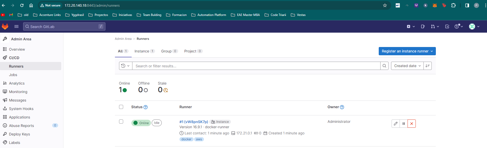

# GitLab Setup with Ansible

This directory contains resources for setting up GitLab using Ansible. It includes configuration for GitLab itself as well as GitLab Runner.

## Requirements

- `Docker Compose pip library installed`: pip install docker-compose

## Directory Structure

```
environment/
	gitlab/
		env_vars.yml
		install_gitlab.yml
		secret_vars.yml
		README.md
		.gitignore
```

## Files

- [`env_vars.yml`](env_vars.yml): This file contains the environment variables needed for the GitLab setup.

- [`install_gitlab.yml`](%22install_gitlab.yml%22): This is the main Ansible playbook that sets up GitLab.

- [`secret_vars.yml`](%22secret_vars.yml%22): This file contains sensitive variables such as passwords and secret keys.

- [`.gitignore`](%22.gitignore%22): This file specifies intentionally untracked files that Git should ignore.

## Usage

To use these resources to set up GitLab, run the [`install_gitlab.yml`](%22install_gitlab.yml%22) playbook with the [`env_vars.yml`](%22env_vars.yml%22) file as extra variables and the `.vault_pass.txt` file for the vault password:

```bash
ansible-playbook install_gitlab.yml -e env_vars.yml --vault-password-file .vault_pass.txt
```

This command will start the Ansible playbook that sets up GitLab. The `-e` option is used to specify the [`env_vars.yml`](%22env_vars.yml%22) file as extra variables, and the `--vault-password-file` option is used to specify the `.vault_pass.txt` file for the vault password.

Please replace `.vault_pass.txt` with your actual vault password file.

> \[!NOTE\]
> After the playbook is executed, you will be able to access the Gitlab UI (it takes 2 mins for set-up approximately) with a docker gitlab runner already configured 😉




> [!IMPORTANT]
> The runner is configured to share the volume of `/var/run/docker.sock` for connecting with the daemon and also `/builds` for being able to mount -v volumes in the pipeline.
> If this was not done, the bind volumes won't be useful in the pipeline because the path will be different when mounting any volume. This is required for bind mounts
> in the pipelines when running docker containers using the docker dind executor.