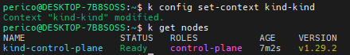
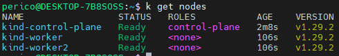

# Creating Kind Cluster

Kind, short for Kubernetes in Docker, is a tool that allows you to run Kubernetes clusters locally using Docker container "nodes". It was primarily designed for testing Kubernetes itself, but it may be used for local development or continuous integration.

Kind creates a cluster by running each of the Kubernetes components in a separate Docker container on your local machine. This includes the control plane components (like the API server, controller manager, and scheduler) and the worker nodes. Each worker node is a separate Docker container that runs a kubelet and a container runtime (like Docker or containerd) to handle the actual containers for your applications.

The main advantages of Kind are its speed and simplicity. It's much faster to start a Kind cluster than a full Kubernetes cluster, and it requires less resources. This makes it ideal for developers who want to quickly test their applications in a Kubernetes-like environment, or for running automated tests in a continuous integration pipeline.

> \[!CAUTION\]
> Kind is not suitable for production use. It's designed for testing and development, and it lacks some of the features and scalability of a full Kubernetes cluster.

## How to set up

1. Install Kind.

My preferred way is to do it from sources. [Kind Getting started - sources](https://kind.sigs.k8s.io/docs/user/quick-start)

```bash
curl -Lo ./kind https://kind.sigs.k8s.io/dl/v0.22.0/kind-linux-amd64; chmod +x kind
sudo mv kind /usr/local/bin
```

2. Create kind cluster:

```bash
kind create cluster
```


> \[!NOTE\]
> If you want to configure the cluster for having more nodes (either control plane or worker nodes) you must configure as well the following configuration file.

```bash
cat > config.yaml <<EOL
kind: Cluster
apiVersion: kind.x-k8s.io/v1alpha4
nodes:
- role: control-plane
- role: worker
- role: worker
EOL
kind create cluster --config config.yaml
```

2. Swith to the kind context for interacting with the cluster.

```bash
kubectl config set-context kind-kind
```



3. Check the cluster nodes.

```bash
kubectl get nodes
```



## Load images

Images that are not directly accessible can be obtained from a registry as always, but there is a quicker path to avoid that configuration in kind.

You can load a custom image into the cluster nodes so those are accessible.

Example:

```bash
cat > Dockerfile <<EOL
FROM alpine:3.12
ENTRYPOINT ["sleep", "infinity"]
EOL
docker build -f Dockerfile . -t custom:image
kind load docker-image custom:image
```


You can check if the image is present in the nodes with local crictl inside any of the nodes.

```bash
docker exec -it kind-worker crictl images | grep custom
```


Check pod creation:

```bash
kubectl run my-nginx --image="nginx" --dry-run -o json | jq '.spec.containers[].image = "custom:image"' | kubectl create -f -
```

