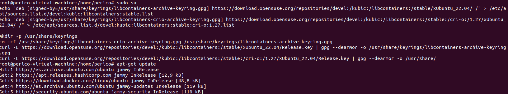
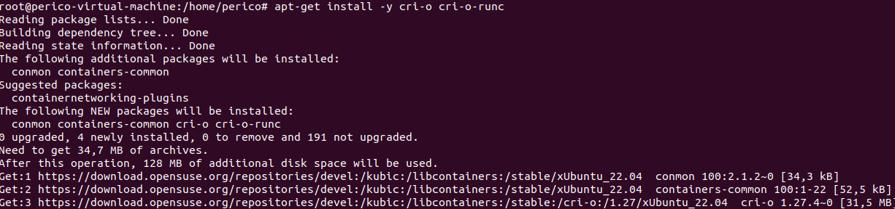
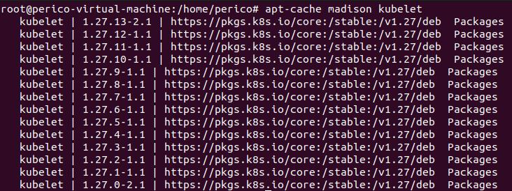
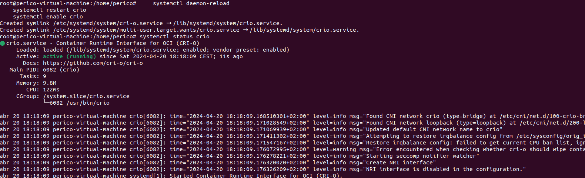
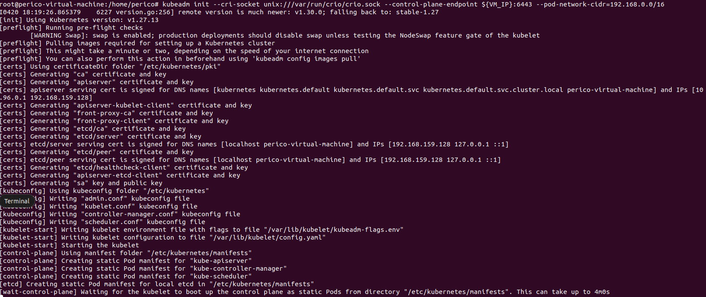
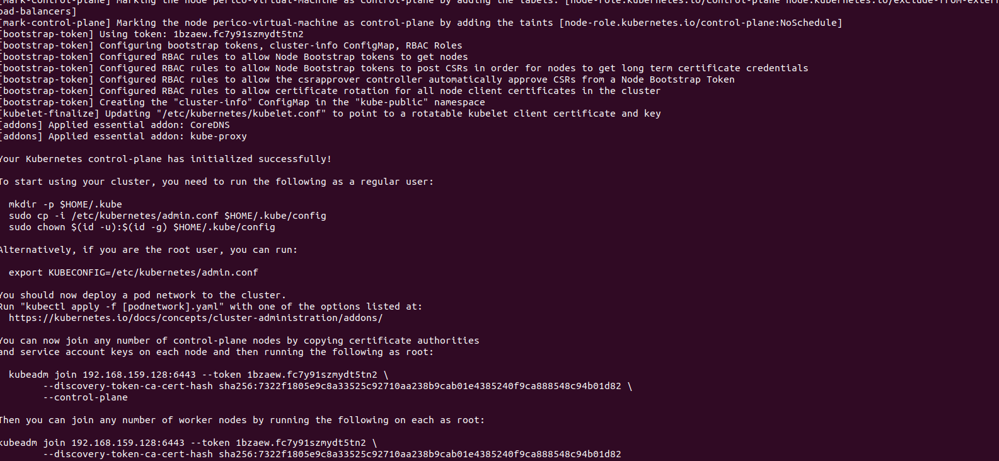
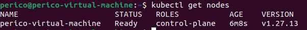
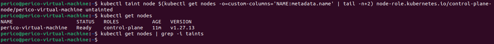
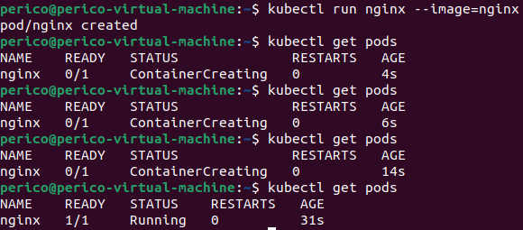

# Creating a Single Node Cluster with Kubeadm

Kubeadm is a tool built to provide `kubeadm init` and `kubeadm join` as best-practice "fast paths" for creating Kubernetes clusters. It performs the actions necessary to get a minimum viable cluster up and running.

> \[!CAUTION\]
> This setup is not suitable for production use. It's designed for learning and development purposes.

> \[!NOTE\]
> This documentation assumes that you have either a machine or VM with linux system (**prepared for ubuntu 22.04**).

## How to set up

## Install preferred CRI interface (in my case CRI-O).

### CRI-O sources

```bash
# As root --> sudo su
sudo su
echo "deb [signed-by=/usr/share/keyrings/libcontainers-archive-keyring.gpg] https://download.opensuse.org/repositories/devel:/kubic:/libcontainers:/stable/xUbuntu_22.04/ /" > /etc/apt/sources.list.d/devel:kubic:libcontainers:stable.list
echo "deb [signed-by=/usr/share/keyrings/libcontainers-crio-archive-keyring.gpg] https://download.opensuse.org/repositories/devel:/kubic:/libcontainers:/stable:/cri-o:/1.27/xUbuntu_22.04/ /" > /etc/apt/sources.list.d/devel:kubic:libcontainers:stable:cri-o:1.27.list

mkdir -p /usr/share/keyrings
rm -rf /usr/share/keyrings/libcontainers-crio-archive-keyring.gpg /usr/share/keyrings/libcontainers-archive-keyring.gpg
curl -L https://download.opensuse.org/repositories/devel:/kubic:/libcontainers:/stable/xUbuntu_22.04/Release.key | gpg --dearmor -o /usr/share/keyrings/libcontainers-archive-keyring.gpg
curl -L https://download.opensuse.org/repositories/devel:/kubic:/libcontainers:/stable:/cri-o:/1.27/xUbuntu_22.04/Release.key | gpg --dearmor -o /usr/share/keyrings/libcontainers-crio-archive-keyring.gpg
```



### Load required kernel modules and customize iptables as required

```bash
# As root --> sudo su
sudo su
modprobe br_netfilter
modprobe overlay
tee /etc/modules-load.d/k8s.conf <<EOF
overlay
br_netfilter
EOF

tee /etc/sysctl.d/z_kubernetes.conf<<EOF
  net.bridge.bridge-nf-call-ip6tables = 1
  net.bridge.bridge-nf-call-iptables = 1
  net.ipv4.ip_forward = 1
EOF
sysctl --system
```

The selected lines are kernel parameters that are often required to be set for Kubernetes networking to function properly. Here's what each of them does:

- `net.bridge.bridge-nf-call-ip6tables = 1`: This tells the kernel to pass bridged IPv6 traffic to iptables' chains. This is required for the kube-proxy to manage IPv6 traffic.
- `net.bridge.bridge-nf-call-iptables = 1`: This tells the kernel to pass bridged IPv4 traffic to iptables' chains. This is required for the kube-proxy to manage IPv4 traffic.
- `net.ipv4.ip_forward = 1`: This enables forwarding of incoming packets to their destination. It's required for routing to work properly in certain cases.

### CRI-O Installation

```bash
# As root --> sudo su
sudo su
apt-get update
apt-get install -y cri-o cri-o-runc
```



Make sure to check `runc` binary in `/usr/lib/cri-o-runc/sbin/runc`. If not present:

```bash
mv /usr/lib/cri-o-runc/sbin/runc /usr/bin
```

## Install kubernetes packages

### Get the sources

```bash
# sudo su
mkdir -p -m 755 /etc/apt/keyrings
curl -fsSL https://pkgs.k8s.io/core:/stable:/v1.27/deb/Release.key \
| gpg --dearmor -o /etc/apt/keyrings/kubernetes-apt-keyring.gpg

echo 'deb [signed-by=/etc/apt/keyrings/kubernetes-apt-keyring.gpg] https://pkgs.k8s.io/core:/stable:/v1.27/deb/ /' \
    | tee /etc/apt/sources.list.d/kubernetes.list

apt-get update
```

### Install packages

> \[!NOTE\]
> Check the exact minor version that is available after update with `apt-cache madison kubelet` (the version matches for `kubectl` and `kubeadm` packages as well). Make sure that medium version matches the CRI to avoid issues. 



```bash
# My version -->
export KUBERNETES_VERSION="1.27.13-2.1"
apt-get install -y kubelet=${KUBERNETES_VERSION}  kubeadm=${KUBERNETES_VERSION}  kubectl=${KUBERNETES_VERSION}  
```

## Initialize kubernetes cluster

### Mare sure CRI-O daemon is ready

```bash
systemctl daemon-reload
systemctl restart crio
systemctl enable crio
```


### Disable swap

```bash
# sudo su
echo "swapoff -a" > ${HOME}/.bashrc

swapoff -a
```

### Kubeadm init

> \[!CAUTION\]
> Make sure to change the `--pod-network-cidr` depending on your selected CNI For `Calico`: `192.168.0.0/16`

> \[!CAUTION\]
> Make sure to change the `--cri-socket` depending on your CRI (if you have multiple in the system, otherwise you can omit this). For CRI-O: `unix:///var/run/crio/crio.sock`

> \[!IMPORTANT\]
> You must obtain the ip of your VM. Use `ifconfig` to reveal your ip.

```bash
# Change VM_IP with your ip
export VM_IP="192.168.159.128"
kubeadm init --cri-socket unix:///var/run/crio/crio.sock --control-plane-endpoint ${VM_IP}:6443 \
--pod-network-cidr=192.168.0.0/16
```





## Interact with cluster

### Retrieve kubernetes admin config

```bash
# Exit root
mkdir -p ${HOME}/.kube
sudo cp -i /etc/kubernetes/admin.conf $HOME/.kube/config
sudo chown $(id -u):$(id -g) $HOME/.kube/config
```



### Untaint master node

> \[!CAUTION\]
> This is **not a production configuration. Single node clusters are totally discouraged for production**

The taint to remove is `node-role.kubernetes.io/control-plane:NoSchedule`. You can check it with `kubectl describe nodes | grep -i taints`

Removing the taints for the node allows scheduling of other pods.

```bash
kubectl taint node $(kubectl get nodes -o=custom-columns='NAME:metadata.name' | tail -n+2) node-role.kubernetes.io/control-plane-
```



### Schedule some pod for testing

```bash
kubectl run nginx --image=nginx
```

