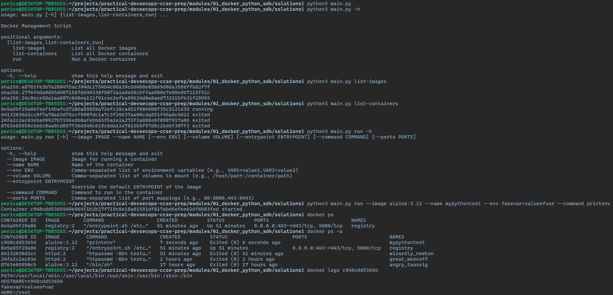

# Solution Guide: Docker Management with Python

This guide provides detailed steps to utilize the Python script for Docker management, which allows listing all Docker images and containers, and running a new container with specific configurations using the Docker SDK for Python. This script is a practical tool for those looking to automate and simplify Docker operations through Python programming.

## Requirements for this exercise

- Python 3.x installed on your system.
- Docker installed and running.
- Docker SDK for Python installed. You can install it using pip:
  ```bash
  pip install docker
  ```

## Step by step - Manual

### Step 1: Understanding the Python Script

The provided Python script `main.py` includes functionality for:

- Listing all Docker images.
- Listing all Docker containers.
- Running a new Docker container with options for environment variables, volume mappings, container name, image, entrypoint, command, and port mappings.

### Step 2: Execute the Python Script

To use the script, you can execute it from the command line with different arguments based on what you want to accomplish. Here are some examples:

#### List all Docker Images

```bash
python main.py list-images
```

#### List all Docker Containers

```bash
python main.py list-containers
```

#### Run a Docker Container

To run a container, specify the required arguments `--image` and `--name`, and optionally include `--env`, `--volume`, `--entrypoint`, `--command`, and `--ports`.

```bash
python main.py run --image nginx --name mynginx --env VAR1=value1,VAR2=value2 --volume /host/path:/container/path --entrypoint "/entrypoint.sh" --command "nginx -g 'daemon off;'" --ports 80:80
```



### Step 3: Verify Container Operation

After running the container, you can verify its operation by listing containers again or by checking Docker's dashboard or CLI to see the newly created container.

## Additional Notes

- This script is a starting point for Docker management with Python. You can extend it with more functionalities like stopping or removing containers, pulling images, etc.
- Remember to follow Python and Docker best practices when modifying the script for your use cases.
- Ensure Docker is running on your system before executing the script to avoid connection errors.

Congratulations on completing the Docker management challenge! This exercise enhances your skills in automating Docker operations using Python, a valuable skill set for development and operations tasks. 🚀
