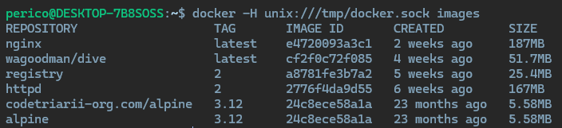
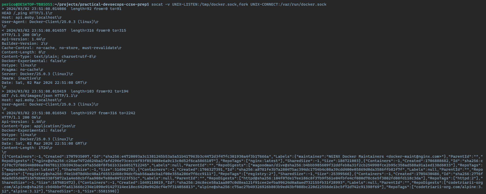

# Solution Guide: Analyze Docker sock Communication

This guide provides detailed steps for analyzing the communication between the Docker CLI and the Docker daemon through the Docker socket (`/var/run/docker.sock`). This exercise is designed to deepen your understanding of how Docker commands translate into API calls, enhancing your skills in Docker's internal mechanisms and API interaction.

## Requirements for this exercise

- Docker installed and running on your system.
- `socat` tool installed for creating a listener to observe Docker socket communication.
- Basic understanding of Unix sockets and Docker CLI operations.

## Step by step - Manual

### Step 1: Install `socat`

The `socat` utility allows data transfer between two addresses. Install it to create a listener on the Docker socket.

```bash
sudo apt-get update && sudo apt-get install -y socat
```

### Step 2: Create a Listener with `socat`

Set up `socat` to listen to a custom socket and forward the communications to the Docker socket. This enables capturing the data transmitted.

```bash
socat -v UNIX-LISTEN:/tmp/docker.sock,fork UNIX-CONNECT:/var/run/docker.sock
```

### Step 3: Perform Docker CLI Operations

With the listener in place, use the Docker CLI to perform operations through the intermediate socket. This captures the HTTP requests made by Docker CLI commands.

#### Capturing Image List Request

```bash
docker -H unix:///tmp/docker.sock images
```





#### Capturing Container List Request

```bash
docker -H unix:///tmp/docker.sock ps -a
```

#### Creating a New Container

```bash
docker -H unix:///tmp/docker.sock run --name fakecontainer alpine:3.12 "sleep" "infinity"
```

#### Executing a Command Inside a Running Container

```bash
docker -H unix:///tmp/docker.sock exec -it fakecontainer sh
```

#### Accessing Container Logs

```bash
docker -H unix:///tmp/docker.sock logs fakecontainer
```

### Step 4: Analyze Captured Communications

With `socat` relaying the communications, observe the console output to analyze the requests made by Docker CLI commands. This will include detailed information on the HTTP methods, endpoints, and data payloads used to interact with the Docker daemon.

## Security Considerations

- Exposing the Docker socket, even temporarily, can be a security risk. Ensure that access is tightly controlled and monitor the environment for unauthorized access.
- Using `socat` as a proxy for the Docker socket should be done in a secure and controlled manner, preferably in a test or isolated environment.

## Conclusion

By completing this challenge, you've gained practical experience in intercepting and analyzing the internal API communications of Docker. This knowledge is invaluable for debugging, developing Docker applications, and understanding the security implications of Docker operations. Congratulations on advancing your Docker expertise! 🚀
