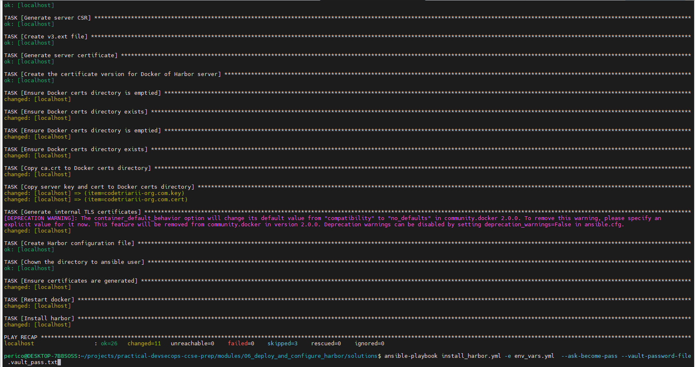

# Solution Guide: Deploy and Configure Harbor with HTTPS and Trivy Scanner

This guide outlines deploying Harbor with HTTPS and integrating the Trivy scanner using an Ansible playbook, ensuring a secure container image registry setup.

## Step by step - Ansible

### 1. Environment Preparation

Ensure Ansible, Docker, and necessary packages are installed on your system. Use `env_vars.yml` for environment configurations and `secret_vars.yml` for sensitive data like passwords and tokens.

### 2. Download and Extract Harbor Installer

The playbook automates downloading Harbor's installer and extracting it to the designated directory.

### 3. Generate and Apply TLS Certificates

Generate a CA, server, and client certificates for HTTPS, ensuring secure communication. The playbook includes tasks for creating a certificates directory, generating keys and certificates, and configuring Docker to trust these certificates.

### 4. Harbor Configuration and Deployment

Configure Harbor settings in `harbor.yml`, including HTTPS, internal TLS, authentication, and Trivy scanner integration. Install Harbor by executing the installation script with the `--with-trivy` option for vulnerability scanning.

### 5. Verify and Test

After installation, verify Harbor's correct setup by accessing its UI over HTTPS, uploading an image, and checking for vulnerability reports by Trivy.

Execute the playbook with:

```bash
ansible-playbook install_harbor.yml -e env_vars.yml --ask-become-pass --vault-password-file .vault_pass.txt
```



## Conclusion

Following these automated steps, you deploy a secure Harbor instance with HTTPS, role-based access control, and integrated vulnerability scanning with Trivy. This setup enhances your container security and management capabilities.