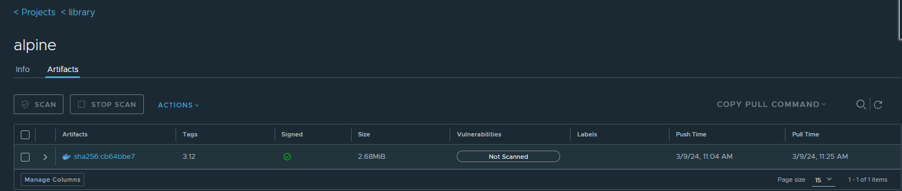
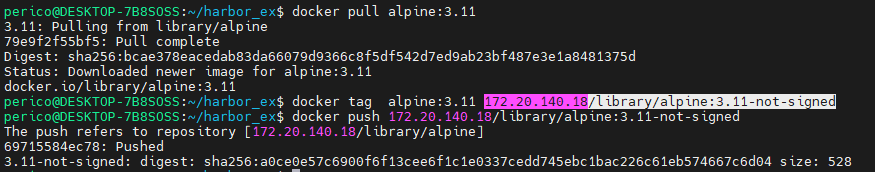
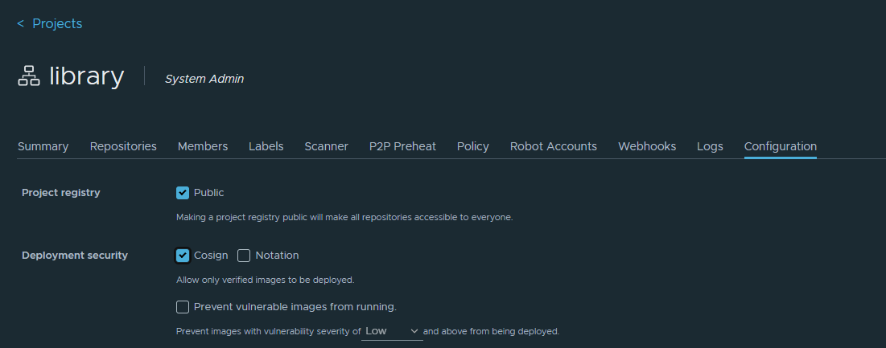
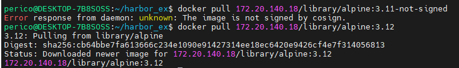

# Solution Guide: Implementing Code-Signing for Docker Images with Harbor

This guide provides detailed instructions for implementing code-signing for Docker images using Harbor. By completing this exercise, you will ensure the integrity and trustworthiness of container images, a critical component of container security.

## Requirements for this exercise

- Docker installed and running on your system.
- Access to a Harbor instance with HTTPS enabled.
- Basic understanding of Docker CLI operations and Harbor administration.

## Step by Step - Manual

### Step 1: Build and Run the Code-Signing Environment

First, you need to build and run a Docker container that is equipped with the necessary tools for code-signing. The references provided indicate using `cosign` for this purpose.

```bash
docker build . -f Dockerfile.cosign -t cosign:1.0
```

```bash
docker run -it --rm cosign:1.0
```

### Step 2: Generate a Signing Key Pair

Generate a key pair for signing your Docker images. Store the key pair securely.

```bash
docker run -v /var/run/docker.sock:/var/run/docker.sock -v $(pwd):/app -w /app -e COSIGN_PASSWORD="CHANGE_WITH_PASSWORD" --user $(id -u):$(id -g) cosign:1.0 generate-key-pair
```

### Step 3: Sign Your Docker Image

You may need to log in into the repo first. In this case, since our Harbor have self-signed certificates, this options are required:

```bash
docker run -v $(pwd)/docker:/root/.docker -v /var/run/docker.sock:/var/run/docker.sock --network host -v $(pwd):/app -w /app -e COSIGN_PASSWORD="CHANGE_WITH_PASSWORD"  cosign:1.0 login 172.20.140.18 -u admin -p fakepassword
```

This command runs a Docker container with several options. Here's a breakdown:

- `docker run`: This is the command to create and start a new Docker container.

- `-v $(pwd)/docker:/root/.docker`: This option mounts the `docker` directory from the current host directory (`$(pwd)`) to the `/root/.docker` directory in the container. This is typically used to share Docker configuration files between the host and the container.

- `-v /var/run/docker.sock:/var/run/docker.sock`: This option mounts the Docker socket from the host to the Docker socket in the container. This allows the Docker client inside the container to communicate with the Docker daemon on the host.

- `--network host`: This option sets the network mode for the container to `host`, which means the container shares the network stack with the host and can access network services running on the host directly.

- `-v $(pwd):/app`: This option mounts the current host directory (`$(pwd)`) to the `/app` directory in the container.

- `-w /app`: This option sets the working directory inside the container to `/app`.

- `-e COSIGN_PASSWORD="CHANGE_WITH_PASSWORD"`: This option sets the `COSIGN_PASSWORD` environment variable inside the container to `"CHANGE_WITH_PASSWORD"`.

- `cosign:1.0`: This is the Docker image that the container is based on.

- `login 172.20.140.18 -u admin -p fakepassword`: This is the command that is run inside the container. It logs into a Docker registry at `172.20.140.18` with the username `admin` and the password `fakepassword`.

Sign your Docker image using the previously generated key pair. Ensure to replace `perico:1.0` with your image's name and tag.

```bash
docker run -v $(pwd)/docker:/root/.docker -v /var/run/docker.sock:/var/run/docker.sock --network host -v $(pwd):/app -w /app -e COSIGN_PASSWORD="CHANGE_WITH_PASSWORD"  cosign:1.0 sign --key cosign.key  --allow-insecure-registry=true 172.20.140.18/library/alpine@sha256:cb64bbe7fa613666c234e1090e91427314ee18ec6420e9426cf4e7f314056813
```

> [!NOTE]
> We need to set `--allow-insecure-registry=true` because the registry is self signed. Also, do not forget to include the hash of the docker image for signing since this ensures unique instance of the image.




### Step 4: Upload Images to Harbor

- Attempt to upload an unsigned image to the same project to verify that Harbor blocks the upload based on your configured policy.

We upload another image that is not signed to the Harbor registry:




### Step 5: Configure Harbor to Require Signed Images

1. Log in to your Harbor instance as an administrator.
2. Navigate to the project where you want to enforce the signed image policy.
3. Go to the project's configuration page and enable the "Only allow signed images" policy.
4. Optionally, you can configure Harbor to verify the signature against a public key you provide. This step ensures that only images signed with the corresponding private key can be pulled.



### Step 6: Deploy Signed and Unsigned Images

- Try to deploy the signed image from Harbor to confirm that the signed image deployment proceeds without issues.
- Attempt to deploy the unsigned image to verify that Harbor enforces the code-signing policy and blocks the deployment.



## Security Considerations

- Keep your signing keys secure and manage access to them carefully to prevent unauthorized use.
- Ensure HTTPS is always enabled for your Harbor instance to protect communication and image transfer.

## Conclusion

By following these steps, you have successfully implemented code-signing for Docker images and configured Harbor to enforce a code-signing policy. This practice enhances the security and trustworthiness of your container images. Congratulations on advancing your skills in container security! 🚀
