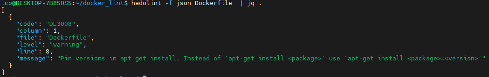
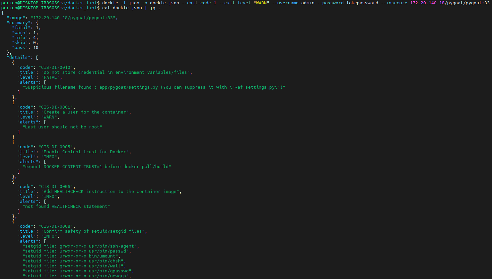

# Solution Guide: Static Analysis of Docker Images for Vulnerabilities and Misconfigurations

This guide provides detailed steps to perform static analysis on Docker images using Grype, Trivy, and Clair. By following this guide, you will identify vulnerabilities and misconfigurations in Docker images, enhancing the security posture of your containerized applications.

## Prerequisites

- Docker installed on your system.
- Basic understanding of Docker image handling and command-line operations.

## Step 1: Install Analysis Tools

### Grype

- Install Grype for vulnerability scanning.

```bash
curl -sSfL https://raw.githubusercontent.com/anchore/grype/main/install.sh | sh -s -- -b /usr/local/bin
```

### Trivy

- Install Trivy for comprehensive vulnerability scanning.

```bash
sudo apt-get install wget apt-transport-https gnupg lsb-release
wget -qO - https://aquasecurity.github.io/trivy-repo/deb/public.key | gpg --dearmor | sudo tee /usr/share/keyrings/trivy.gpg > /dev/null
echo "deb [signed-by=/usr/share/keyrings/trivy.gpg] https://aquasecurity.github.io/trivy-repo/deb $(lsb_release -sc) main" | sudo tee -a /etc/apt/sources.list.d/trivy.list
sudo apt-get update
sudo apt-get install trivy
```

### Clair

- Clone the Clair repository and deploy using Docker Compose.

```bash
git clone https://github.com/quay/clair.git -b release-4.7
cd clair
docker-compose up -d
```

### Snyk

```bash
wget -O /usr/local/bin/snyk https://github.com/snyk/cli/releases/download/v1.1205.0/snyk-linux
chmod +x /usr/local/bin/snyk
```

### Hadolint

> \[!NOTE\]
> Hadolint can be installed, but it comes already prepared in a docker image that can be leveraged `ghcr.io/hadolint/hadolint`.

Either way, for quickly being able to execute it outside of a container we can do this trick:

In one terminal tab run:

```bash
# This will keep the container running because default CMD is ["/bin/hadolint" "-"] so if no entry is provided, will be waiting for that.
docker run --rm -i --name hadolint ghcr.io/hadolint/hadolint
```

```bash
sudo docker cp hadolint:/bin/hadolint /usr/local/bin/hadolint
```

### Dockle

Same as Hadolint, we can install the the utility following  as a package.
However, we can leverage Docker for executing it.

```bash
VERSION=$(
  curl --silent "https://api.github.com/repos/goodwithtech/dockle/releases/latest" | \
  grep '"tag_name":' | \
  sed -E 's/.*"v([^"]+)".*/\1/' \
) && docker pull goodwithtech/dockle:v${VERSION}
```

```bash
docker run -it --rm --name dockle --entrypoint sleep docker.io/goodwithtech/dockle:v0.4.14 infinity

# In other TERMINAL TAB
sudo docker cp dockle:/usr/bin/dockle /usr/local/bin/dockle
```

### Syft

```bash
curl -sSfL https://raw.githubusercontent.com/anchore/syft/main/install.sh | sudo sh -s -- -b /usr/local/bin
```

## Step 2: Configure Tools and Environment

- Ensure Docker is running.
- Pull a test Docker image to scan, e.g., `docker.io/library/bash:latest`.

## Step 3: Perform Scans and Generate Reports

### Using Grype

- Scan the image with Grype and output the report in JSON format.

```bash
grype docker.io/library/bash:latest -o json > grype_report.json
```

### Using Trivy

- Scan the image with Trivy and output the report in JSON format.

```bash
trivy image --format json --output trivy_report.json docker.io/library/bash:latest
```

### Using Clair

- For Clair, you first need to push your Docker image to a registry accessible by Clair and then scan it using `clairctl`.

- Execute the scan (example command, adjust as necessary).

```bash
clairctl --config /etc/clair/config.yaml report --host ${CLAIR_HOST} docker.io/library/bash:latest
```

### Using Snyk

```bash
# Login to Snyk with you token (free account works for this)
snyk auth ${SNYK_TOKEN}

# Analyze the target image
snyk container test --json docker.io/library/bash:latest > output.json
```

### Using Hadolint

```bash
docker run --rm -i ghcr.io/hadolint/hadolint
```



### Using Dockle

```bash
dockle -f json -o dockle.json --exit-code 1 --exit-level "WARN" --username ${REGISTRY_USER} --password ${REGISTRY_PASSWORD} --insecure 172.20.140.18/pygoat/pygoat:33
```



### Using Syft

```bash
syft scan 172.20.140.18/pygoat/pygoat:32 -o json | jq . > syft.json
```

## Step 4: Analyze and Compare Results

- Review the JSON reports generated by Grype, Trivy, and Clair.
- Compare the vulnerabilities and misconfigurations identified by each tool to understand their coverage and unique capabilities.

## Conclusion

By completing this challenge, you've leveraged powerful tools to uncover vulnerabilities and misconfigurations in Docker images. This process is crucial for maintaining secure containerized applications. Continuous integration of these scanning tools into your development pipeline can significantly enhance the security and integrity of your container images. Congratulations on advancing your skills in container security analysis!

## Optional: Integration into CI/CD

- Refer to the provided CI configuration examples to integrate these scanning tools into your GitLab CI/CD pipeline.
- Adjust the `.gitlab-ci.yml` file according to your project's requirements and ensure all necessary environment variables are correctly set.

> \[!IMPORTANT\]
> For quickly deploying the gitlab with docker executor runner, use [Gitlab testing set-up](../../../environment/gitlab/README.md).

```yaml
image: docker:latest

services:
  - docker:dind

stages:
  - build
  - test
  - release
  - preprod
  - integration
  - prod

# build:
#   stage: build
#   image: python:3.11.0b1-buster
#   before_script:
#    - pip3 install --upgrade virtualenv
#   script:
#    - virtualenv env
#    - source env/bin/activate
#    - pip install -r requirements.txt
#    - python manage.py check

simple_test:
  stage: build
  script:
    - echo "hola" > mock_file
    - pwd
    - docker run -v $(pwd):/test -w /test alpine:3.11 ls
    - docker run --rm --name test -v $(pwd):/test -w /test alpine:3.11 cat mock_file

build_and_push:
  stage: build
  before_script:
    - export DOCKER_HOST="unix:///var/run/docker.sock"
  script:
   - docker build . -f Dockerfile -t ${harbor_url}/pygoat/pygoat:${CI_COMMIT_SHA}
   - docker login ${harbor_url} -u ${harbor_user} -p ${harbor_password}
   - docker push ${harbor_url}/pygoat/pygoat:${CI_COMMIT_SHA}

image_testing_grype:
  stage: test
  before_script:
    - apk add --update && apk add curl
    - curl -sSfL https://raw.githubusercontent.com/anchore/grype/main/install.sh | sh -s -- -b /usr/local/bin
    - mkdir /opt/${CI_COMMIT_SHA}
  script:
    - docker login ${harbor_url} -u ${harbor_user} -p ${harbor_password}
    - docker pull ${harbor_url}/pygoat/pygoat:${CI_COMMIT_SHA}
    - grype ${harbor_url}/pygoat/pygoat:${CI_COMMIT_SHA} -o json -f high > grype.json
  artifacts:
    paths:
      - grype.json
    when: always
  allow_failure: true

image_testing_trivy:
  stage: test
  before_script:
    - mkdir /opt/${CI_COMMIT_SHA}
  # Other option for login: https://docs.gitlab.com/ee/user/packages/container_registry/authenticate_with_container_registry.html#use-gitlab-cicd-to-authenticate
  # docker login -u $CI_REGISTRY_USER -p $CI_JOB_TOKEN $CI_REGISTRY
  script:
    - docker login ${harbor_url} -u ${harbor_user} -p ${harbor_password}
    - docker pull ${harbor_url}/pygoat/pygoat:${CI_COMMIT_SHA}
    - docker save ${harbor_url}/pygoat/pygoat:${CI_COMMIT_SHA} -o pygoat.tar
    - docker run --rm -v /root/.cache/:/root/.cache/ -v $(pwd):/opt/${CI_COMMIT_SHA} aquasec/trivy:0.49.1 image --input /opt/${CI_COMMIT_SHA}/pygoat.tar -f json 1> trivy.json
  artifacts:
    paths:
      - trivy.json
    when: always
  allow_failure: true

image_testing_snyk:
  stage: test
  before_script:
    - wget -O /usr/local/bin/snyk https://github.com/snyk/cli/releases/download/v1.1205.0/snyk-linux
    - chmod +x /usr/local/bin/snyk
  script:
    - docker login ${harbor_url} -u ${harbor_user} -p ${harbor_password}
    - docker pull ${harbor_url}/pygoat/pygoat:${CI_COMMIT_SHA}
    - snyk auth ${SNYK_AUTH_TOKEN}
    - snyk container test --json docker.io/library/bash:latest > snyk.json
    # Other option
    # docker run --rm -e SNYK_TOKEN=${SNYK_AUTH_TOKEN} -e USER_ID=${SNYK_USER} -e SNYK_REGISTRY_USERNAME=${harbor_user} -e SNYK_REGISTRY_PASSWORD=${harbor_password} -v "$(pwd):/project" snyk/snyk-cli:docker container test --json ${harbor_url}/pygoat/pygoat:${CI_COMMIT_SHA} 1> snyk-output.json
  artifacts:
    paths:
      - snyk.json
    when: always
  allow_failure: true

# image_testing_clair:
#   stage: test
#   image: quay.io/projectquay/golang:1.20
#   before_script:
#     - go install github.com/quay/clair/v4/cmd/clairctl@latest
#     - |
#       cat > config.yaml <<EOL
#       ${clairctl_config}
#       EOL
#   script:
#     - clairctl --config config.yaml report --host ${clair_host} ${harbor_url}/pygoat/pygoat:${CI_COMMIT_SHA}
#     - clairctl -h
#   allow_failure: true


integration:
  stage: integration
  script:
    - echo "This is an integration step"
    - exit 1
  allow_failure: true # Even if the job fails, continue to the next stages

prod:
  stage: prod
  script:
    - echo "This is a deploy step."
  # when: manual
```
