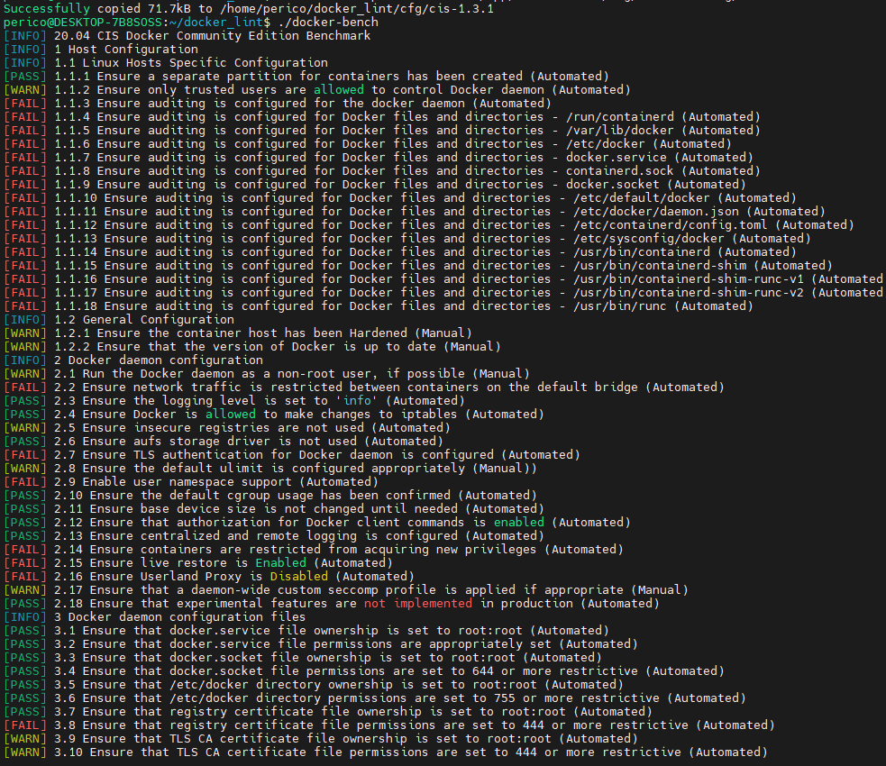

# Solution Guide: Ensuring CIS Compliance with Docker-Bench

This solution guide outlines the process of auditing Docker configurations against the Center for Internet Security (CIS) Docker Benchmark using Docker-Bench. By following these steps, you ensure that your Docker configurations adhere to established best practices, enhancing your container security posture.

## Requirements

- Docker installed on your system.
- Basic understanding of Docker operations and command-line proficiency.

## Steps to Complete the Challenge

### Step 1: Build the Docker-Bench Image

To avoid installing unnecessary files on your system, build a Docker image for Docker-Bench:

```bash
docker build . -f Dockerfile.docker_bench -t docker-bench:1.0
```

### Step 2: Extract the Docker-Bench Binary

Create a temporary container from your Docker-Bench image and copy the binary to your host system:

1. Run the container in detached mode:

   ```bash
   docker run --rm --entrypoint sleep --name docker-bench docker-bench:1.0 infinity
   ```

2. In a new terminal tab or window, copy the Docker-Bench binary:

   ```bash
   docker cp docker-bench:/usr/local/bin/docker-bench ./docker-bench
   ```

3. Prepare the configuration directory and copy the desired CIS benchmark version (e.g., CIS 1.3.1):

   ```bash
   mkdir -p cfg/cis-1.3.1
   docker cp docker-bench:/app/docker-bench/cfg/cis-1.3.1 cfg
   ```

### Step 3: Execute Docker-Bench

Run Docker-Bench in your local environment, specifying to output the report in JSON format:

```bash
./docker-bench --json

 --outputfile docker-bench.json
```

This command executes Docker-Bench against your Docker configurations, generating a report in JSON format for easier analysis and machine processing.



### Step 4: Analyze the Results

To understand the compliance status of your Docker configurations, analyze the generated `docker-bench.json`. You can use various tools or scripts to parse this JSON file, but one simple way to get summaries for passed tests is by using `jq`:

1. **List Passed Tests:**

   ```bash
   cat docker-bench.json | jq -r '.tests[] | select(.results != null) | .results[] | select(.status=="PASS") | .test_number'
   ```

This command filters out the passed tests from the Docker-Bench report, helping you to quickly identify configurations that meet the CIS Benchmark criteria.


### Step 5: Review and Remediate

Review the full `docker-bench.json` report to identify any failed tests. For each failure, Docker-Bench provides recommendations and references to the CIS Docker Benchmark for remediation steps. Address these recommendations to improve your Docker environment's security posture.

## Conclusion

By completing this challenge, you've taken a significant step towards securing your Docker configurations by ensuring they comply with the CIS Docker Benchmark. Regularly running Docker-Bench as part of your security audit process can help maintain and improve the security posture of your containerized applications over time. Congratulations on enhancing your container security skills!
