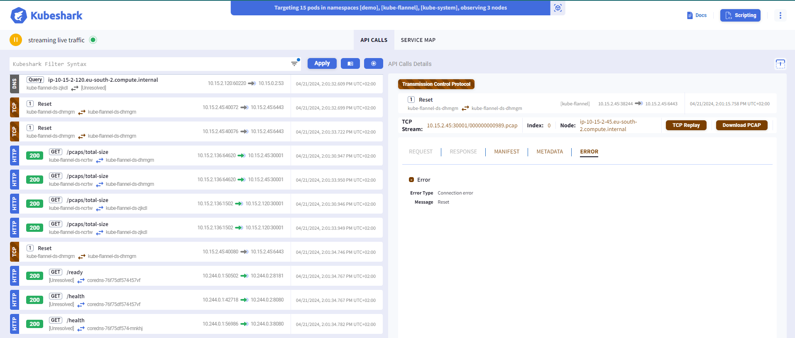

# Discovery Techniques in container environment

- [Discovery Techniques in container environment](#discovery-techniques-in-container-environment)
  - [Docker](#docker)
    - [Discover Docker Daemon API - nmap](#discover-docker-daemon-api---nmap)
  - [Kubernetes](#kubernetes)
    - [Kube-hunter - finding cluster missconfigurations](#kube-hunter---finding-cluster-missconfigurations)
    - [Kube-shark - Network discovery](#kube-shark---network-discovery)
    - [Checks inside a compromised Pod](#checks-inside-a-compromised-pod)

If not securely restricted, there are several techniques to discover the attack surface of a container environment to identify possible breaches and act upon to secure it.

## Docker

### Discover Docker Daemon API - nmap

Using nmap or other infrastructure discovery tool (widely used by hackers or penetration testers), we may try to identify Docker API exposed or even Kubernetes API (who knows which secrets are hold in the network, huh?)

```bash
docker run --rm uzyexe/nmap -p 1-65535 <target_machine>
```

The common ports for Docker exposure are `2375 (HTTP - non authenticated)` or `2376 (HTTPS)`. However, those can variate so that is the reason for using the whole possible port range in the discovery `1-65535`.

The docker API leaves a finger print (if found) `2375/tcp open  docker`.

## Kubernetes

### Kube-hunter - finding cluster missconfigurations

> \[!CAUTION\]
> Kube hunter has been staled and no longer receiving active development. Instead, already mentioned `trivy` is being enriched with `Kubernetes missconfigurations scanning` as per repo states.

[Kube-hunter GitHub - AquaSec](https://github.com/aquasecurity/kube-hunter)

To run kube-hunter inside the cluster (deploying a pod) is the best option to retrieve the maximum valuable information possible (based on documentation as well).

Doing this is extremely simple, thanks to great Aquasec job. They have an available image in Docker Hub ready and also a `job.yaml` file with a Kubernetes `Job` definition for launching the scan.

```bash
kubectl create -f https://raw.githubusercontent.com/aquasecurity/kube-hunter/main/job.yaml
```


If you want to retrieve the information in machine-readable format:

```bash
kubectl create -f https://raw.githubusercontent.com/aquasecurity/kube-hunter/main/job.yaml --dry-run=client -o json | jq '.spec.template.spec.containers[].args = ["--pod", "--report", "json"]' | kubectl replace -f - --force
```

> \[!NOTE\]
> The `replace --force` is just to simplify several executions, instead of having to delete previously created `kube-hunter` jobs (if that is the case).

### Kube-shark - Network discovery

Kube-shark is a tool for network packet analysis in a Kubernetes environment. It's designed to provide insights into the network traffic flowing through your Kubernetes clusters. With Kube-shark, you can capture, display, and analyze network packets, helping you troubleshoot network issues, analyze network performance, and detect network security threats.

Kube-shark is also quite useful from the perspective of an attacker that wants to know what is happening inside kubernetes networking layer and obtain relevant information.

To download visit [GitHub releases page](https://github.com/kubeshark/kubeshark/releases/tag/v52.2.30)

```bash
sudo sh -c "curl -Lo kubeshark https://github.com/kubeshark/kubeshark/releases/download/v52.2.30/kubeshark_linux_amd64 && chmod 755 kubeshark && mv kubeshark /usr/local/bin/kubeshark"
```

There are multiple options that can be checked with `--help`.

To simply start:

```bash
kubeshark tap --proxy-host=172.20.140.18
```

> \[!TIP\]
> Use the `--proxy-host=YOUR_IP` if you are not in an environment with browser (maybe ubuntu sever) so you can access from the exterior (maybe from your client if you are connected from windows using vpn).

> \[!TIP\]
> Use `-n` option if you want to focus in specific namespace communication.



### Checks inside a compromised Pod

Assuming the pod has been compromised by any vulnerability in the application layer, there are several discovery checks that must be done in order to get a proper understanding of the attack surface and possible paths for persistance, lateral movement, privilege escalation and more.

- **`Try accessing host pid`**: `ls /proc/1/root`
- **`Get container allowed capabilities`**: 
  - `cat /proc/1/status`
  - `capsh --decode=0000000000003000`. Being `0000000000003000` the id of the caps obtained from previous command.
  - `capsh --print`