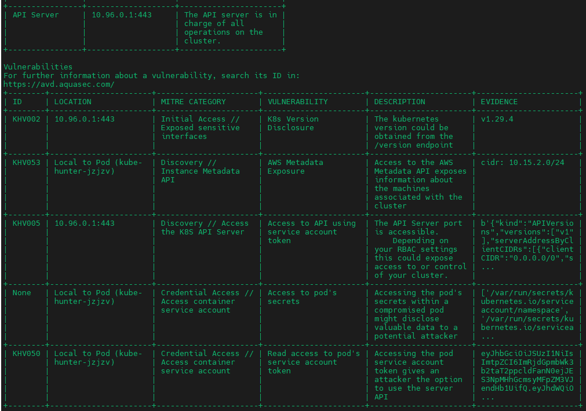

# Discovery Techniques in container environment

- [Discovery Techniques in container environment](#discovery-techniques-in-container-environment)
  - [Docker](#docker)
    - [Discover Docker Daemon API - nmap](#discover-docker-daemon-api---nmap)
  - [Kubernetes](#kubernetes)
    - [Kube-hunter - finding cluster missconfigurations](#kube-hunter---finding-cluster-missconfigurations)

If not securely restricted, there are several techniques to discover the attack surface of a container environment to identify possible breaches and act upon to secure it.

## Docker

### Discover Docker Daemon API - nmap

Using nmap or other infrastructure discovery tool (widely used by hackers or penetration testers), we may try to identify Docker API exposed or even Kubernetes API (who knows which secrets are hold in the network, huh?)

```bash
docker run --rm uzyexe/nmap -p 1-65535 <target_machine>
```

The common ports for Docker exposure are `2375 (HTTP - non authenticated)` or `2376 (HTTPS)`. However, those can variate so that is the reason for using the whole possible port range in the discovery `1-65535`.

The docker API leaves a finger print (if found) `2375/tcp open  docker`.

## Kubernetes

### Kube-hunter - finding cluster missconfigurations

> \[!CAUTION\]
> Kube hunter has been staled and no longer receiving active development. Instead, already mentioned `trivy` is being enriched with `Kubernetes missconfigurations scanning` as per repo states.

[Kube-hunter GitHub - AquaSec](https://github.com/aquasecurity/kube-hunter)

To run kube-hunter inside the cluster (deploying a pod) is the best option to retrieve the maximum valuable information possible (based on documentation as well).

Doing this is extremely simple, thanks to great Aquasec job. They have an available image in Docker Hub ready and also a `job.yaml` file with a Kubernetes `Job` definition for launching the scan.

```bash
kubectl create -f https://raw.githubusercontent.com/aquasecurity/kube-hunter/main/job.yaml
```



If you want to retrieve the information in machine-readable format:

```bash
kubectl create -f https://raw.githubusercontent.com/aquasecurity/kube-hunter/main/job.yaml --dry-run=client -o json | jq '.spec.template.spec.containers[].args = ["--pod", "--report", "json"]' | kubectl replace -f - --force
```

> \[!NOTE\]
> The `replace --force` is just to simplify several executions, instead of having to delete previously created `kube-hunter` jobs (if that is the case).


