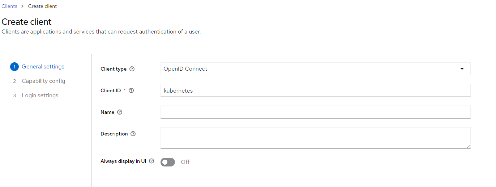
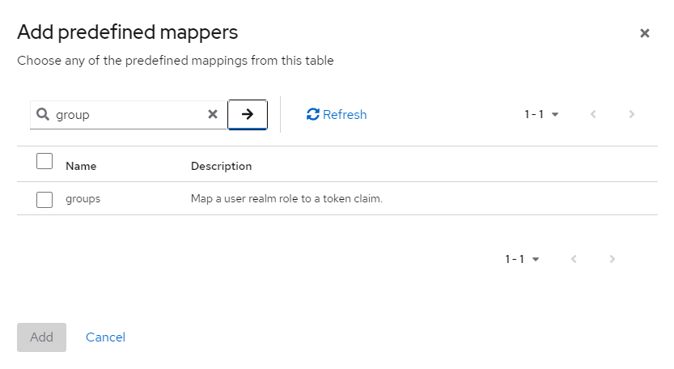
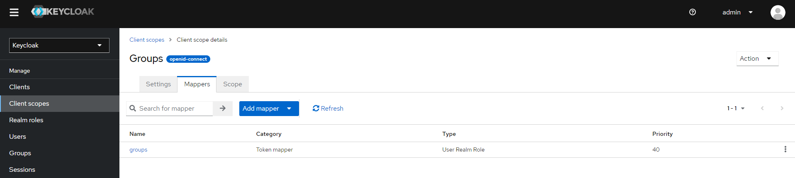
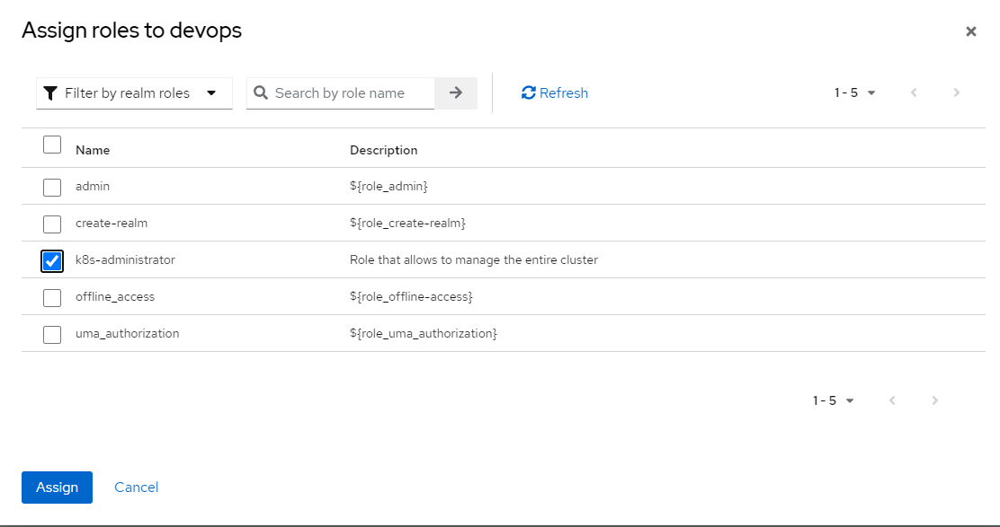

# Kubernetes Auth

- [Kubernetes Auth](#kubernetes-auth)
  - [Kubernetes Authentication](#kubernetes-authentication)
    - [Webhook Token Authentication](#webhook-token-authentication)
    - [mTLS (Mutual TLS)](#mtls-mutual-tls)
    - [Service Account Tokens](#service-account-tokens)
    - [Static Token File](#static-token-file)
    - [OIDC (OpenID Connect) Integration](#oidc-openid-connect-integration)
      - [Setting OIDC with Keycloak](#setting-oidc-with-keycloak)
        - [Keycloak configuration](#keycloak-configuration)
        - [Configure API server](#configure-api-server)
        - [Connect with kauth.sh](#connect-with-kauthsh)
  - [Kubernetes Authorization](#kubernetes-authorization)
    - [Role-Based Access Control (RBAC)](#role-based-access-control-rbac)
    - [Attribute-Based Access Control (ABAC)](#attribute-based-access-control-abac)

This modules aims to give a good understanding of the different authentication and authorization mechanisms available in kubernetes.
For this I am going to introduce the concepts and create a lab scenario for each of them so the reader can understand the different options and see in detail how this can be configured.

## Kubernetes Authentication

Kubernetes provides several mechanisms for authenticating users and services to the API server. These mechanisms ensure that only authorized entities can interact with your Kubernetes resources.

### Webhook Token Authentication

Webhook token authentication allows the Kubernetes API server to make an HTTP POST request to a remote web service to verify bearer tokens. The remote service is expected to return a JSON response to indicate whether the token is valid or not.

The API server reads the configuration from a file with a `kubeconfig`-style format. The file contains the server's URL and the client certificate and key for the API server to connect to the webhook.

### mTLS (Mutual TLS)

Mutual TLS (mTLS) is a protocol where both the client and the server authenticate each other. In Kubernetes, the API server and the client (which could be a user or a Kubernetes service) present certificates to each other, which they use to mutually verify their identities.

The client certificates are provided by users or services in their request headers to the API server. The API server then verifies the client certificates against the CA certificates that it holds.

### Service Account Tokens

Service account tokens are a type of bearer token that are associated with service accounts in Kubernetes. They are automatically created by Kubernetes and mounted into pods for in-cluster access to the Kubernetes API server.

Service account tokens are JWTs (JSON Web Tokens) that include a variety of claims like the service account name, namespace, and secret name.

### Static Token File

The static token file is a simple CSV file with at least three columns: token, user name, and user ID. Optionally, you can include a fourth column for group names.

The API server reads the static token file on startup and uses it to authenticate bearer tokens in user requests. This method is simple but not as secure or flexible as other methods.

### OIDC (OpenID Connect) Integration

OpenID Connect (OIDC) is a simple identity layer on top of the OAuth 2.0 protocol. Kubernetes can use OIDC tokens to authenticate users against an OIDC identity provider.

The API server includes several flags for configuring the OIDC authenticator. These flags include the issuer URL, client ID, CA file, username claim, username prefix, group claim, and others.

#### Setting OIDC with Keycloak

##### Keycloak configuration

For this showcase scenario we are going to:

- Set a keycloak instance.
- Configure one of our clusters (single node in VM in this case) to be integrated with OIDC.

1. Start Keycloak over HTTPS leveraging my repository [Keycloak Docker Compose](https://github.com/paf-triarii/Keycloak-Docker-Compose). Only by executing a simple bash script, you got it!

```bash
git clone https://github.com/paf-triarii/Keycloak-Docker-Compose.git keycloak-docker-compose
cd keycloak-docker-compose
chmod +x start.sh
./start.sh --gen_certs
```


2. Make sure to retrieve the `server.pem` generated from previous execution.


3. Navigate to your Keycloak instance and start creating a client.





4. Now let's create the groups scope to be included in the token.




5. Now lets create the realm role that we will map to the user and include in the token.


6. After that we can proceed to add the client scope to our created client `kubernetes`.




7. Finally let's create the user, assign the realm role and generate a password.




**With this we are good to proceed with the configuration of the API server!**

> \[!TIP\]
> I recommend you to try first the token retrieval with this additional steps.

```bash
cd keycloak
chmod +x kauth.sh

export KAUTH_CLIENT_SECRET="<your-client-secret>"

# Make sure to set the options that match your configuration.
./kauth.sh --url https://172.20.140.18:8443 --user devops --client_id kubernetes --ca_cert /home/perico/Keycloak-Docker-Compose/ca.pem --check
```


##### Configure API server

1. Copy the generated `ca.pem` to the master node. I have copied the file to `/root/oidc/ca.pem`

2. In the master node, insert (with sudo su first) the following configuration:
 
```yaml
# In /etc/kubernetes/manifests/kube-apiserver.yaml

    - --tls-private-key-file=/etc/kubernetes/pki/apiserver.key
    ### Insert these lines with your values
    - --oidc-issuer-url=https://172.20.140.18:8443/realms/master
    - --oidc-groups-claim=groups
    - --oidc-client-id=kubernetes
    - --oidc-ca-file=/root/oidc/ca.pem
    - --oidc-groups-prefix=
    - --oidc-username-prefix=
    ### End of insert
    image: registry.k8s.io/kube-apiserver:v1.27.13
    imagePullPolicy: IfNotPresent
```

3. Make sure to mount the volume to share the certs with the pod.

```yaml
# In /etc/kubernetes/manifests/kube-apiserver.yaml
  containers:
  ...
    - mountPath: /root/oidc
      name: oidc-certs
      readOnly: true
...
  volumes:
  - hostPath:
      path: /etc/ssl/certs
      type: DirectoryOrCreate
    name: ca-certs
  - hostPath:
      path: /root/oidc
      type: DirectoryOrCreate
    name: oidc-certs
```

> \[!IMPORTANT\]
> I decided to add `'empty` prefix of the group and the username, but this could be omitted and then it will take automatically the prefix of the issuer URL.

1. Wait for the api-server pod to restart.

##### Connect with kauth.sh

1. Configure kubectl with kauth. The `ca.pem` is the one automatically generated in Keycloak set-up.

```bash
./kauth.sh --url https://172.20.140.18:8443 --user devops --client_id kubernetes --ca_cert /home/perico/Keycloak-Docker-Compose/ca.pem
```

2. Test getting the pods.

```bash
kubectl get pods
```


> \[!IMPORTANT\]
> Notice that the user has been properly authenticated but there is no permissions associated. We need to grant some permissions for the user to be able to operate.

3. Swith back to your admin config (in my case `kubernetes-admin-ubuntu`).

```bash
kubectl config set-context $(kubectl config current-context) --user=kubernetes-admin-ubuntu
```

4. Let's create a `clusterrolebinding` for the group `k8s-administrator`.

```bash
kubectl create clusterrolebinding --clusterrole=cluster-admin --group=k8s-administrator oidc-admin
```

> \[!TIP\]
> Notice that the user used is matching (by default) the `sub` claim of the token. If you want something more clear to the sight, you can set an additional value to the api server command such as this one `--oidc-username-claim=email`

---

## Kubernetes Authorization

Once the Kubernetes API server has authenticated a user or service, it must determine whether they are authorized to perform the requested action. Kubernetes provides several mechanisms for authorization, including Role-Based Access Control (RBAC) and Attribute-Based Access Control (ABAC).

### Role-Based Access Control (RBAC)

RBAC is a method of regulating access to computer or network resources based on the roles of individual users within your organization. In Kubernetes, you can define roles with rules that specify a set of permissions. A role can be scoped to a namespace or cluster-wide (ClusterRole).

Permissions are purely additive (there are no "deny" rules). A Role always sets permissions within a particular namespace; when you create a Role, you have to specify the namespace it belongs in.

RoleBindings grant the permissions defined in a role to a user or set of users. It holds a list of subjects (users, groups, or service accounts), and a reference to the role being granted. A RoleBinding grants permissions within a specific namespace whereas a ClusterRoleBinding is a cluster-wide version of a RoleBinding.

Here's an example of how to create a Role and RoleBinding in Kubernetes:

```yaml
# Define a Role that allows reading Pods in a specific namespace
apiVersion: rbac.authorization.k8s.io/v1
kind: Role
metadata:
  namespace: default
  name: pod-reader
rules:
- apiGroups: [""]
  resources: ["pods"]
  verbs: ["get", "watch", "list"]

# Bind the 'pod-reader' Role to the 'john' user
apiVersion: rbac.authorization.k8s.io/v1
kind: RoleBinding
metadata:
  name: read-pods
  namespace: default
subjects:
- kind: User
  name: john
  apiGroup: rbac.authorization.k8s.io
roleRef:
  kind: Role
  name: pod-reader
  apiGroup: rbac.authorization.k8s.io
```

In this example, the `pod-reader` Role allows reading (get, watch, list) Pods in the `default` namespace. The RoleBinding then grants this Role to the `john` user.

### Attribute-Based Access Control (ABAC)

ABAC is a flexible access control method where administrators can define policies based on attributes of the user, the resource, the action, and the environment. In Kubernetes, ABAC policies are simple JSON or YAML files that the API server loads on startup.

Each line of a policy file identifies a resource by its attributes (group, namespace, etc.) and specifies the actions (read, write, etc.) that are allowed on it. The API server checks each incoming request against the ABAC policies and allows or denies the request based on the matching policies.

While ABAC can provide more fine-grained control than RBAC, it can also be more complex to manage, especially in large or dynamic environments. Therefore, RBAC is generally recommended for most Kubernetes deployments.

Remember, the choice of authorization mechanism depends on your specific requirements for security, complexity, integration with existing systems, and other factors. Always choose the mechanism that best fits your needs and provides the appropriate level of security for your Kubernetes environment.

Here's an example of an ABAC policy in Kubernetes:

```json
{
  "apiVersion": "abac.authorization.kubernetes.io/v1beta1",
  "kind": "Policy",
  "spec": {
    "user": "alice",
    "namespace": "projectA",
    "resource": "pods",
    "readonly": true
  }
}
```

In this example, the policy allows the `alice` user to read (but not write) Pods in the `projectA` namespace.

Remember, these are just simple examples. In a real-world scenario, you would likely have more complex roles and policies that reflect the specific needs of your organization.
